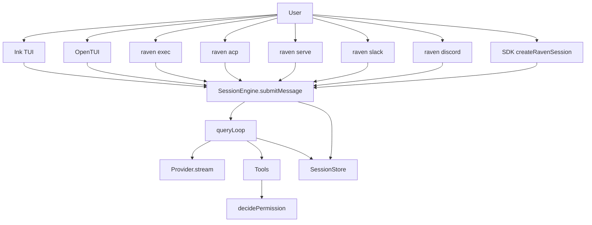

# RavenClaw 아키텍처

English: [ARCHITECTURE.md](ARCHITECTURE.md)

이 문서는 RavenClaw의 런타임 구조와 설계 불변식을 소스 기준으로 정리한다. RavenClaw는 Bun/TypeScript로 작성된 BYOK 코딩 에이전트다. 회사 백엔드는 없다. 라이선스는 Apache-2.0이다. 호스트가 달라도 루프는 하나이며, 권한 모드에 bypass/yolo는 없다.

관련 문서:

- [README.md](README.md)
- [SLASH_COMMANDS.ko.md](SLASH_COMMANDS.ko.md)
- [CONTRIBUTING.md](CONTRIBUTING.md)
- [docs/headless.md](docs/headless.md)
- 구현됨: [2026-09-16-session-as-job-roadmap.md](docs/superpowers/specs/2026-09-16-session-as-job-roadmap.md) (`ea56edd`, closeout `0ef1554`); [job-host state](docs/superpowers/specs/2026-09-17-job-host-state-roadmap.md) (`6e56764`); [rewind persist-before-reset](docs/superpowers/specs/2026-09-18-rewind-persist-and-todo-projection.md) (`048deff`); [cancel abort-pair / reset-on-resume / follow-up persist](docs/superpowers/specs/2026-09-18-cancel-reset-followup.md) (`5eefdde`); [no-job todo revert](docs/superpowers/specs/2026-09-18-no-job-todo-revert.md) (`be5a4a7`); [stream version / continuationToken](docs/superpowers/specs/2026-09-18-stream-version-token.md) (`c9c4871`); [keep-id `/clear`](docs/superpowers/specs/2026-09-18-keep-id-clear.md) (`edeb611`); [parent tree-stop](docs/superpowers/specs/2026-09-18-parent-tree-stop.md) (`9901d0e`) (이전: [eve-inspired](docs/superpowers/specs/2026-09-15-eve-inspired-roadmap.md), implemented)
- 선행 분석: [eve-analysis.ko.md](docs/research/eve-analysis.ko.md), [y0-analysis.ko.md](docs/research/y0-analysis.ko.md)

---

## 설계 불변식

아래 규칙은 구현 편의로 우회하지 않는다.

**`queryLoop`는 하나다.** 구현은 `packages/core/src/loop/query-loop.ts`에만 있다. Ink, OpenTUI, `exec`, `acp`, `serve`, Slack, Discord, SDK는 각자 루프를 다시 만들지 않는다. 호스트의 역할은 입력을 모으고, 권한 질문을 중계하고, 스트림을 그리는 것이다.

**호스트는 `SessionEngine.submitMessage`만 호출한다.** 엔진은 `packages/core/src/loop/session-engine.ts`의 `createSessionEngine`이 만든다. 사용자 한 번의 제출이 하나의 `Turn`이 되고, 그 안에서 `queryLoop`가 라운드를 돌린다. 호스트가 `provider.stream`을 직접 부르거나 툴을 직접 실행하지 않는다.

**persist-before-execute와 pairing은 법이다.** assistant의 `tool_use`는 `persistToolCalls`로 먼저 저장한 뒤에만 실행한다. 모든 `tool_use.id`는 정확히 하나의 `role: 'tool'` 메시지와 짝을 이룬다. 권한 거절, abort, persist 실패도 예외가 아니다. 짝 없는 `tool_use`는 resume 때 재실행하지 않고 `incomplete` 툴 메시지로 고정한다. 구현은 `packages/core/src/loop/pairing.ts`다.

**leftover-ask / `dontAsk` / `acceptEdits`는 서로 다르다.** 툴의 `checkPermissions`가 `ask`를 반환한 상태가 leftover-ask다. `default`는 그 leftover를 호스트에게 묻는다. `acceptEdits`는 트리 안 `Edit` / `Write` / `ApplyPatch`(그리고 일부 `Memory` 경로)만 승격한다. `dontAsk`는 leftover를 거절로 바꾼다. 트리 안 파일 편집과 읽기 전용 툴은 예외로 허용하지만, `Fetch`와 `AskUser`는 읽기 전용이어도 거절한다. bypass/yolo 모드는 없다. `dontAsk`는 bypass가 아니다.

**기본 툴 prefix는 턴 동안 frozen이다.** 첫 `assembleRequest`가 `filterToolsForTurn` 결과를 `turn.frozenToolNames`에 찍는다. 같은 턴에서 MCP가 뒤늦게 붙거나 스킬이 allow-list를 줄여도, 모델에 보이는 prefix 이름은 바뀌지 않는다. 새 이름은 `ToolSearch` / `ToolCall`로만 연다.

**광고는 included 세션만.** `session.funding === 'included'`일 때만 피드에 접촉한다. `@ravenclaw/ads`는 `@ravenclaw/core`를 import하면 안 된다. 빈 `ads.feedUrl`은 소켓을 열지 않고 house floor만 쓴다. BYOK 세션은 광고 피드를 보지 않는다.

**클린룸.** 선행 제품의 계약(루프 의미, pairing, persist-before-execute)만 참고한다. 소스, 프롬프트, 브랜드 문자열을 복사하지 않는다. builtin 스킬은 `Claude` / `Anthropic` 문자열을 금지한다.

---

## 저장소 레이아웃

워크스페이스는 Bun monorepo다. 루트 `package.json`의 workspaces는 `packages/*`다.

| 패키지 | 경로 | 책임 |
|---|---|---|
| `@ravenclaw/core` | `packages/core` | `queryLoop`, `SessionEngine`, 툴, 권한, 세션 스토어, compact, MCP 브리지, 스킬, cron, Provider 포트. 모델 역할과 가격은 `src/cost/models.ts` |
| `@ravenclaw/providers` | `packages/providers` | Anthropic Messages, OpenAI Chat Completions, OpenAI Responses, included gateway. `core`를 구현체로 끌어오지 않는다 |
| `@ravenclaw/ads` | `packages/ads` | 1st-party 광고 레이아웃, house floor, entitlement probe. `@ravenclaw/core` / `ink` / `react`를 import하지 않는다 |
| `@ravenclaw/cli` | `packages/cli` | `raven` 바이너리. Ink TUI, OpenTUI 부트, `exec` / `acp` / `serve` / `slack` / `discord` / `pairing` / `cron` |
| `@ravenclaw/tui-opentui` | `packages/tui-opentui` | StreamEvent 줄 단위 뷰. Ink를 대체하는 호스트 표면만 담당 |
| `@ravenclaw/acp` | `packages/acp` | Agent Client Protocol JSON-RPC. 에디터가 leftover-ask에 답할 수 있게 한다 |
| `@ravenclaw/sdk` | `packages/sdk` | `createRavenSession`. Ink, 광고, CLI 없이 루프를 임베드한다 |

`core`는 `@ravenclaw/providers`를 import하지 않는다. 호스트가 `createProvider`로 구현체를 만들어 엔진에 넘긴다. `ads`는 CLI가 included 세션일 때만 붙인다.

설계 메모는 `docs/superpowers/specs/`에 있다. 선행 연구 노트는 `docs/research/`다. 그 노트는 계약 참고용이며 복제 대상이 아니다.

---

## 런타임 토폴로지

모든 표면이 같은 허리로 모인다.



호스트는 세션 락을 잡고, 시스템 프롬프트를 만들고, 툴 풀을 조립한 뒤 `submitMessage`를 호출한다. `queryLoop`가 모델 스트림, leftover-ask, persist, pairing, compact를 소유한다. Slack/Discord는 `raven serve`의 어댑터가 아니다. 같은 `queryLoop`를 쓰는 형제 호스트다.

세션 락 holder 이름은 `tui` | `serve` | `exec` | `cron` | `acp` | `sdk` | `slack` | `discord`다. TTL은 120초, renew는 30초다. 한 세션 id에는 라이브 writer가 하나다.

---

## 부트 경로

엔트리는 `packages/cli/src/index.ts`의 `main`이다.

1. `parseArgv` (`packages/cli/src/args.ts`)가 커맨드와 플래그를 읽는다.
2. 키가 필요 없는 커맨드(`help`, `version`, `sessions`, `show`, `rm`, `search`, `export`, `title`, `doctor`, `config`, `init`, `setup`, `completions`, `mcp`, `skills`, `pairing`, cron의 list/add/rm/on/off)는 `bootCli` 전에 처리한다.
3. 키가 필요한 경로(`interactive`, `resume`로 열기, `exec`, `acp`, `smoke`, `serve`, `slack`, `discord`, cron `tick`/`watch`)는 `ensureHomeDir` 후 `bootCli` (`packages/cli/src/engine.ts`)를 탄다.

`bootCli`가 하는 일:

- `loadConfig({ home, flags })`로 설정을 해석한다.
- `$RAVENCLAW_HOME/state.db`에 SQLite WAL 스토어를 연다.
- included gateway를 probe한다. `--provider`가 있으면 BYOK를 선호한다. headless 표면에서 gateway가 `placementRequired`를 주면 신규 세션은 BYOK로 남는다.
- `createProvider`로 Provider를 만든다.
- `createSession !== false`이면 `openEngine`이 세션, 락, 시스템 파트, 툴 풀, MCP, 훅, `SessionEngine`을 만든다.

기본 대화형 경로는 `lockHolder: 'tui'`로 Ink `App`을 render한다. `--tui opentui`면 `runOpenTuiApp`이다.

`exec` / `smoke` / `serve`는 `parseArgv`가 `flags.dontAsk = true`를 강제한다. `acp`는 강제하지 않는다. 에디터가 leftover-ask에 답할 수 있게 기본은 `default`다. 무인 ACP는 `--dont-ask`를 넘긴다.

---

## 호스트 상세

### Ink TUI (기본)

`packages/cli/src/app.tsx`의 `App`이 기본 호스트다. `bootCli`가 만든 `CliRuntime`을 받아 `engine.submitMessage`를 돌린다.

- Shift+Tab은 `default → acceptEdits → plan → default`를 순환한다. `dontAsk`는 순환에 들어가지 않는다.
- Escape는 `engine.abort()`로 현재 턴을 끊는다.
- `!cmd` / `/bash`는 모델 없이 로컬 셸을 실행한다.
- 프롬프트 히스토리는 `~/.ravenclaw/prompt-history.jsonl`이다.
- `@path` / `@agent`는 파일 내용 또는 스페셜리스트 이름을 펼친다.
- 빈 submit은 macOS에서 클립보드 PNG를 붙일 수 있다.
- 턴 중 입력은 `/queue`로 다음 턴에 붙고, `/steer`는 라이브 턴에 주입한다.
- 트랜스크립트 표시 창은 `TRANSCRIPT_WINDOW = 200` (`packages/cli/src/transcript.tsx`)이다. 스토어의 전체 히스토리 한도가 아니다.
- included 세션이면 `AdDock`이 붙을 수 있다. BYOK면 붙지 않는다.
- 15초마다 cron ticker가 due job을 태운다.

슬래시 처리의 공통 부분은 `packages/cli/src/slash/dispatch.ts`의 `dispatchSharedSlash`다. Ink와 OpenTUI가 같은 dispatcher를 쓴다. `quit` / `stop` / `clear` / `resume` / `diff` / `retry` / `queue` / `loop` / `bash`만 호스트 전용이다. `/follow`는 dispatch(엔진 one-slot). job 세션의 `/diff`는 cwd dirty가 아니라 `jobDiff`(`base...HEAD` ∪ dirty) 요약을 쓴다.

### OpenTUI

`--tui opentui`는 `packages/cli/src/opentui-app.ts`의 `runOpenTuiApp`이다. 뷰는 `@ravenclaw/tui-opentui`의 `createOpenTuiView`가 StreamEvent를 줄로 그린다. 엔진, 슬래시, cron ticker, queue, steer는 Ink와 같다. 루프를 다시 구현하지 않는다.

### `raven exec` (`dontAsk`)

원샷 호스트다. `parseArgv`가 `dontAsk`를 강제하고 `lockHolder: 'exec'`로 `bootCli`한다. `packages/cli/src/exec.ts`의 `runExec`는 `engine.submitMessage(prompt)`를 소비한다. `--json`이면 StreamEvent를 JSONL로 찍는다.

`dontAsk`는 자동 허용이 아니다. 트리 안 `Edit` / `Write` / `ApplyPatch`와 읽기 전용 툴은 진행하고, leftover Bash는 프로젝트/유저/세션 allow rule이 없으면 거절한다. `Fetch`와 `AskUser`는 거절한다. 자세한 표는 [docs/headless.md](docs/headless.md)다.

`--tools-preset`은 `read` | `write` | `ci`다. `--allowed-tools`가 비어 있을 때만 풀을 채운다. `ci`는 Bash를 풀에 넣을 뿐 명령을 자동 허용하지 않는다. `--allowed-tools`가 있으면 preset보다 이긴다.

`--verify-on-stop`은 파일이 바뀌었는데 test/lint 명령이 없으면 nudge한다. TUI는 기본 on, exec/cron은 기본 off다. 루프가 테스트를 대신 돌리지는 않는다.

### `raven acp`

`packages/cli/src/acp-stdio.ts`가 stdin/stdout JSON-RPC를 `@ravenclaw/acp`의 `createAcpServer`에 넘긴다. `bootCli({ createSession: false, surface: 'headless', lockHolder: 'acp' })` 후 에디터의 `session/new` / `session/load`마다 `openNewSession` / `resumeRuntime`을 연다.

`--dont-ask`가 없으면 `askUserHost: true`다. leftover-ask는 에디터 permission 요청으로 간다. `--dont-ask`면 leftover는 거절이다. 어느 쪽이든 bypass가 아니다. permission timeout은 in-process waiter만 끊고 **deny를 persist하지 않는다** (Slack/Discord durable row와 같은 법칙).

ACP `session/new`는 cwd, model, MCP 서버 목록을 overlay할 수 있다. 이미지 블록은 `UserSubmitInput.images`로 매핑한다.

### `raven serve` (루프백 + HMAC)

장기 실행 루프백 HTTP 호스트다. Slack/Discord의 부모 어댑터가 아니다.

- `GATEWAY_SECRET` 또는 `RAVEN_SERVE_SECRET`이 필요하다.
- bind는 `127.0.0.1` / `localhost` / `::1`만 허용한다. 기본은 `127.0.0.1:8787`.
- `dontAsk`를 강제하고 `lockHolder: 'serve'`다. (`/v1/turn` 경로. 아래 세션 라우트는 다름.)
- `POST /v1/turn`은 `Authorization: Bearer <secret>`이 필요하다. body는 `{ text, sessionKey? }`다. 같은 `sessionKey`는 `~/.ravenclaw/gateway/sessions.json`에 세션 id를 고정한다.
- `GET  /v1/session/:id` — 재연결 스냅샷 `{ id, title?, job?, jobAutoCommit, pendingAsks, lastSeq, permissionMode, live, lastEnd?, jobError?, queued, version: 1, continuationToken }` (Bearer). 없으면 404 (생성하지 않음). `live`는 턴 진행 중 true. `jobAutoCommit`은 항상 boolean. `queued`는 one-slot follow-up 텍스트 또는 `null`. `lastEnd` / `jobError`는 세션에 있을 때만 포함. `version`은 serve-wire 프로토콜(`1`). `continuationToken`은 `lastSeq`와 같은 커서의 opaque tip 핸들(`base64url({ v:1, s, q })`). `?version=`은 알 수 없거나 잘못된 값이면 400. 스냅샷의 `?after=` / `?continuationToken=`은 무시한다.
- `GET  /v1/session/:id/stream` — NDJSON `{ version: 1, seq } & StreamEvent` (Bearer). `after`와 `continuationToken`이 없으면 live tail. `?after=<seq>`는 `seq > after`를 재생한 뒤 tail. `after=0`은 처음부터. `?continuationToken=`은 같은 커서의 호스트용 별칭(`after=q`). 한 요청에 두 resume 키가 있으면 400 `resume conflict`. `?version=`은 알 수 없거나 잘못된 값이면 400. 스트림을 닫는 것은 detach이며 cancel이 아니다.
- `POST /v1/session/:id/submit` — `{ text }` → `submitMessage({ text, turnPolicy: 'queue' })`, **202** `{ accepted, sessionId }`. 없는 세션은 **default** permission mode로 만든다 (`dontAsk` 아님). 턴이 끝나면 serve가 `runFollowupAfterSubmit`(in-process one-slot epilogue; 이번 submit이 `lastEnd`를 쓰지 않으면 skip)을 호출할 수 있다.
- `POST /v1/session/:id/resolve` — `{ callId, allow }`가 먼저 live waiter를 처리하고, 없으면 `applyAskAnswer`. crash-resolve는 **pair only**.
- `POST /v1/session/:id/cancel` — body에 optional `{ turnId? }`. 라이브 턴이 일치하면(또는 `turnId` 생략 시 라이브가 있으면) `engine.abort('cancel')`. 라이브 부모에서 stale `turnId` → **200** `{ ok: true, status: 'no_active_turn' }` (reconnect guard; walk 없음). 라이브 부모 cancel은 tree-stop: 자손 live turn을 `abort('cancel')`한 뒤 자손 leftover-ask를 persist-before-drop (I2). idle 부모 + 자손 leftover-ask/live turn은 `whenTreeStop()` 후 **200** `{ ok: true }`. idle 부모 + 자손 일 없음은 **200** `{ ok: true, status: 'no_active_turn' }`이며 **이** 세션의 parked ask는 그대로다. `abort('interrupt')`는 tree-stop이 아니다. 스트림은 이 세션 I2와 tree-stop 뒤 owned unpaired 행이 남을 때만 `cancelled, ask still pending`을 낸다. 스펙: [`2026-09-18-parent-tree-stop.md`](docs/superpowers/specs/2026-09-18-parent-tree-stop.md).
- `POST /v1/session/:id/compact` — `compactNow()` (`liveTurn !== null`이면 큐).
- `POST /v1/session/:id/pr` — optional `{ title, body }` → 세션 shadow에서 draft PR (기본 off; 모델 턴 아님). 200 `{ ok, notice, snapshot? }`. job 없음/dirty tree는 notice이지 5xx가 아니다.
- `POST /v1/session/:id/followup` — `{ text }` → one-slot `setFollowup` (persist-then-assign); 200 `{ ok: true, queued }` 또는 400. `DELETE …/followup`도 같은 순서로 clear; 200 `{ ok: true, queued: null }`. `/queue`도 `SuggestFollowups`도 아니다.
- `POST /v1/session/:id/edit` — `{ text }` → `rewindLast()` 후 `submitMessage`. 빈 text → 400. rewind 거절 → 200 `{ ok: false, notice, droppedText? }`. 성공 → **202** `{ accepted, sessionId, droppedText? }` 후 fire-and-forget submit (`/submit`과 같은 follow-up epilogue).
- `GET  /v1/session/:id/diff` — 먼저 pending job rewind reset을 끝낸 뒤 (`maybeFinishRewindReset`) read-only job range: `baseCommitSha...HEAD` ∪ dirty (`jobDiff`). 200 `JobDiff` (`ok: true`, `create|update|delete|rename` 파일 목록) 또는 `{ ok: false, notice }` (job 없음 / git 실패). 모델 턴이 아니다. GET snapshot은 reset하지 않는다.
- `POST /v1/turn`은 dontAsk one-shot으로 남는다. `/v1/turn`으로 연 세션은 `dontAsk`가 찍히므로 leftover-ask는 deny다. `/v1/turn`의 `?after=` / `?version=` / `?continuationToken=`은 무시한다.
- `POST /webhooks/<route>`는 `X-Raven-Signature: t=<unix>,v1=<hmac-sha256 of t.body>`다. skew는 5분. 각 delivery는 새 세션이다. 툴은 `Read` / `Grep` / `Glob` / `Fetch` / `WebSearch`만.
- `GET /health`는 `{ ok: true }`.
- 세션당 single-flight다. 15초 mailbox poller가 child Agent mail을 `[mailbox]` 턴으로 깨운다.

### `raven slack`

Socket Mode 봇이다. 공개 URL이 필요 없다. `config.yaml`의 `slack.enabled: true`와 `appToken` (`xapp-`) / `botToken` (`xoxb-`)가 필요하다. 시크릿은 env/`~/.ravenclaw/.env`의 `SLACK_APP_TOKEN` / `SLACK_BOT_TOKEN`으로 채울 수 있다.

- `lockHolder`는 `slack`이다.
- allowlist: `allowFrom`에 없는 user는 거절한다.
- 채널은 `channels`에 있어야 한다. 비어 있으면 채널 메시지를 무시한다. DM은 allowlist만 통과하면 된다.
- `mentionOnly` 기본값은 true다.
- DM은 `default`(leftover-ask), 채널/스레드는 `dontAsk`다.
- DM leftover-ask는 채널에 allow/deny를 묻고 120초 안에 답이 없으면 deny다. 채널 메시지의 leftover는 묻지 않고 deny다.
- 세션 키: DM은 `raven:slack:<team>:<userId>`. 비-DM은 어댑터가 항상 `threadId`를 넘기므로 `raven:slack:<team>:<channel>:<threadTs||messageTs>`다. 3파트 채널 키 헬퍼는 있지만 라이브 경로에서는 쓰이지 않는다.
- 인메모리 dedupe는 `team:channel:ts`다. Discord처럼 SQLite ledger를 쓰지 않는다.
- `createChatSessionHost`로 serve와 같은 세션 맵/mailbox를 재사용한다. serve HTTP를 경유하지 않는다.

### `raven discord`

Gateway 봇이다. `discord.enabled: true`와 `DISCORD_BOT_TOKEN`이 필요하다.

- `lockHolder`는 `discord`다.
- allowlist + DM pairing. `allowFrom`에 없거나 pairing되지 않은 DM은 `pair-dm`이 된다. 봇이 `pair with: raven pairing approve <code>`를 보낸다.
- 길드 채널은 `channels`에 있어야 하고, `mentionOnly`면 멘션이 필요하다.
- DM은 `default`, 길드/스레드는 `dontAsk`다. durable DM은 timer-deny하지 않는다. `pending_asks` 행이 남는다 (timeout은 in-process waiter만 끊음). 길드 메시지의 leftover는 묻지 않고 deny다.
- 세션 키: DM은 `raven:discord:dm:<channelId>`, 길드는 `raven:discord:<guildId>:<channelId>`, 스레드는 `raven:discord:<guildId>:<channelId>:<thread>`.
- inbound ledger는 `state.db`의 `deliveries` 테이블이다. 키는 `discord:<messageId>`. TTL 24시간. 같은 메시지를 두 번 돌리지 않는다.

### `raven pairing`

Discord DM pairing만 관리한다. Slack pairing은 없다.

- 저장: `~/.ravenclaw/pairing.json` (승인), `~/.ravenclaw/pairing-pending.json` (대기). mode `0600`.
- 코드 TTL은 10분. 같은 user의 미만료 코드는 재사용한다.
- `raven pairing` / `list`: 승인·대기 목록.
- `raven pairing approve <code>`: pending을 store로 옮긴다.
- `raven pairing revoke discord <userId>`: 승인을 지운다.

### SDK `createRavenSession`

`packages/sdk/src/index.ts`는 Ink, 광고, CLI 없이 루프를 연다. included gateway는 CLI 관심사다. SDK는 BYOK만 만든다.

```ts
import { createRavenSession } from '@ravenclaw/sdk'
const session = await createRavenSession({ cwd: process.cwd(), store: 'memory', provider })
```

`store: 'memory'`면 인메모리, 생략이면 `$RAVENCLAW_HOME/state.db`다. lock holder는 `sdk`다. 기본 `askUser`는 항상 `deny`다.

`createRootTools`는 라이브 CLI 루트 풀의 일부를 뺀다. SDK 기본 풀:

- `Read` `Grep` `Glob` `ListDir` `ReadSubtree`
- `Edit` `Write` `ApplyPatch`
- `Bash` `Skill` `TodoWrite`
- `SessionSearch` `Memory`
- `TaskOutput` `TaskStop`
- `AskUser` `SetOutput`
- `CronCreate` `CronList` `CronDelete` `CronSetEnabled`
- `EnterPlanMode` `ExitPlanMode`
- `tools.network === true`일 때만 와이어에 올라가는 `Fetch` `WebSearch`

SDK `createRootTools`에 없는 CLI 루트 툴: `NotebookEdit`, `TaskSteer`, `AddDir`, `LSP`, `EnterWorktree`, `ExitWorktree`. `Agent`는 양쪽 모두 `createSessionTools`가 뒤에 붙인다. network가 꺼져 있으면 `Fetch`/`WebSearch`는 deferred로 숨기고 `ToolSearch`/`ToolCall`을 붙인다.

---

## SessionEngine

`createSessionEngine`은 세션 레코드, 메시지, 라이브 `Turn`, 태스크 레지스트리, 파일 히스토리, steering 큐를 소유한다.

`submitMessage`가 하는 일:

1. 세션 락을 renew하고 30초마다 갱신한다.
2. 첫 호출에서 `SessionStart` 훅을 돌린다.
3. `UserPromptSubmit`이 `preventContinuation`이면 그 턴을 멈춘다.
4. agent mailbox를 drain해 user 텍스트 앞에 `[mailbox]`를 붙인다. drain 실패 시 메일을 다시 넣는다.
5. user 메시지를 만들고 `persistUser`한다. persist 실패면 메시지를 되돌리고 던진다.
6. 제목이 비어 있으면 첫 줄로 제목을 잡는다(최대 50자).
7. `Turn`을 만들고 `queryLoop`에 넘긴다.
8. 끝나면 usage, compact generation, permission mode, cwd를 세션에 다시 쓴다.
9. 조건이 맞으면 persist-detached background review를 띄운다. included / `dontAsk` / headless에서는 켜지지 않는다.

`setModel`은 세션의 model id와 엔진이 들고 있는 `ModelProfile`을 갱신하고 `upsertSession`한다. 이미 돌아가고 있는 `queryLoop`는 제출 시점의 `model`과 `turn.model`을 이미 잡았다. 라이브 라운드의 윈도우/가격/thinking은 바뀌지 않는다. `/model <id>`는 다음 턴부터 프로필을 다시 로드한다.

`setPermissionMode`는 라이브 턴에도 즉시 반영한다. `plan`으로 들어갈 때 이전 모드를 `prePlanMode`에 저장하고, 나올 때 지운다. 시스템 파트의 volatile 줄 `Current permission mode:`도 같이 고친다.

`enqueueSteer` / `drainSteering`은 `/steer`와 `TaskSteer`가 쓰는 큐다. `bindDrainQueued`는 `/queue`의 다음 턴 텍스트를 루프에 넘긴다. `clearKeepId`는 같은 `session.id`와 같은 엔진을 유지한다. 자식 unpaired leftover-ask가 있으면 abort 전에 `pending permission ask`로 거부한다. 라이브 턴이면 `abort('cancel')` 후 idle을 기다리고 persist-first `store.clearConversation`한다. persist 실패는 memory를 바꾸지 않는다. job/worktree/락/MCP/자식은 유지. `POST /v1/session/:id/clear`는 없다. `rewindLast`는 라이브 턴·running agent·unpaired pending ask가 없을 때만 동작하며 `{ ok, notice, droppedText? }`를 반환한다. `job.pendingResetSha`가 있으면 먼저 `maybeFinishRewindReset`을 await한다. **job 세션** (`session.job`)은 `rewindToCheckpoint`: 드롭된 id에 대해 compact `rewind` persist, 대상 sha를 `job.pendingResetSha`에 upsert, 그 다음 job worktree에서 이전 assistant 체크포인트 sha(또는 `baseCommitSha`)로 `git reset --hard`, 해당 todo 스냅샷을 `session.todos`에 복원, `pendingResetSha` clear, `originalCwd ?? cwd` 아래 프로젝트 `.ravenclaw/todo.json` 재투영. persist 실패 시 HEAD와 마지막 user는 그대로. flag 기록 후 reset 실패 시 `pendingResetSha`와 `jobError`를 유지하고, 이후 첫 `submitMessage` / `rewindLast` / host `/diff`가 끝낸다. `createSessionEngine`은 sync로 남는다. GET snapshot은 reset하지 않는다. projection 실패는 notice suffix (`ok`는 true). **job 없는 세션**은 `rewindLastTurn`(file-history undo + 마지막 user 턴 drop + 남은 assistant `todoSnapshot`으로 `session.todos` 복원 후 `session.cwd`의 `todo.json` 재투영)이다. checkpoint가 없는 예전 transcript는 todos를 건드리지 않는다. `/undo`는 파일만. serve `POST …/edit`와 TUI `/retry`는 rewind 후 `submitMessage`(또는 composer 복원)를 합성한다. `setFollowup` / `clearFollowup` / `getFollowup`은 `session.followup` one-slot(schema v10)이다. `writeFollowup`은 memory assign 전에 `upsertSession`한다. 호스트는 실제 턴 종료 후 `runFollowupAfterSubmit`을 호출한다 (persist된 `lastEnd`만; owned leftover-ask는 skip). `abort(kind?)`는 background review를 취소하고 라이브 턴을 abort한다. serve cancel은 `'cancel'`을 넘긴다. `abort('cancel')`은 tree-stop이다: 등록된 자손 live turn을 먼저 abort하고, 이 세션 live turn을 abort한 뒤, `treeStopFlight`가 자손 leftover-ask를 persist-before-drop한다. 이 세션 leftover-ask는 이 세션에 live turn이 있을 때만 I2 abort-pair한다. idle 부모도 자손만 걷는다. `whenTreeStop()`이 join이다. `abort('interrupt')`는 tree-stop이 아니다. 스트림은 owned unpaired 행이 남을 때만 `cancelled, ask still pending`을 낸다. `liveTurnId()`가 serve `turnId` 가드를 받친다. `close`는 `SessionEnd` 후 락을 놓는다.

---

## `queryLoop` 페이즈

구현은 `packages/core/src/loop/query-loop.ts`와 `phases.ts`다. 한 라운드는 다음 순서다.

1. `beginRound` — abort / grace / `maxRounds`를 검사하고 `round`를 올린다.
2. `prepareContext` — `repairRoleAlternation`으로 짝 없는 `tool_use`를 고치고, 삽입된 툴 메시지를 persist한다. steering을 주입한다.
3. `maybeCompact` — 토큰이 임계를 넘으면 보호 꼬리를 남기고 중간을 요약한다.
4. `assembleRequest` — 시스템 파트, 메시지, frozen 툴 prefix, `maxTokens`를 모은다. thinking을 지원하지 않는 모델은 thinking 블록을 뺀다. grace 라운드는 툴을 비운다.
5. `streamModel` — Provider SSE를 소비한다. 재시도 최대 8회, 지수 백오프. 413/context overflow면 reactive compact 한 번. retryable이면 `--fallback-model`로 한 번 갈아탄다. 잘린 텍스트만 있으면 output token을 최대 64k까지 올린다.
6. `normalizeResponse` — abort면 `aborted`로 pair한다. 툴이 없으면 empty-completion ladder를 탄다. 툴이 있고 grace면 `tools_omitted`으로 pair하고 끝낸다.
7. `runToolRound` — **먼저** `persistToolCalls`한다. 실패면 `persist_failed`로 pair하고 실행하지 않는다. 그다음 `partitionToolCalls`로 배치를 나누고 `decidePermission` 후 실행한다.
8. `finalizeRound` — 툴 결과를 `persistToolResults`한다(실패 시 incomplete로 재시도). queued / steering 힌트를 주입한다.

`injectMidTurnHint` (`packages/core/src/prompt/cache.ts`)가 mid-turn 텍스트의 유일한 writer다. 마지막 tool 텍스트, 없으면 마지막 assistant 텍스트에 suffix한다. 둘 다 없으면 user 행을 추가한다. `/steer`, empty nudge, verify-on-stop, memory/learn nudge, queue 모두 이 함수를 탄다.

empty-completion ladder (`normalizeResponse`):

| 조건 | 동작 | cap |
|---|---|---|
| truncated stop, 툴 없음 | `TRUNCATION_NUDGE` | 3 |
| thinking만 있고 텍스트 없음 | `THINKING_ONLY_NUDGE` | 2 |
| 완전 빈 응답, fingerprint가 직전과 다름 | `EMPTY_COMPLETION_NUDGE` | 기본 3, 추정 비용 > $0.25면 1 |
| `--json-schema`인데 `StructuredOutput`이 없음 | `STRUCTURED_OUTPUT_NUDGE` | 2 |
| verify-on-stop이고 파일이 바뀌었는데 test/lint가 없음 | `VERIFY_ON_STOP_NUDGE` | 2 |

같은 fingerprint의 빈 응답을 반복하면 nudge하지 않고 종료한다. persist할 내용이 없는 빈 assistant 행은 저장하지 않는다.

prefix freeze: `wireToolsForTurn`이 `frozenToolNames`를 한 번 찍고 그 이름만 와이어에 올린다. `ToolCall`로 frozen 이름이나 `ToolCall`/`ToolSearch` 자신을 다시 부르는 것은 거절한다. 스킬 `allowed-tools`는 턴 스코프 allow-list다. `Skill` / `EnterPlanMode` / `ExitPlanMode` / `Agent` / `ToolCall` / `ToolSearch`는 항상 남는다.

같은 툴+인자+결과가 3번 반복되면 stall로 막는다.

---

## Pairing

`packages/core/src/loop/pairing.ts`는 툴 호출과 결과의 1:1을 강제한다. Discord DM pairing과는 다른 개념이다.

짝이 없을 때 쓰는 텍스트:

| reason | 텍스트 |
|---|---|
| `incomplete` | `incomplete: the process ended before this tool result was saved. The tool was not re-run.` |
| `tools_omitted` | `tools_omitted: tools were disabled on the final round; the call was not executed.` |
| `aborted` | `aborted: the turn was interrupted before this tool finished.` |
| `persist_failed` | `persist_failed: the tool call could not be saved; it was not executed.` |

`unknown_tool` / `parse_failed` / `execute_failed` / `permission_denied`도 모두 `role: 'tool'` 메시지다. 예외를 던져 짝을 깨지 않는다.

별칭: `Task` → `Agent`, `read_file` → `Read`, `write_file` → `Write`, `search_files` → `Grep`, `list_dir` → `ListDir`, `list_files` → `Glob`. 등록된 이름에 대상이 있을 때만 치환한다.

`loadSession`은 `repairRoleAlternation`으로 짝을 고치고, 새로 만든 incomplete 행을 `persistToolResults`한다. resume 후 툴을 재실행하지 않는다.

---

## Permissions

파이프라인은 `packages/core/src/permissions/pipeline.ts`의 `decidePermission`이다.

순서:

1. session / user / project deny rule
2. 툴 `checkPermissions`
3. `safetyCheck` (`.git/`, credential, shell rc)
4. file hook (`pre_tool` / `PreToolUse`) — deny는 즉시, allow는 leftover-ask만 승격
5. `plan`이면 mutating 툴 거절. 예외는 cwd의 `.ravenclaw/plan.md`에 대한 `Edit`/`Write`
6. leftover-ask에 allow rule이 있으면 허용
7. 모드 승격 / 거절

| 모드 | leftover-ask 처리 |
|---|---|
| `default` | 호스트에 묻는다 (`allow` / `deny` / `allow_always`) |
| `acceptEdits` | 트리 안 `Edit` / `Write` / `ApplyPatch`와, `.ravenclaw/MEMORY.md`·`USER.md`를 향한 `Memory`는 허용. 나머지 leftover는 계속 묻는다 |
| `plan` | mutating 툴 거절. `EnterPlanMode` / `ExitPlanMode`는 읽기 전용으로 취급 |
| `dontAsk` | leftover는 거절. 예외: 읽기 전용 툴(단 `Fetch`/`AskUser` 제외), 트리 안 `Edit`/`Write`/`ApplyPatch`. `ExitPlanMode`는 막을 수 있다 |

`dontAsk` ≠ bypass. 위험한 Bash, 트리 밖 쓰기, leftover `Fetch`/`AskUser`/`NotebookEdit`/`Agent`/플러그인은 거절된다. 헤드리스에서 Bash를 돌리려면 `.ravenclaw/permissions.json`에 allow rule을 심는다. prefix match다. `bun test`는 `bun test packages/core`도 허용한다.

`safetyCheck`는 `Edit`/`Write`/`ApplyPatch`에 대해 `.git/` 아래, `*.pem`, `~/.ssh/id_*`, `~/.bashrc` / `~/.zshrc`를 deny한다. 툴 execute 단계의 hard-deny는 `~/.ssh/id_*`, `$RAVENCLAW_HOME/state.db`, `/etc/shadow`다. `.env` 쓰기는 hard-deny가 아니라 leftover-ask다.

규칙 파일:

- 세션: `state.db`의 permission_rules
- 유저: `~/.ravenclaw/permissions.json`
- 프로젝트: `<cwd>/.ravenclaw/permissions.json`

훅 파일은 `~/.ravenclaw/hooks.json`과 `<cwd>/.ravenclaw/hooks.json`이다. 라이프사이클: `PreToolUse`, `PostToolUse`, `UserPromptSubmit`, `SessionStart`, `SessionEnd`, `Stop`. `--bare`는 훅과 MEMORY/USER 로드를 건너뛴다.

`/add-dir` 슬래시는 notice-only다. 루트를 추가하지 않는다. 실제 추가는 `AddDir` 툴 또는 `--add-dir`다. `/team-onboarding`(`/onboard`)은 고정 프롬프트와 `scanTeamOnboarding` JSON이다. `/interview`는 `INTERVIEW_PROMPT`를 넣는다. 둘 다 두 번째 루프가 아니다.

---

## Tools

루트 에이전트의 선언적 이름은 `packages/core/src/agent/root.ts`의 `rootAgent.toolNames`다.

```
Read Grep Glob ListDir ReadSubtree
Edit Write ApplyPatch NotebookEdit
Bash Skill Fetch WebSearch
TodoWrite TaskOutput TaskStop TaskSteer
AskUser SessionSearch Memory SetOutput
AddDir ToolSearch ToolCall LSP
EnterWorktree ExitWorktree
CronCreate CronList CronDelete CronSetEnabled
Agent EnterPlanMode ExitPlanMode
```

CLI `createRootTools` (`packages/cli/src/engine.ts`)가 실제로 조립하는 정적 루트 풀은 다음과 같다. `Fetch`/`WebSearch`는 `tools.network === true`가 아니면 와이어에 바로 올리지 않는다.

| 툴 | 역할 |
|---|---|
| `Read` `Grep` `Glob` `ListDir` `ReadSubtree` | 읽기. `.ipynb`는 셀로 보여 준다 |
| `Edit` `Write` `ApplyPatch` | 쓰기. `Edit`는 CRLF/indent를 견딘다. 트리 안 `ApplyPatch`는 `acceptEdits`/`dontAsk`에서 승격 |
| `NotebookEdit` | leftover-ask. `acceptEdits`/`dontAsk`가 승격하지 않는다 |
| `Bash` | `bash -c`. 읽기 전용으로 보이는 `ls`/`echo`/`pwd`/`git status` 등은 allow. 그 외 leftover-ask. `run_in_background`면 `TaskOutput`/`TaskStop` |
| `Skill` | 스킬 본문 또는 스킬 디렉터리 파일을 로드. `allowed-tools`는 턴 풀을 줄인다 |
| `TodoWrite` | 세션 체크리스트 |
| `TaskOutput` `TaskStop` | 백그라운드 Bash/Agent |
| `TaskSteer` | **라이브 Agent에만.** Bash이거나 아직 시작하지 않았거나 끝난 태스크는 실패. 툴을 재실행하지 않고 다음 child 결과에 힌트를 suffix |
| `AskUser` | 객관식. leftover-ask. `dontAsk`에서는 거절 |
| `SetOutput` | 자식 structured 출력 |
| `AddDir` | 세션 permission root 추가 |
| `SessionSearch` | FTS5 |
| `Memory` | `USER.md` / `MEMORY.md` 읽기·쓰기 |
| `LSP` | `.ravenclaw/lsp.json`이 있을 때만 `isEnabled` |
| `EnterWorktree` `ExitWorktree` | 세션 git worktree. cwd는 persist. dirty worktree는 **report-only**. `remove`는 dirty면 `discard_changes` 없이는 실패하고, 강제 삭제하지 않는다 |
| `CronCreate` `CronList` `CronDelete` `CronSetEnabled` | 루트만. 자식에게는 nesting deny |
| `EnterPlanMode` `ExitPlanMode` | `.ravenclaw/plan.md` |
| `Agent` | `createSessionTools`가 루트 뒤에 붙인다 |
| `ToolSearch` `ToolCall` | deferred 카탈로그(네트워크, MCP)를 연다 |
| `StructuredOutput` | `--json-schema`가 있을 때만 풀에 들어간다. complete 전에 호출해야 한다 |
| `ListMcpResources` `ReadMcpResource` | MCP가 붙어 있을 때. deferred unlock |

트리에는 있지만 **기본 prefix가 아닌** 툴:

- `TaskCreate` `TaskGet` `TaskUpdate` `TaskList` — `.ravenclaw/tasks.json` durable 태스크 (`packages/core/src/tools/task-v2.ts`)
- `Sleep` — abort 가능한 대기, 최대 60초
- `ThinkDeeply` — 생각만 기록, 파일 없음
- `SuggestFollowups` — 후속 프롬프트

이 네 계열은 `createRootTools` / `rootAgent.toolNames`에 없다. `exec.test.ts`가 prefix에 없음을 고정한다.

`Fetch`는 https만, SSRF 가드(localhost / private / link-local / file / http 거절), 10초, 100k자. leftover-ask다. `WebSearch`는 `BRAVE_API_KEY` 또는 `SERPER_API_KEY`가 있을 때.

자식에게 넘기지 않는 이름 (`NESTING_DENIED`): `Agent`, `EnterPlanMode`, `ExitPlanMode`, cron 4종, `AskUser`, `SetOutput`, `EnterWorktree`, `ExitWorktree`, `AddDir`, `TaskSteer`.

---

## Agents

루트 `Agent` 툴이 스폰한다. 카탈로그는 `packages/core/src/agent/catalog.ts`다.

| id | 툴 | 비고 |
|---|---|---|
| `general` | `Read` `Grep` `Glob` `ListDir` `Edit` `Write` `ApplyPatch` `Bash` `Skill` | 기본 중첩 워커. 부모 시스템 프롬프트 상속. `maxRounds` 30 |
| `file-finder` | `Read` `Grep` `Glob` | 경로만. 셸/편집 없음. `maxRounds` 8 |
| `command-runner` | `Read` `Bash` | 명령 하나. `maxRounds` 2 |
| `reviewer` | 없음 | 같은 모델, 부모 히스토리. `maxRounds` 4 |
| `researcher-web` | `WebSearch` `Fetch` | 최소 3페이지. `maxRounds` 12 |

디스크 에이전트는 `<project>/.ravenclaw/agents/*.md`와 `~/.ravenclaw/agents`다. 같은 id면 빌트인이 이긴다. `--agent <id>`는 세션을 그 정의의 툴로 시작한다.

`Agent` 입력은 `prompt`가 필수다. `agents[]`로 병렬, `run_in_background`, `isolation: worktree`를 지원한다. worktree는 `.ravenclaw/worktrees/<childSessionId>`에 detached로 만든다. cleanup이 dirty를 보면 경로를 남기고 `dirty: true`만 보고한다. 자식 결과는 32k자로 자른다. included 세션의 자식은 부모와 같은 모델을 쓴다.

자식 세션은 부모 `state.db`에 `parent_session_id`로 붙는다. `raven rm`은 자식까지 지운다.

---

## Skills

로드 순서(나중이 이긴다): **builtin → user → project**.

| 출처 | 경로 |
|---|---|
| Builtin | `packages/core/src/skills/builtin/<name>/SKILL.md` |
| User | `~/.ravenclaw/skills/<name>/SKILL.md` |
| Project | `<cwd>/.ravenclaw/skills/<name>/SKILL.md` |

frontmatter는 `name`, `description`, 선택적 `allowed-tools`다. `allowed-tools`는 나머지 턴 동안 라이브 풀과 교집합한다. 비활성 이름은 `~/.ravenclaw/skills-disabled.json`이다.

builtin 8개:

| 이름 | 용도 |
|---|---|
| `review` | 최근 편집의 읽기 전용 리뷰 |
| `test` | 변경을 덮는 가장 작은 테스트 |
| `commit` | diff에서 conventional commit. push하지 않음 |
| `debug` | 재현 → 가설 → 최소 수정 |
| `tdd` | red-green-refactor |
| `plan` | 편집 전 계획 |
| `frontend-design` | UI를 만들거나 고치기 전에 미학 하나를 고른다 |
| `mcp-builder` | 이 CLI가 로드할 로컬 MCP 서버를 작성한다. 검증은 `raven mcp tools` |

`mcp-builder`는 세션 안 `/mcp` + `/reload`로 새 서버가 뜬다고 말하지 않는다. `/mcp`는 `config.yaml`에 적힌 서버 목록만 보여 준다. `/reload`는 시스템 파트(스킬, 메모리)를 다시 만들고 공지는 `skills reloaded`다. MCP 프로세스를 다시 spawn하지 않는다. 새 서버를 확인하려면 프로세스를 재시작하거나 `raven mcp tools`로 spawn/list한다.

`/learn`은 현재 세션에서 스킬을 쓰라고 모델에게 시킨다. `/skill:<name>`은 `Skill` 툴을 부르라는 user 턴을 넣는다.

---

## Prompt / memory

시스템 프롬프트는 세 tier다 (`packages/core/src/prompt/builder.ts`).

| tier | 내용 | cache |
|---|---|---|
| `stable` | 에이전트 정체성과 네 permission 모드의 의미 | breakpoint |
| `context` | 프로젝트 파일, 파일 트리, memory snapshot, git snapshot, coding posture | breakpoint |
| `volatile` | cwd, 현재 모드, locale, effort, 스킬 인덱스(이름 + 설명 60자) | 없음 |

프로젝트 파일은 `AGENTS.md` / `RAVEN.md` / `CLAUDE.md`, `.ravenclaw/RAVEN.md`, `RAVEN.local.md`, `AGENTS.local.md`, `.ravenclaw/rules/*`다 (`packages/core/src/prompt/project-files.ts`). 파일당 40k, 합 60k. `@path` include를 펼친다. vendor 프롬프트를 쓰지 않는다. 읽기만 한다.

memory snapshot (`packages/core/src/prompt/memory.ts`):

- 파일당 `MEMORY_FILE_CHAR_CAP = 8_000`
- 합 `MEMORY_TOTAL_CHAR_CAP = 16_000`
- 순서: `~/.ravenclaw/USER.md`, `~/.ravenclaw/MEMORY.md`, `<cwd>/USER.md`, `<cwd>/MEMORY.md`, `<cwd>/.ravenclaw/USER.md`, `<cwd>/.ravenclaw/MEMORY.md`

git snapshot은 `branch` / `HEAD` / `dirty`를 텍스트로 넣는다. dirty는 보고만 한다. 커밋하거나 되돌리지 않는다.

`--bare`는 memory와 파일 훅, 라이프사이클 훅을 건너뛴다. `--effort`는 volatile에 `thinking effort:` 한 줄을 넣는다. `/effort`는 persist하지 않는다.

TUI 트랜스크립트 창은 `TRANSCRIPT_WINDOW = 200`이다. compact의 `protectLastMessages` 기본값은 20이다.

---

## Compact

정책 기본값 (`packages/core/src/compact/policy.ts`):

- `enabled: true`
- `autoCompactBuffer: 13_000`
- `blockingBufferWhenManual: 3_000`
- `protectLastMessages: 20`
- 복원 파일 5개 / 파일당 5k / 합 50k
- 복원 스킬 파일당 5k / 합 25k
- 연속 실패 3회면 compact를 멈추고 `context_full`
- config의 `compact.llmSummarize` 기본은 true. 코드 default policy의 `llmSummarize`는 false이고, CLI가 config로 덮어쓴다
- cache expiry 1시간, 최소 2k 토큰이면 compact

라운드 전 `maybeCompact`는 먼저 tool-result budget과 microcompact(`Read`/`Grep`/`Glob`/`Bash`/`Agent` 결과를 stub)를 한다. 그래도 임계를 넘으면 중간을 요약하고 `runAutocompact`가 옛 메시지를 `active=0`으로 내린다. `/compact`는 `compactNow`로 같은 경로를 탄다. `liveTurn !== null`이면 한 슬롯 플래그만 세우고, `liveTurn`이 null이 된 뒤에 돌린다 (라이브 transcript를 splice하지 않음).

모델이 413을 주면 reactive compact를 한 번 시도한다. 이미 overflow compact를 했으면 `context_full`이다.

---

## Sessions

SQLite WAL, `$RAVENCLAW_HOME/state.db`. `PRAGMA journal_mode = WAL`, `busy_timeout = 5000`, `foreign_keys = ON` (`packages/core/src/session/sqlite-store.ts`). Schema version **10**:

| version | SQL | 내용 |
|---|---|---|
| 1 | `migrations/001_init.sql` | `meta`, `sessions`, `messages`, `compact_boundaries`, `permission_rules` |
| 2 | `002_fts5.sql` | `messages_fts` FTS5 — **always applied**, fail-open on query |
| 3 | `003_agent_mail.sql` | `agent_mail` mailbox + `session_locks` |
| 4 | `004_deliveries.sql` | inbound delivery ledger |
| 5 | `005_pending_asks.sql` | `pending_asks` (one row per `call_id`) |
| 6 | `006_read_mtime.sql` | `messages.read_mtime_ms` |
| 7 | `007_session_todos.sql` | `sessions.todos_json` |
| 8 | `008_session_job.sql` | `sessions.job_json`, `sessions.job_auto_commit`, `messages.checkpoint_json` |
| 9 | `009_stream_events.sql` | `stream_events` (serve `seq` / `?after=`) |
| 10 | `010_session_host_state.sql` | `sessions.last_end_json`, `sessions.job_error`, `sessions.followup_text` |

`applyAskAnswer(callId, allow|deny|allow_always)`는 `submitMessage`가 아닌 유일한 호스트 진입점이다. parked leftover-ask를 pair하고 모델 턴을 시작하지 않는다. `resumeSession`은 pending `callId`를 paired-for-resume으로 취급한다.

`loadSession`은 순수 read가 아니다. active 메시지를 읽은 뒤 `repairRoleAlternation`을 돌리고, 삽입된 incomplete 툴 행을 `persistToolResults`한다. `loadMessages`는 optional pure read다. 짝을 고치지 않고 persist하지 않는다. onboarding scan처럼 부작용이 없어야 하는 경로가 쓴다.

메시지 persist API:

- `persistUser` — API 호출 전
- `persistToolCalls` — execute 전. 같은 행에 `persistAssistant`를 또 부르지 않는다
- `persistToolResults` — 실행 후, 또는 incomplete/aborted pair
- `persistAssistant` — 툴이 없는 텍스트 완료만

세션 락은 한 id에 writer 하나다. 다른 holder가 잡고 있으면 `SessionLockError`다. Discord/Slack/serve는 이 메시지로 채널에 충돌을 알린다.

FTS5는 `raven search` / `/search` / `SessionSearch`가 쓴다. compact로 비활성화된 행은 검색에서 빠진다.

**Rewind vs undo:** `/undo`는 닫힌 마지막 generation의 `fileHistory.undo()`만이다. `/rewind`는 세션에 따라 갈린다. job 기록이 있으면 `rewindToCheckpoint`(compact `rewind` persist, `job.pendingResetSha` 기록, 그 다음 worktree에서 `git reset --hard`, `session.todos` 복원, flag clear, 프로젝트 `.ravenclaw/todo.json` 재투영; mid-reset crash는 다음 `submitMessage` / `rewindLast` / host `/diff`의 `maybeFinishRewindReset`이 끝냄), 없으면 file-history undo + 마지막 user 턴 drop + compact `rewind` 경계 + 남은 assistant `todoSnapshot`으로 `session.todos` 복원(`todo.json` 재투영; 스탬프 없는 예전 assistant는 그대로). 둘 다 라이브 턴/열린 generation이면 `a turn is in progress`로 거절한다.

---

## Providers + 모델 카탈로그

Provider 포트는 `packages/core/src/types.ts`의 `Provider`다. `stream(req, signal)`이 `text_delta` / `thinking_delta` / `tool_call` / `usage` / `stop`을 낸다.

구현 (`packages/providers/src/registry.ts`의 `createProvider`):

| kind | 클래스 | 기본 base |
|---|---|---|
| `anthropic` | `AnthropicMessagesProvider` | Anthropic Messages |
| `openai_compat` | `OpenAICompatProvider` | `OPENAI_BASE_URL` 또는 OpenAI |
| `ollama` | `OpenAICompatProvider` (`id: ollama`) | `http://127.0.0.1:11434/v1`, 모델 `llama3.2` |
| `vllm` | `OpenAICompatProvider` (`id: vllm`) | `http://127.0.0.1:8000/v1`, 모델 `local-model` |
| `openai_responses` | `OpenAIResponsesProvider` | Responses API. `createProvider`가 테스트/내부용으로 만들 수 있다. `--provider` / `config.yaml` `provider:` 값은 아니다. |
| `included` | included gateway | `included.gatewayUrl`. CLI만 |

`--model`과 `config.yaml`의 `model:`은 provider에 그대로 간다. 원격 카탈로그로 rewrite하지 않는다. 역할 `default` / `strong` / `fast`는 코드의 `defaultModelId`에만 있다. config 키가 아니다.

`packages/core/src/cost/models.ts`의 2026-09 스냅샷:

| family | default | strong | fast |
|---|---|---|---|
| anthropic | `claude-sonnet-5` | `claude-opus-5` | `claude-haiku-4-5` |
| openai | `gpt-5.6-terra` | `gpt-6-astra` | `gpt-5.6-luna` |

빌트인 행(윈도우 / thinking):

| API id | family | context | thinking |
|---|---|---|---|
| `claude-sonnet-5` | Anthropic | 1M | yes |
| `claude-opus-5` | Anthropic | 1M | yes |
| `claude-fable-5-1` | Anthropic | 1M | yes |
| `claude-haiku-4-5` | Anthropic | 200k | yes |
| `gpt-5.6-terra` | OpenAI | 1.05M | no |
| `gpt-5.6-sol` (`gpt-5.6`) | OpenAI | 1.05M | no |
| `gpt-6-astra` | OpenAI | 1.05M | no |
| `gpt-5.6-luna` | OpenAI | 1.05M | no |

`gpt-5.6`과 `openai/gpt-5.6`은 `gpt-5.6-sol`로 alias된다. vendor prefix와 dated Haiku id도 같은 프로필로  mo인다. 알 수 없는 id는 `conservativeProfile`: 32k 윈도우, $0, thinking 없음. `contextWindow`와 `prices:`로 코드 변경 없이 덮을 수 있다.

`defaultConfig()`, `defaultModelForProvider()`, Responses fallback은 모두 `defaultModelId`를 부른다. 스냅샷 문자열을 다른 패키지에 복제하지 않는다. 런타임에 vendor `/models`를 긁지 않는다.

---

## MCP

stdio, streamable HTTP, SSE. `config.yaml`의 `mcp.servers[]`다.

- spawn 또는 listTools 실패는 건너뛰고 부팅은 계속한다.
- 빌트인 이름이 충돌하면 빌트인이 이긴다.
- `tools` / `excludeTools`로 서버 네이티브 이름을 거른다.
- HTTP는 optional headers.
- OAuth는 회사 브로커가 없다. 선택적 PKCE 루프백이 `~/.ravenclaw/mcp-oauth/<server>.json`에 토큰을 둔다. stdio에는 필요 없다.
- elicitation은 `askUserHost`이고 `dontAsk`가 아닐 때만 `AskUser`로 중계한다. 아니면 cancel.
- 리소스 툴은 `ListMcpResources` / `ReadMcpResource`다. deferred unlock.
- 부팅 후 늦게 준비된 툴은 `refreshTools` → `appendDeferredMcpTools`다. frozen prefix를 다시 정렬하지 않고 뒤에만 붙인다. 모델이 보려면 `ToolSearch`/`ToolCall`이 필요하다.

`/mcp`는 설정에 적힌 서버를 나열한다. `/reload`로 새 서버가 세션에 뜨지 않는다. 검증은 `raven mcp tools`(또는 `probe`)다.

로컬 플러그인(`~/.ravenclaw/plugins/<name>/plugin.json`, 프로젝트 `.ravenclaw/plugins`)은 MCP와 같은 풀에 merge된다. 실행 전 leftover-ask다.

---

## Cron

잡 파일은 `~/.ravenclaw/cron/jobs.json`이다. 스토어는 mkdir lock으로 claim-before-execute한다. 같은 id의 겹치는 fire는 건너뛴다. running lease는 2시간이다.

스케줄:

- 5필드 UTC cron
- `every <n>s|m|h` — 최소 15초 (`MIN_INTERVAL_MS`)
- `@hourly` → `0 * * * *`, `@daily` → `0 0 * * *`

fire는 새 `dontAsk` 세션을 연다. `lockHolder`는 `cron`이다. surface는 headless라 included gateway가 `placementRequired`면 BYOK로 남는다. 기본 timeout 600초(15초–1시간). optional `preScript`(30초), `skipMemory`(`--bare`), `verifyOnStop`.

진입점:

- `raven cron add|list|rm|on|off`
- `raven cron tick` — 한 번
- `raven cron watch` — 15초 poll
- Ink/OpenTUI ticker 15초
- `/cron`
- 루트 툴 `CronCreate` / `CronList` / `CronDelete` / `CronSetEnabled`

---

## Local gateway vs Slack/Discord vs included gateway

세 가지를 섞지 않는다.

**Local gateway (`raven serve`)**는 이 머신에서 도는 루프백 HTTP다. HMAC webhook과 Bearer turn API를 제공한다. 채팅 플랫폼을 말하지 않는다.

**Slack / Discord**는 serve의 플러그인이 아니다. 각각 Socket Mode / Gateway를 붙인 형제 호스트다. 같은 `createChatSessionHost`와 `queryLoop`를 쓰지만, bind 주소나 webhook 경로를 열지 않는다. Slack은 allowlist만, Discord는 allowlist + DM pairing + inbound ledger다.

**Included gateway**는 선택적 원격 모델 제공자다. `included.enabled: true`이고 `included.gatewayUrl`이 실제 URL이며 `GET /v1/entitlement`가 세션을 받아들일 때만 쓴다. 그때 `funding: included`가 찍히고 광고가 붙을 수 있다. probe가 거절하면 BYOK로 떨어진다.

헤드리스(`exec`, `smoke`, `acp`, cron fire, serve, slack, discord)는 gateway가 `placementRequired`를 주면 신규 세션을 included로 열지 않는다. 이미 included로 찍힌 세션을 resume하면 gateway를 유지한다. gateway가 없으면 `IncludedResumeError`다. BYOK 키로 조용히 바꾸지 않는다.

`hasPaidCapacityPlan`은 cap을 올린다. 광고를 끄지 않는다. Pro = no-ads가 아니다.

광고 피드는 채팅 텍스트와 거친 디바이스 신호만 보낼 수 있다. 저장소 내용은 보내지 않는다. 빈 `feedUrl`은 소켓을 열지 않는다.

---

## Config 해석 순서

`loadConfig` (`packages/core/src/config.ts`):

1. `RAVENCLAW_HOME`이 있으면 그 디렉터리, 없으면 `~/.ravenclaw`.
2. `config.yaml`을 읽는다. 없으면 빈 객체.
3. `.env`를 읽고, process env가 같은 키를 이긴다. 시크릿은 env가 공급한다.
4. provider 선택: `--provider` > `config.yaml` `provider:` > env 추론(`ANTHROPIC_API_KEY` → anthropic, `OLLAMA_HOST` → ollama, `VLLM_BASE_URL` → vllm, `OPENAI_API_KEY`/`OPENAI_BASE_URL` → openai_compat). 없으면 에러.
5. model: `--model` > `config.yaml` `model:` > `defaultModelForProvider(provider)`.
6. permission: `--dont-ask`면 `dontAsk`, 아니면 `--permissionMode` / yaml / `default`.
7. `exec` / `smoke` / `serve`는 argv 단계에서 이미 `dontAsk`다.

플래그가 yaml보다 이긴다. yaml이 env보다 provider *선택*을 이긴다. 키 값 자체는 여전히 env/`.env`다.

기타 필드: `maxRounds`(80), `childMaxRounds`(30), `compact`, `ads.feedUrl`, `included`, `terminal.backend` (`local`|`docker`), `mcp.servers`, `tools.network`, `slack`, `discord`, `review.background`, `contextWindow`, `prices`, `specialistModel`, `auxiliary`.

---

## 데이터가 어디에 저장되는지

홈은 `$RAVENCLAW_HOME` 또는 `~/.ravenclaw`다. `ensureHomeDir`이 `skills`, `logs`, `tool-results`를 만든다.

| 경로 | 내용 |
|---|---|
| `~/.ravenclaw/.env` | API 키. mode `0600`을 권장 |
| `~/.ravenclaw/config.yaml` | 모델, provider, MCP, slack/discord, ads, included |
| `~/.ravenclaw/state.db` | 세션, 메시지, FTS5, 락, mailbox, deliveries |
| `~/.ravenclaw/USER.md`, `MEMORY.md` | 유저/에이전트 메모리 |
| `~/.ravenclaw/skills/` | 유저 스킬 |
| `~/.ravenclaw/skills-disabled.json` | 비활성 스킬 |
| `~/.ravenclaw/agents/` | 디스크 에이전트 |
| `~/.ravenclaw/plugins/` | 로컬 플러그인 |
| `~/.ravenclaw/hooks.json` | 유저 훅 |
| `~/.ravenclaw/permissions.json` | 유저 allow/deny |
| `~/.ravenclaw/cron/jobs.json` | 스케줄 |
| `~/.ravenclaw/pairing.json`, `pairing-pending.json` | Discord pairing |
| `~/.ravenclaw/gateway/sessions.json` | serve/chat sessionKey → session id |
| `~/.ravenclaw/prompt-history.jsonl` | TUI 히스토리 |
| `~/.ravenclaw/logs/` | 라운드 로그 |
| `~/.ravenclaw/tool-results/` | 큰 Bash 출력 |
| `~/.ravenclaw/mcp-oauth/` | MCP OAuth 토큰 |
| `<cwd>/.ravenclaw/` | 프로젝트 스킬, 에이전트, 플러그인, hooks, permissions, `plan.md`, `tasks.json`, `lsp.json`, `MEMORY.md`/`USER.md`, worktrees |
| `<cwd>/AGENTS.md` 등 | 프로젝트 지시. `raven init`이 없으면 작성 |

이 프로세스는 사용자와 같은 OS 유저다. 네트워크 샌드박스는 없다. Docker terminal backend는 허용된 Bash가 어디서 도는지 바꿀 뿐, 권한 결정을 바꾸지 않는다.

---

## 확장 포인트

호스트를 늘리거나 루프를 복제하지 않고 아래만 연다.

- **Provider** — `Provider` 포트 구현을 `createProvider`에 추가한다.
- **툴** — `Tool`을 풀에 넣는다. leftover-ask와 pairing을 지킨다.
- **MCP** — `config.yaml`에 서버를 적는다. 빌트인 이름과 충돌하면 빌트인이 이긴다.
- **플러그인** — `plugin.json`의 command 툴. leftover-ask.
- **디스크 에이전트** — `.ravenclaw/agents/*.md`.
- **스킬** — agentskills.io frontmatter. builtin 8개를 키친싱크로 키우지 않는다.
- **훅** — `hooks.json` 라이프사이클 / `pre_tool`.
- **권한 규칙** — session / user / project JSON.
- **terminal backend** — `local` | `docker`.
- **TUI 표면** — Ink 또는 OpenTUI. 루프는 공유.
- **SDK** — `createRavenSession`.
- **chat host** — Slack/Discord처럼 `createChatSessionHost` + admit 함수.

새 메시징 플랫폼을 추가할 때도 `queryLoop`를 복사하지 않는다. admit과 세션 키와 leftover-ask 중계만 만든다.

---

## 명시적 non-goals

아래는 의도적으로 없다. 이슈/PR에서 “다른 에이전트에 있으니”로 넣지 않는다.

- **25 messaging adapters.** Slack과 Discord만 형제 호스트로 둔다. Hermes식 멀티 플랫폼 게이트웨이를 만들지 않는다.
- **Electron / 데스크톱 셸.** CLI가 제품이다.
- **플러그인 marketplace.** 로컬 `plugin.json`과 MCP만.
- **computer-use / 브라우저 조종 / Playwright 기본 풀.**
- **Pro = no-ads.** 유료는 included cap이다. 광고 침묵 SKU가 핵심 스토리가 아니다.
- **`execute_code` 샌드박스 툴.** `Bash`와 권한 규칙으로 충분하다.
- **공식 19-skill 복사.** `anthropics/skills`의 문서/예제/프로덕트 스킬을 vendor하지 않는다. builtin은 8개다. 이름만 겹치는 `frontend-design` / `mcp-builder`도 원문 프롬프트를 베끼지 않는다.
- **bypass / yolo / auto-allow-all-Bash.**
- **회사 RavenClaw 백엔드 필수.** BYOK가 완전하다.
- **pets / buddy / grove / voice / kanban / mixture-of-agents.**

클린룸을 다시 적는다. 계약만 가져오고 소스와 프롬프트는 가져오지 않는다.
