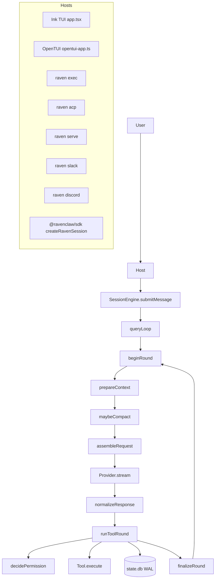
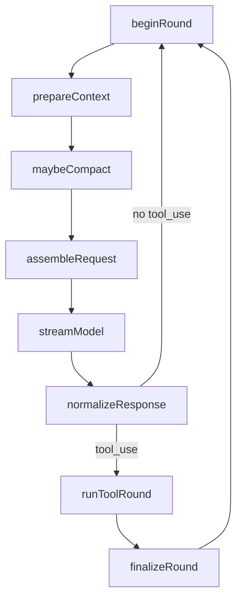
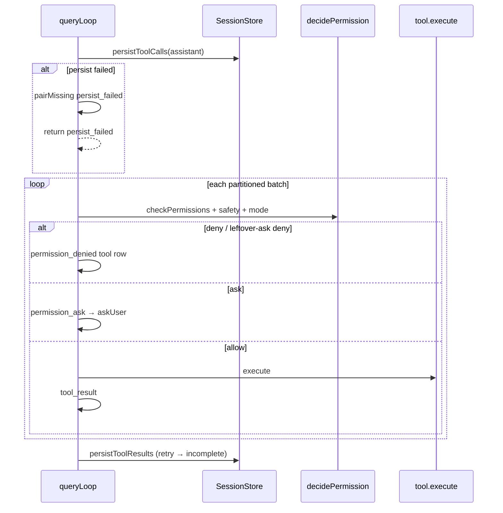
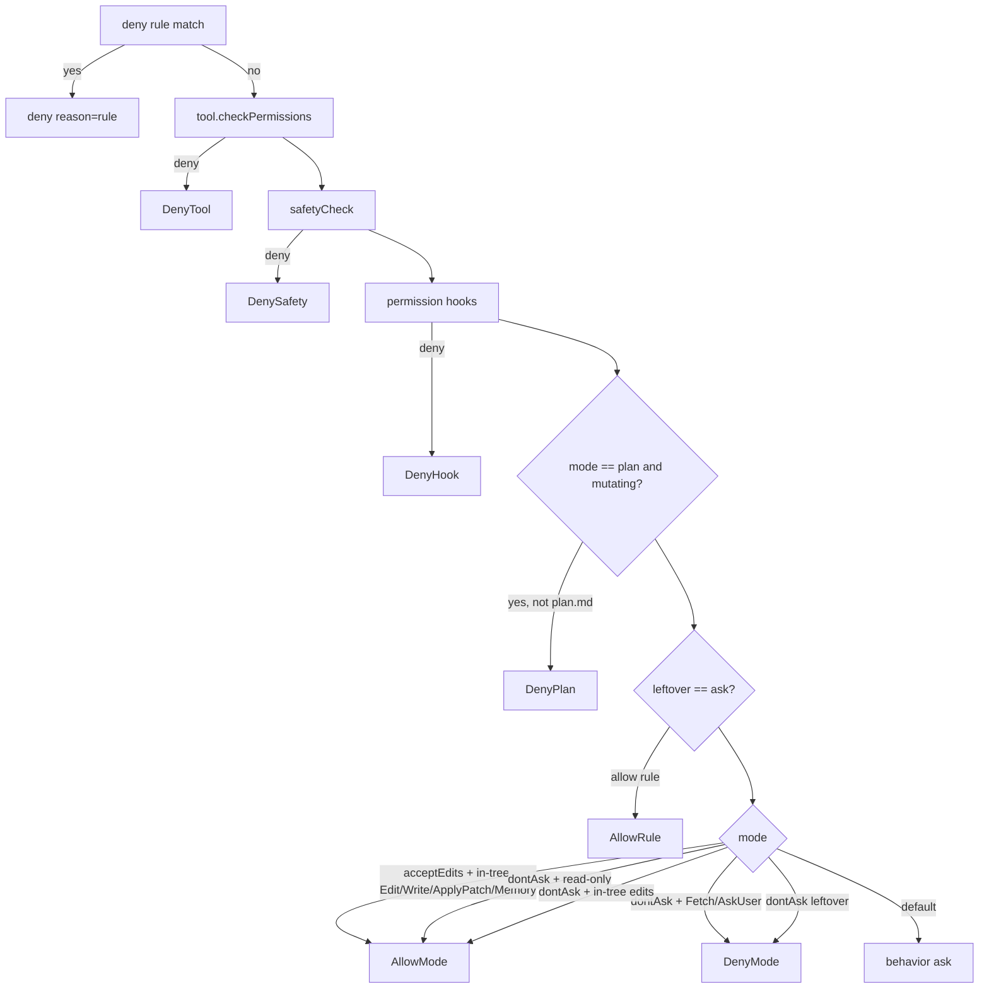

# RavenClaw architecture

한국어: [ARCHITECTURE.ko.md](ARCHITECTURE.ko.md)

RavenClaw is a Bun/TypeScript coding agent that reads and edits a workspace, runs a shell, and resumes after crash. It is bring-your-own-key (BYOK): there is no RavenClaw company backend, and the first public tag is BYOK-only. Hosts (Ink TUI, OpenTUI, `exec`, ACP, `serve`, Slack, Discord, SDK) do not reimplement the agent loop. They construct a `SessionEngine` and call `submitMessage`. Licensed Apache-2.0.

Related docs: [README.md](README.md), [SLASH_COMMANDS.md](SLASH_COMMANDS.md) ([한국어](SLASH_COMMANDS.ko.md)), [CONTRIBUTING.md](CONTRIBUTING.md), [docs/headless.md](docs/headless.md). Design notes live under `docs/superpowers/specs/` (implemented: [session-as-job](docs/superpowers/specs/2026-09-16-session-as-job-roadmap.md) at `ea56edd`, closeout `0ef1554`; [job-host state](docs/superpowers/specs/2026-09-17-job-host-state-roadmap.md) at `6e56764`; [rewind persist-before-reset](docs/superpowers/specs/2026-09-18-rewind-persist-and-todo-projection.md) at `048deff`; [cancel abort-pair / reset-on-resume / follow-up persist](docs/superpowers/specs/2026-09-18-cancel-reset-followup.md) at `5eefdde`; [no-job todo revert](docs/superpowers/specs/2026-09-18-no-job-todo-revert.md) at `be5a4a7`; [stream version / continuationToken](docs/superpowers/specs/2026-09-18-stream-version-token.md) at `c9c4871`; [keep-id `/clear`](docs/superpowers/specs/2026-09-18-keep-id-clear.md) at `edeb611`; [parent tree-stop](docs/superpowers/specs/2026-09-18-parent-tree-stop.md) at `9901d0e`; [rewind recovery / schema v11 / async `createSessionEngine`](docs/superpowers/specs/2026-09-20-rewind-recovery-v11.md); previous: [eve-inspired](docs/superpowers/specs/2026-09-15-eve-inspired-roadmap.md)). Prior-art research is in `docs/research/` ([eve](docs/research/eve-analysis.md), [y0](docs/research/y0-analysis.md)).

## Design invariants

These are product contracts. Do not soften them in hosts, tools, or docs.

1. **One `queryLoop`.** The turn loop lives in `packages/core/src/loop/query-loop.ts` and is assembled from phases in `packages/core/src/loop/phases.ts`. Hosts do not reimplement streaming, tool execution, compact, or pairing.

2. **Hosts only `submitMessage`.** The host-facing object is `SessionEngine` (`packages/core/src/loop/session-engine.ts`). A host may bind ask-user, drain a queue, or call `setModel` / `setPermissionMode` / `enqueueSteer`. It does not drive provider streams or persist tool rows itself.

3. **Persist-before-execute / pairing.** Every `tool_use` block must have a matching `tool` result before the next model request. The store is written *before* `tool.execute` runs (`runToolRound` in `phases.ts`). Crash mid-tools leaves durable incomplete/aborted/persist_failed texts, never an unpaired assistant.

4. **leftover-ask vs `dontAsk` vs `acceptEdits`.** There is no `bypass` / yolo / auto-allow-all-Bash mode. `dontAsk` is not bypass: leftover asks become denials, except in-tree `Edit` / `Write` / `ApplyPatch` and read-only tools. `Fetch` and `AskUser` stay denied under `dontAsk`. See `decidePermission` in `packages/core/src/permissions/pipeline.ts` and [docs/headless.md](docs/headless.md).

5. **Default tool prefix is small and frozen for the turn.** `assembleRequest` snapshots `frozenToolNames` on first use (`phases.ts`). Deferred tools (network when `tools.network` is off, MCP) are not on the wire until `ToolSearch` / `ToolCall`. The prefix does not grow mid-turn.

6. **Ads only on included-model sessions.** `@ravenclaw/ads` must not import `@ravenclaw/core`. The isolation test in `packages/ads/src/isolation.test.ts` forbids `@ravenclaw/core`, `ink`, and `react` in ads source. `hasPaidCapacityPlan` raises session caps; it does not silence ads.

7. **Clean-room.** Steal *contracts* from Claude Code, Freebuff, Hermes, and eve (one loop, adapters at the edge, leftover-ask, durable HITL / sandbox split). Never copy source or prompts. Builtin skills forbid the strings `Claude` and `Anthropic` (`packages/core/src/skills/builtin.test.ts`).

## Repository layout

Bun workspaces (`package.json` `"workspaces": ["packages/*"]`). Version is read from each package's `package.json` via `readPackageVersion` — do not hardcode `0.1.x` in source.

| Package | Path | Owns |
|---|---|---|
| `@ravenclaw/core` | `packages/core` | `queryLoop`, `SessionEngine`, tools, permissions, sessions (SQLite), MCP client, skills, agents, compact, cron store, prompt assembly, model catalog |
| `@ravenclaw/providers` | `packages/providers` | Anthropic Messages, OpenAI Chat Completions, OpenAI Responses, Ollama/vLLM (compat), optional included gateway |
| `@ravenclaw/ads` | `packages/ads` | Entitlement probe, house floor, feed fetch, dock layout, rotation. No core import |
| `@ravenclaw/sdk` | `packages/sdk` | `createRavenSession` — no Ink, ads, or CLI |
| `@ravenclaw/cli` | `packages/cli` | `raven` bin: Ink TUI, OpenTUI host, exec/acp/serve/slack/discord/pairing/cron |
| `@ravenclaw/tui-opentui` | `packages/tui-opentui` | Line-oriented StreamEvent view (`createOpenTuiView`) |
| `@ravenclaw/acp` | `packages/acp` | Agent Client Protocol JSON-RPC types + `createAcpServer` |

CLI depends on core, providers, ads, acp, and tui-opentui. SDK depends on core and providers only. Ads depends on nothing in the monorepo.

```
packages/
  core/src/
    loop/           query-loop, session-engine, phases, pairing, repair, abort, budget
    tools/          one file per tool + registry, parse (Ajv), partition
    permissions/    pipeline, modes, safety, rules, directories, hooks
    session/        sqlite-store, memory-store, rewind, file-history, search, deliveries
    prompt/         builder, memory, project-files, coding-posture, cache
    agent/          root + catalog specialists + disk load
    compact/        policy, prune, summarize
    mcp/            stdio/http/sse transports, tools, resources, oauth (per-server)
    skills/builtin/ eight SKILL.md trees
    cost/models.ts  CURRENT / BUILT_INS / ALIASES
    schedule/       cron parse + jobs.json store + claim-before-execute
    gateway/        loopback HTTP helpers + HMAC webhook (used by raven serve)
  cli/src/
    index.ts        main
    args.ts         parseArgv
    engine.ts       bootCli / openEngine / createRootTools
    app.tsx         Ink TUI
    opentui-app.ts  OpenTUI host
    exec.ts / serve.ts / acp-stdio.ts
    slack/  discord/  pairing.ts
```

## Runtime topology



Every host ends at the same waist. Slack and Discord are sibling CLI commands that share `createChatSessionHost` (`packages/cli/src/chat-host/session-host.ts`). They are **not** adapters plugged into `raven serve`.

## Boot path

Entry is `packages/cli/src/index.ts`. When `import.meta.main`, `main()` runs and `process.exit`s with the returned code.

1. **`parseArgv`** (`packages/cli/src/args.ts`) produces `{ cmd, flags, prompt, tui, json, … }`. `exec`, `smoke`, and `serve` force `flags.dontAsk = true`. Interactive default is Ink unless `--tui opentui`.

2. **Key-free commands** return before `bootCli`: `help`, `version`, `sessions`, `show`, `rm`, `search`, `export`, `title`, `doctor`, `config`, `init`, `setup`, `completions`, `mcp`, `skills`, `pairing`, and `cron` except `tick`/`watch`. See [CONTRIBUTING.md](CONTRIBUTING.md).

3. **Key-required commands** call `ensureHomeDir()` then `bootCli` (`packages/cli/src/engine.ts`):
   - Interactive / `resume` → `lockHolder: 'tui'`, `surface` defaults to `'interactive'`.
   - `exec` / `smoke` → `surface: 'headless'`, `lockHolder: 'exec'`.
   - `cron tick|watch` → `createSession: false`, `lockHolder: 'cron'`.
   - `serve` → `createSession: false`, `lockHolder: 'serve'`, `dontAsk`.
   - `slack` / `discord` → `createSession: false`, lock holders `'slack'` / `'discord'`.
   - `acp` → `createSession: false`, `lockHolder: 'acp'`, `surface: 'headless'`; leftover ask is forwarded to the editor unless `--dont-ask`.

4. **`bootCli`** then:
   - `ensureHomeDir()` creates `~/.ravenclaw/{skills,logs,tool-results}` (`packages/core/src/home.ts`).
   - `loadConfig({ home, flags })` (`packages/core/src/config.ts`).
   - `createSqliteStore(join(home, 'state.db'))`.
   - `resolveIncludedAccess` — first public release stays BYOK unless `included.enabled` is true **and** a gateway admits the session. Headless + `placementRequired` is forced BYOK so CI is not ad-funded.
   - `providerFromConfig` — included gateway or BYOK Anthropic / OpenAI-compat / Ollama / vLLM.
   - If `createSession !== false`, `openEngine` builds tools, system parts, MCP, hooks, lock, and `createSessionEngine`.

5. **`openEngine`** is the shared constructor for TUI, exec, ACP, serve, Slack, Discord, and cron fires. It:
   - Creates or reuses a `SessionRecord`.
   - `acquireSessionLock(session.id, { holderId, holderName })` unless `skipLock`.
   - `buildSystemParts({ cwd, permissionMode, bare, effort })`.
   - Builds one `TerminalBackend` (`local|docker`) and passes that same object to `createBashTool` and to Grep/Glob (`createGrepTool` / `createGlobTool` via `createSessionTools`). Docker kind needs an image; without image, search stays host `rg`/walk.
   - Loads MCP (`loadConfiguredMcpTools`) — a failed spawn is skipped, not fatal.
   - Merges local plugins (`loadLocalPlugins`) when the host did not pass an explicit tool list.
   - Loads file hooks unless `--bare`.
   - `createSessionTools` → optional `--json-schema` adds `StructuredOutput` → `--agent` filters via `filterChildTools` → `--add-dir` extra roots → `--allowed-tools` filter.
   - Attaches `sessionLock`, `verifyOnStop` (TUI on by default; exec/cron off unless flagged), `backgroundReview` (interactive + `review.background` + not `dontAsk` + not included).

Interactive TTY with no key runs `runFirstRun` and writes `~/.ravenclaw/.env`. `exec` and `acp` print `SETUP_HINT` instead of prompting.

## Hosts in detail

| Host | Command / entry | Lock holder | Permission default | Notes |
|---|---|---|---|---|
| Ink TUI | `raven` → `app.tsx` | `tui` | config (`default`) | Default UI |
| OpenTUI | `raven --tui opentui` → `opentui-app.ts` | `tui` | config | Line view |
| exec | `raven exec` | `exec` | **forced `dontAsk`** | One-shot; [docs/headless.md](docs/headless.md) |
| ACP | `raven acp` | `acp` | editor ask; `--dont-ask` optional | JSON-RPC on stdio |
| serve | `raven serve` | `serve` | `dontAsk` | Loopback HTTP + HMAC webhook |
| Slack | `raven slack` | `slack` | DM `default`, channel `dontAsk` | Socket Mode, allowlist |
| Discord | `raven discord` | `discord` | DM `default`, channel `dontAsk` | Gateway, pairing + ledger |
| pairing | `raven pairing` | n/a | n/a | Approve / revoke Discord DMs |
| SDK | `createRavenSession` | `sdk` | config or opt | No Ink / ads / CLI |

### Ink TUI (`packages/cli/src/app.tsx`)

Default host. React + Ink. Binds `runtime.ask` to `PermissionDialog`. Shift+Tab cycles `default → acceptEdits → plan → default` (`cyclePermissionMode`; `dontAsk` does not cycle). Escape / `/stop` abort the live turn. A second abort within 3s kills background tasks (`createSecondAbortGate`). Mid-turn typed text is queued (`message-queue.ts`); `/steer` calls `engine.enqueueSteer`. Transcript rendering windows to `TRANSCRIPT_WINDOW = 200` (`packages/cli/src/transcript.tsx`). Cron ticker every 15s (`fireDueJobs` + `fireCronJob`). Skill idle prune on the same timer. `AdDock` mounts only when `session.funding === 'included'`.

### OpenTUI (`packages/cli/src/opentui-app.ts`, `@ravenclaw/tui-opentui`)

Same `CliRuntime` and slash dispatch (`packages/cli/src/slash/dispatch.ts`). Renders via `createOpenTuiView` / `composerLine` / `permissionPromptLines` — a StreamEvent line view, not Ink. Included ads are printed as dock lines (`loadIncludedDockLines`) when funding is `included`.

### `raven exec`

`packages/cli/src/exec.ts` drains `engine.submitMessage(prompt)` and writes `text_delta` (or JSONL StreamEvents with `--json`). `args.ts` forces `dontAsk`. That is leftover-ask → deny, not bypass. In-tree `Edit`/`Write`/`ApplyPatch` proceed; leftover Bash is denied unless `.ravenclaw/permissions.json` (or user/session rules) allows it. `--tools-preset ci` only puts Bash in the pool. See [docs/headless.md](docs/headless.md).

`verifyOnStop` is **off** for exec/cron unless `--verify-on-stop` (or a cron job's `verifyOnStop: true`). TUI turns it on.

### `raven acp`

`packages/cli/src/acp-stdio.ts` + `@ravenclaw/acp`. JSON-RPC 2.0 on stdin/stdout. Methods (`packages/acp/src/protocol.ts`): `initialize`, `session/new`, `session/load`, `session/prompt`, `session/cancel`, plus server→client `session/update` and `session/request_permission`. Permission timeout stops the in-process waiter and **does not persist deny** (same law as Slack/Discord durable rows). Interactive ACP defaults to editor ask (`askUserHost: true`); `--dont-ask` leaves leftover asks as denials. `session/new` can overlay MCP servers and cwd/model. ACP is a host: it still goes through `openNewSession` / `resumeRuntime` → `SessionEngine`.

### `raven serve`

`packages/cli/src/serve.ts`. Requires `GATEWAY_SECRET` or `RAVEN_SERVE_SECRET`. Binds loopback only: `127.0.0.1`, `localhost`, or `::1`. Non-loopback `--listen` is rejected (`serve binds loopback only`). Default `127.0.0.1:8787`.

- `GET /health` → `{ ok: true }`
- `POST /v1/turn` — `Authorization: Bearer <secret>` (`checkBearer` in `packages/core/src/gateway/http.ts`). Body `{ text, sessionKey? }`. Runs `runExec` with `closeEngine: false`. Session map is `$RAVENCLAW_HOME/gateway/sessions.json`.
- `GET  /v1/session/:id` — reconnect snapshot `{ id, title?, job?, jobAutoCommit, pendingAsks, lastSeq, permissionMode, live, lastEnd?, jobError?, queued, version: 1, continuationToken }` (Bearer). Reads `store.loadSession` only (does not `createSessionEngine` / does not reset). 404 if unknown (does not create). `live` is true only when a cached `liveRuntimes` engine has `liveTurnId() !== null`. `jobAutoCommit` is always a boolean. `queued` is the one-slot follow-up text or `null`. `lastEnd` / `jobError` appear when set on the session. `version` is the serve-wire protocol (`1`). `continuationToken` is an opaque tip handle (`base64url({ v:1, s, q })`) for the same cursor as `lastSeq`. `?version=` fail-closes unknown/malformed values (400). `?after=` / `?continuationToken=` on the snapshot are ignored.
- `GET  /v1/session/:id/stream` — NDJSON `{ version: 1, seq } & StreamEvent` (Bearer). Omit `after` and `continuationToken` for a live tail. `?after=<seq>` replays `seq > after` then tails. `after=0` replays from the start. `?continuationToken=` is the host-facing alias for the same cursor (`after=q`). Both resume keys on one request → 400 `resume conflict`. `?version=` fail-closes unknown/malformed values. Closing the stream is detach, not cancel.
- `POST /v1/session/:id/submit` — `{ text }` → `submitMessage({ text, turnPolicy: 'queue' })`, **202** `{ accepted, sessionId }`. Missing sessions are created with the **default** permission mode (not `dontAsk`). After the turn ends, serve may `runFollowupAfterSubmit` (in-process one-slot epilogue; skip if this submit did not write `lastEnd`).
- `POST /v1/session/:id/resolve` — `{ callId, allow }` settles a live waiter first, else `applyAskAnswer`. Crash-resolve **pairs only**.
- `POST /v1/session/:id/cancel` — optional body `{ turnId? }`. Stale `turnId` while the parent is live → **200** `{ ok: true, status: 'no_active_turn' }` (reconnect guard; no walk). Live parent (`turnId` omitted or matching) → `abort('cancel')`, **202** `{ ok: true }` without joining `whenTreeStop`. Live cancel is tree-stop of descendants; this session’s leftover-asks abort-pair in the cancelled epilogue (I2). Idle parent with this-session leftover-asks and/or descendant leftover-asks / in-process descendant live turns is **200** `{ ok: true }` after `whenTreeStop()`. Idle parent with no work is **200** `{ ok: true, status: 'no_active_turn' }`. `abort('interrupt')` abort-pairs this session only (not tree-stop). Stream emits `cancelled, ask still pending` only if an owned unpaired row remains after this session’s I2 and the tree-stop walk (cancel path; not aborted). Spec: [`2026-09-20-leftover-ask-abort-pair.md`](docs/superpowers/specs/2026-09-20-leftover-ask-abort-pair.md).
- `POST /v1/session/:id/compact` — `compactNow()` (queues if `liveTurn !== null`).
- `POST /v1/session/:id/clear` — awaits `engine.clearKeepId()`. **200** `{ ok: true, notice: 'session cleared' }` or **200** `{ ok: false, notice }` (engine string as-is). Empty body OK; invalid JSON 400 `{ error: 'invalid json' }`. Unknown session 404; does not mint. Not 202/204. Not tree-stop (`/cancel` still owns `abortCachedDescendants` / `whenTreeStop`). Spec: [`2026-09-20-http-post-clear.md`](docs/superpowers/specs/2026-09-20-http-post-clear.md).
- `POST /v1/session/:id/pr` — optional `{ title, body }` → draft PR from the session shadow (default off; never a model turn). 200 `{ ok, notice, snapshot? }`. Missing job or dirty tree is a notice, not 5xx.
- `POST /v1/session/:id/followup` — `{ text }` → one-slot `setFollowup` (persist-then-assign); 200 `{ ok: true, queued }` or 400. `DELETE …/followup` clears the same way; 200 `{ ok: true, queued: null }`. Not `/queue`, not `SuggestFollowups`.
- `POST /v1/session/:id/edit` — `{ text }` → `rewindLast()` then `submitMessage`. Empty text → 400. Rewind refuse → 200 `{ ok: false, notice, droppedText? }`. Success → **202** `{ accepted, sessionId, droppedText? }` then fire-and-forget submit (same follow-up epilogue as `/submit`).
- `GET  /v1/session/:id/diff` — finishes a pending job rewind reset first (`maybeFinishRewindReset`), then read-only job range: `baseCommitSha...HEAD` ∪ dirty via `jobDiff`. 200 `JobDiff` (`ok: true`, files with `create|update|delete|rename`) or `{ ok: false, notice }` (no job / git fail). Not a model turn. GET snapshot does not reset.
- `POST /v1/turn` stays dontAsk one-shot. Opening a session via `/v1/turn` first stamps `dontAsk`, so leftover-ask on that session is deny. No `?after=` / `?version=` / `?continuationToken=` on `/v1/turn` (query ignored).
- `POST /webhooks/<route>` — `X-Raven-Signature: t=<unix>,v1=<hmac>` (`verifyWebhookSignature`, 300s skew). Fire-and-forget 202. Webhook sessions are restricted to `safeWebhookToolNames()`: `Read`, `Grep`, `Glob`, `Fetch`, `WebSearch` (`packages/core/src/gateway/webhook.ts`).

Mailbox poller every 15s wakes a live engine with `[mailbox]` if `peekAgentMail` is non-empty. Slack and Discord are **not** serve adapters.

### `raven slack`

`packages/cli/src/slack/run.ts`. Requires `slack.enabled: true` plus `appToken` (`xapp-`) and `botToken` (`xoxb-`) in `config.yaml` (or env refs). Socket Mode (`packages/cli/src/slack/socket.ts`) — no public URL. `admitSlackEvent` (`slack/admit.ts`): bots/subtypes ignored; `allowFrom` is a hard allowlist; DMs always ok if allowlisted; channels must be in `channels`; `mentionOnly` defaults true. Lock holder is `'slack'`. DMs use `default` (leftover-ask: allow/deny buttons, `SLACK_PERMISSION_TIMEOUT_MS = 120_000`); channels use `dontAsk`. Shared `createChatSessionHost`. Inbound is Socket Mode (app token), not Slack signing-secret HMAC. Non-DM session keys are `raven:slack:<team>:<channel>:<threadTs||messageTs>` (the adapter always passes `threadId`).

### `raven discord`

`packages/cli/src/discord/run.ts`. Requires `discord.enabled: true` and `DISCORD_BOT_TOKEN`. Discord Gateway (`discord/gateway.ts`), not a webhook. Admit (`discord/admit.ts`): bots/empty ignored; allowlist **or** pairing-approved user; unapproved DMs return `pair-dm` (a 6-digit code, 10-minute TTL); channels must be listed; `mentionOnly` defaults true.

Inbound delivery ledger (`packages/core/src/session/deliveries.ts`, migration `004_deliveries.sql`): `deliveryKey('discord', messageId)` is `INSERT OR IGNORE`; duplicates are dropped. GC TTL 24h. Lock holder `'discord'`. DMs `default`, guild channels `dontAsk`. Permission asks: guild `askUser` is immediate deny; durable DMs do **not** timer-deny; the `pending_asks` row remains (`DISCORD_PERMISSION_TIMEOUT_MS` stops the in-process waiter only). Combined with channel `dontAsk`, leftover-ask never reaches a human in a guild.

### `raven pairing`

`packages/cli/src/pairing.ts`. Files `$RAVENCLAW_HOME/pairing.json` and `pairing-pending.json` (mode `0600`). Platform today is Discord only.

```
raven pairing                  # list approved + pending
raven pairing approve <code>
raven pairing revoke discord <userId>
```

Unapproved DM reply is `pair with: raven pairing approve <code>`.

### `@ravenclaw/sdk` (`packages/sdk/src/index.ts`)

`createRavenSession({ cwd, home?, provider?, store?, tools?, askUser?, flags?, permissionMode?, session?, messages? })` returns `{ engine, store, provider, config, submit, close }`. No Ink, ads, or CLI. Default `askUser` is deny. Default store is `$RAVENCLAW_HOME/state.db`; pass `'memory'` for `createMemoryStore`. Funding is always `'byok'` — the included gateway is a CLI concern (`byokProviderFromConfig` comment).

**SDK `createRootTools` is a smaller pool than the live CLI root.** Verified against current `packages/sdk/src/index.ts`:

| In SDK `createRootTools` | Not in SDK `createRootTools` (exist in core / CLI live root) |
|---|---|
| `Read`, `Grep`, `Glob`, `ListDir`, `ReadSubtree` | `NotebookEdit` |
| `Edit`, `Write`, `ApplyPatch` | `TaskSteer` |
| `Bash`, `Skill`, `TodoWrite` | `AddDir` |
| `SessionSearch`, `Memory` | `LSP` |
| `TaskOutput`, `TaskStop` | `EnterWorktree`, `ExitWorktree` |
| `AskUser`, `SetOutput` | |
| Cron create/list/remove/setEnabled | |
| `EnterPlanMode`, `ExitPlanMode` | |
| `Fetch` / `WebSearch` only if `network` | |

`createSessionTools` then adds deferred `Fetch`/`WebSearch` + `ToolSearch`/`ToolCall` when network is off, and `createAgentTool`. Hosts that need TaskSteer / AddDir / LSP / worktree / NotebookEdit must pass their own `tools` or use the CLI.

## SessionEngine

`createSessionEngine` in `packages/core/src/loop/session-engine.ts` is `async` and returns `Promise<SessionEngine>`. When `job.pendingResetSha` is set, construct awaits `maybeFinishRewindReset` (reset-fail does not throw). Live state (not a Redux store — closures):

| Field | Role |
|---|---|
| `session` | `SessionRecord` (id, cwd, model, permissionMode, usage, compactGeneration, funding, title, prePlanMode) |
| `messages` | In-memory transcript; replaced from `turn.messages` after each `queryLoop` |
| `model` | `ModelProfile` used on the **next** `submitMessage` |
| `system` | `SystemPart[]` (stable / context / volatile) |
| `tasks` | `TaskRegistry` (background Bash + Agent) |
| `fileHistory` | Per-session undo snapshots under `$RAVENCLAW_HOME/file-history/<id>/` |
| `steering` | Texts from `enqueueSteer`, drained into mid-turn hints |
| `liveTurn` | The in-flight `Turn`, or `null` |
| `lifecycle` | Hooks from `hooks.json`, or a no-op when `bare` |

### `submitMessage`

Accepts a string or `{ text?, images? }`. Sequence:

1. Cancel any detached background review.
2. Renew the session lock if present; start a 30s renew timer (`SESSION_LOCK_RENEW_MS`).
3. First call: `SessionStart` hook.
4. `UserPromptSubmit` hook — `preventContinuation` can stop the turn (`hook_stopped` or `completed`).
5. Append user message; `fileHistory.beginTurn()`.
6. Drain agent mailbox into the user text (`[mailbox]\n…`).
7. `persistUser` — on failure, re-enqueue mailbox notices and throw. The user row is not left half-written.
8. Auto-title from the first 50 chars of the first line if untitled.
9. Every 10 user turns, inject `MEMORY_NUDGE` (`consider Memory`).
10. `yield* queryLoop(loopOpts)`.
11. After `completed` with `turn.round >= 10` (`shouldNudgeLearn`), inject `LEARN_NUDGE` (`consider /learn`).
12. Upsert session (usage, compactGeneration, permissionMode, cwd).
13. Optionally start persist-detached background review (Memory/Skill/Read/Grep only, `dontAsk`, memory store, max 8 rounds, `askUser` deny). Cancelled on the next `submitMessage` / `abort` / `close`.

`finally`: `fileHistory.endTurn()`, `liveTurn = null`, stop lock renew.

### Other methods

- **`setModel(profile)`** writes `session.model = profile.id`, replaces the engine's `model` binding, upserts. The in-flight `queryLoop` already closed over the previous `model` / `turn.model`. Next turn picks up the new window, prices, and `supportsThinking`. `/model` in the TUI calls this after `getModelProfile`.
- **`setPermissionMode(mode)`** updates session + live turn (so leftover asks in this turn see the new mode), tracks `prePlanMode` when entering/leaving `plan`, and rewrites the volatile system line via `applyPermissionMode`.
- **`enqueueSteer(text)`** pushes onto `steering`. Drained in `prepareContext` and `finalizeRound` through `injectMidTurnHint` (the only mid-turn writer).
- **`bindDrainQueued(fn)`** — host `/queue`. At most one queued prompt is injected after each tool batch (`finalizeRound` → `injectQueued`).
- **`compactNow()`** runs autocompact on live or stored messages (LLM summary if `compact.llmSummarize`, else `mechanicalSummary`). May run during a live turn.
- **`clearKeepId()`** keeps `session.id` and the live engine. Refuses unpaired child leftover-asks (`pending permission ask`) before abort. If `liveTurn` is set, `abort('cancel')`s and waits for idle, then persist-first `store.clearConversation` (inactivate via `recordCompact` summary `'clear'`, delete this session’s pending asks and stream events, drain this id’s mail, upsert wiped fields). Persist fail leaves memory unchanged (`clear persist failed`). Success notice is `session cleared`. Job, worktree, lock, MCP, children, permission mode, and funding stay. Serve `POST /v1/session/:id/clear` calls this method. Hosts must still not call `openNewSession` / `close` / `mcpCloser` on this path.
- **`rewindLast()`** refuses if `liveTurn`, a running Agent task, or unpaired pending asks exist. Returns `{ ok, notice, droppedText? }` (prior last-user text when a turn was dropped). Awaits `maybeFinishRewindReset` first when `job.pendingResetSha` is set. **Job sessions** (`session.job`) call `rewindToCheckpoint`: persist compact `rewind` for dropped ids, upsert `job.pendingResetSha` to the target sha, then `git reset --hard` in the job worktree to the nearest earlier assistant checkpoint sha (or `baseCommitSha`), restore that todo snapshot onto `session.todos`, clear `pendingResetSha`, and re-project `.ravenclaw/todo.json` under `originalCwd ?? cwd`. Persist fail leaves HEAD and the last user. Reset fail after the flag is written keeps `pendingResetSha` and sets `jobError`; construct / `submitMessage` / `rewindLast` / host `/diff` finishes it. Compact + flag are one SQLite write (`recordCompactAndUpsertSession`); a combined-write throw does not `git reset`. `createSessionEngine` is async and recovers when the flag is set; GET snapshot does not attach an engine. Projection fail is a notice suffix (`ok` stays true). **No-job sessions** call `rewindLastTurn`: persist a compact boundary for dropped ids, `fileHistory.undo()`, drop the last user turn, then restore `session.todos` from the last remaining assistant `todoSnapshot` (sha-less stamp; omit `commitSha`) and re-project `.ravenclaw/todo.json` under `session.cwd`. Persist-first on the session row. Legacy assistants without a checkpoint leave todos unchanged. First-turn rewind with no remaining assistant sets `[]`. Projection fail is a notice suffix (`ok` stays true). `/undo` stays file-only. Serve `POST …/edit` and TUI `/retry` compose rewind then `submitMessage` (or restore the composer).
- **`setFollowup` / `clearFollowup` / `getFollowup`** — one next-turn slot on `session.followup` (schema v10). `writeFollowup` persists (`upsertSession`) before assigning memory. Hosts call `runFollowupAfterSubmit` after a real turn ends (persisted `lastEnd` only; owned leftover-asks skip); serve exposes `POST/DELETE …/followup` and GET `queued`.
- **`reloadSystem(next)`** replaces `system` for the next assemble. `/reload` rebuilds parts and calls this.
- **`abort(kind?)`** cancels background review and `abortTurn(liveTurn.abort)`. Serve cancel passes `'cancel'` (vs `'interrupt'` for steer). `abort('cancel')` is tree-stop of descendants and abort-pairs this session’s leftover-asks whether or not `liveTurn` is set. Live cancel owns this-session I2 in the cancelled epilogue; idle cancel starts leftover flight. Persist of leftover-flight and tree-stop rows starts when `whenTreeStop()` is awaited. `whenTreeStop()` returns `{ descendantWork, thisSessionWork }`. `abort('interrupt')` abort-pairs this session only (not tree-stop; parent interrupt leaves a parked child leftover-ask). Idle this-session I2 invents no `lastEnd`. Stream emits `cancelled, ask still pending` only if an owned unpaired row remains after cancel I2 + tree-stop (not on aborted). Optional `liveTurnId()` backs the serve `turnId` guard. Spec: [`2026-09-20-leftover-ask-abort-pair.md`](docs/superpowers/specs/2026-09-20-leftover-ask-abort-pair.md).
- **`close({ releaseLock? })`** fires `SessionEnd` once, then `releaseSessionLock` unless `releaseLock: false` (child agents use that).

Lock holders (`SessionLockHolderName`): `'tui' | 'serve' | 'exec' | 'cron' | 'acp' | 'sdk' | 'slack' | 'discord'`. TTL 120s, renew 30s. One live writer per session id — a second holder gets `SessionLockError`. Same `holderId` may re-acquire. Stale locks are stealable.

## queryLoop phases

`queryLoop` (`packages/core/src/loop/query-loop.ts`) is a `while (true)` over eight phases. Each phase returns `{ action: 'continue' | 'break' | 'return', end? }`.



### `beginRound`

Abort → `{ reason: 'aborted' }`. If the previous round used tools and `round >= maxRounds` and grace is unused, enter grace (one last no-tools reply) via `shouldEnterGrace` (`packages/core/src/loop/budget.ts`). Else if `round >= maxRounds` → `max_rounds`. Otherwise increment `round`, reset pending buffers, yield `round_start`.

Default `maxRounds` is 80 (`defaultConfig`). Child agents use `childMaxRounds` (default 30) or the catalog definition.

### `prepareContext`

`repairRoleAlternation` on `turn.messages`. Newly inserted incomplete tool rows are persisted. Then `injectSteering()` (drain `enqueueSteer`).

### `maybeCompact`

Policy in `packages/core/src/compact/policy.ts`. Cheap first: `applyToolResultBudget` (Bash results over 100k chars become a preview) then `microcompact` (clears old Read/Grep/Glob/Bash/Agent results outside the protected tail). If still over threshold and LLM summarize is on, `compactSummary` + `runAutocompact`. Three consecutive failures + hard limit → `context_full`. Reactive compact also runs from `streamModel` on 413 / "prompt too long".

### `assembleRequest`

Grace suffix: `This is the last round; answer the user now. Do not call tools.` and `tools: []`. Non-thinking models drop `thinking` blocks. **Prefix freeze:** first call snapshots `filterToolsForTurn(state.tools, turn)` into `turn.frozenToolNames`. Later rounds reuse that list even if MCP refresh appended deferred tools. Skill `allowed-tools` frontmatter further filters the snapshot (`filterToolsForTurn` in `packages/core/src/tools/skill.ts`). Always-on despite a skill allow-list: `Skill`, `EnterPlanMode`, `ExitPlanMode`, `Agent`, `ToolCall`, `ToolSearch`.

`maxTokens` is `model.reserveOutputTokens` until output-token escalation.

### `streamModel`

Up to 8 tries, 500ms exponential backoff + 25% jitter. Auth 401/403 is not retryable. On abort, set `streamAborted` and continue to `normalizeResponse` (which pairs). On context overflow: one reactive compact, then `context_full`. On retryable error: if `fallbackModel` is set and unused, switch `turn.model` + `getModelProfile` and retry (`fallbackUsed`).

**Output-token escalation:** if the stop reason looks like max_tokens / length, there are no tool calls, and escalation has not run, bump `maxTokens` to `min(64_000, contextWindow - 1000)` and retry the stream.

Yields `text_delta`, `thinking_delta`, `tool_call`, `usage`, `stop`, and status lines (`output truncated; escalating`, `fallback model …`).

### `normalizeResponse`

Builds the assistant message from pending text / thinking / tool_calls.

**Abort path:** persist tool_use if any, `pairMissing(..., 'aborted')`, return `aborted`. Partial text-only assistant is kept in memory.

**Empty-completion ladder** (no tool_use, not aborted) — each step uses `applyMidTurnHint` → `injectMidTurnHint`:

| Condition | Cap | Status | Hint |
|---|---|---|---|
| Truncated stop | 3 | `output truncated; continuing` | Continue from where you left off |
| Thinking-only (empty text, non-empty thinking) | 2 | `thinking-only; continuing` | Continue with visible text |
| Empty text | 3, or 1 if estimated cost > $0.25 | `empty completion; retrying` | Continue the task. Do not apologize |
| Identical empty fingerprint as last empty | — | stop retrying | — |
| Grace used | — | return `max_rounds` | — |
| `jsonSchema` set and no `SetOutput` | 2 | `structured output required` | Call StructuredOutput now |
| `verifyOnStop` and files mutated without a test/lint Bash | 2 | `verify on stop; retrying` | Run the project's test or lint command |
| Stop hook `preventContinuation` | — | `hook_stopped` | — |
| Stop hook message on `completed` | 1 | `stop hook; continuing` | hook message |

Identical-fingerprint empty replies do not burn another nudge. Empty assistant rows with no persistable content are dropped (`persistAssistantOnce`).

`injectMidTurnHint` (`packages/core/src/prompt/cache.ts`) is the **only** mid-turn writer. It suffixes the last tool text, else the last assistant text, else appends a user row.

### `runToolRound` — persist-before-execute



1. Push assistant if missing.
2. `persistToolCalls`. On failure: in-memory `pairMissing(..., 'persist_failed')`, return `{ reason: 'persist_failed' }`. **The tool is not executed.**
3. Load permission rules (session + `~/.ravenclaw/permissions.json` + `.ravenclaw/permissions.json`).
4. `partitionToolCalls` (`packages/core/src/tools/partition.ts`): serial tools alone; concurrency-safe tools in parallel up to 8; mutating file tools on the same path do not share a batch. Parallel batches get a 300s merged abort.
5. `executeOneCall`: resolve name (including `Task`→`Agent` and other aliases in `TOOL_NAME_ALIASES`), parse (Ajv), `PreToolUse` lifecycle, `decidePermission`, serialized `askUser` (one dialog at a time), stall check, `execute`, `PostToolUse`. `interruptBehavior() === 'block'` (Read, AddDir) ignores cancel during execute.
6. After all batches: `refreshTools()` may append newly ready MCP tools (`appendDeferredMcpTools`) — they stay off the frozen prefix.
7. If abort: persist results, return `aborted`.

**Stall detection:** same `name + stableJson(input) + resultText` three times → next identical call returns `stall: same tool+args+result repeated 3 times; change approach.` without executing.

**ToolCall bridge:** `ToolCall` is on the frozen prefix. Its target must *not* be on the prefix (`toolCallTargetText`). That is how deferred MCP / network tools run without growing the default schema.

### `finalizeRound`

`persistResultsWithRetry`: first `persistToolResults`; on failure write `pairMissing(..., 'incomplete')` and return `results_persist_failed`. Then inject at most one queued host prompt and any steers.

## Pairing / persist-before-execute

`packages/core/src/loop/pairing.ts`. Invariant: every `tool_use.id` has a `tool` message with that `toolUseId` before the next provider request.

| Reason | Constant | Text | When |
|---|---|---|---|
| `incomplete` | `INCOMPLETE_TEXT` | `incomplete: the process ended before this tool result was saved. The tool was not re-run.` | persist of real results failed; `loadSession` / `repairRoleAlternation` repair |
| `tools_omitted` | `TOOLS_OMITTED_TEXT` | `tools_omitted: tools were disabled on the final round; the call was not executed.` | grace + pending tool_use |
| `aborted` | `ABORTED_TEXT` | `aborted: the turn was interrupted before this tool finished.` | abort / askUser throw / leftover after abortRest |
| `persist_failed` | `PERSIST_FAILED_TEXT` | `persist_failed: the tool call could not be saved; it was not executed.` | `persistToolCalls` failed |

`resumeSession` (`packages/core/src/session/resume.ts`) calls `loadSession` then **throws** if any unpaired `tool_use` remains. `loadSession` itself is the repair path (see Sessions).

Aliases so models that emit Claude/Hermes names still resolve: `Task`→`Agent`, `read_file`→`Read`, `write_file`→`Write`, `search_files`→`Grep`, `list_dir`→`ListDir`, `list_files`→`Glob`.

## Permissions

`decidePermission` (`packages/core/src/permissions/pipeline.ts`):



### Modes

| Mode | Leftover-ask becomes | In-tree Edit/Write/ApplyPatch | Mutating Bash | Plan file `.ravenclaw/plan.md` |
|---|---|---|---|---|
| `default` | host `askUser` | ask (unless rule) | ask (unless clearly read-only) | ask |
| `acceptEdits` | still ask (except promoted edits) | **allow** | ask | allow if Edit/Write of plan file |
| `plan` | deny mutating (except plan file + ExitPlanMode) | deny | deny | **allow** Edit/Write of that one path |
| `dontAsk` | **deny** | **allow** | deny unless allow rule or `isReadOnlyBashCommand` | allow as in-tree write |

`dontAsk ≠ bypass`. `Fetch` and `AskUser` are explicitly denied under `dontAsk` even though they are otherwise read-only. `ExitPlanMode` is exempt from the dontAsk leftover-deny so a plan can be accepted.

Clearly read-only Bash (`isReadOnlyBashCommand` in `packages/core/src/tools/bash.ts`): `ls`, `echo`, `pwd`, `true`, `false`, `date`, `whoami`, `uname`, `cat`, `head`, `tail`, `wc`, `which`, `type`, and `git status|log|diff|show|rev-parse|branch` — no pipes/redirects/substitution. Dangerous patterns (`rm -rf /`, `curl | sh`, `dd`, `mkfs`, fork bomb) always ask. Destructive git (`push --force`, `reset --hard`, `clean -f`, `--no-verify`) asks with an extra note.

### `safetyCheck` hard-denies

`packages/core/src/permissions/safety.ts`, for `Edit` / `Write` / `ApplyPatch` only:

- any path whose components include `.git`
- credential files: `*.pem`, or `id_*` under `.ssh`
- shell rc: `~/.bashrc`, `~/.zshrc`, or a basename of those

These run after `checkPermissions` and cannot be allow-ruled away.

### Extra roots

`--add-dir <path>` (repeatable) and the `AddDir` tool add directories to `turn.additionalDirectories`. `isInTreePath` then treats them like cwd for acceptEdits / dontAsk promotion.

**`/add-dir` is notice-only.** `packages/cli/src/slash/dispatch.ts` prints `this slash does not add a root; use the AddDir tool or --add-dir`. It does not call `addDirectory`.

**`/team-onboarding` (`/onboard`)** runs a frozen prompt plus mechanical `scanTeamOnboarding` JSON (`packages/core/src/onboarding/scan.ts`). **`/interview`** injects `INTERVIEW_PROMPT`. Neither is a second loop.

### Hooks

Two layers, both skipped when `--bare` / `engineOpts.bare`:

1. **Lifecycle** (`packages/core/src/hooks/lifecycle.ts`) — `~/.ravenclaw/hooks.json` and `<cwd>/.ravenclaw/hooks.json`. Events: `PreToolUse`, `PostToolUse`, `UserPromptSubmit`, `SessionStart`, `SessionEnd`, `Stop`. Commands receive JSON on stdin, 5s timeout, shell. `PreToolUse` may `preventContinuation` (deny the tool) or `updatedInput`. `PostToolUse` `preventContinuation` aborts the rest of the batch after recording a successful result. `Stop` may nudge once or stop (`hook_stopped`).

2. **Permission hooks** (`loadFileHooks` → `PreToolUse` only) feed `decidePermission`. `behavior: deny` wins; `behavior: allow` can promote a leftover-ask.

`--bare` also skips MEMORY/USER load in `buildSystemParts`.

## Tools

Registry: `createToolRegistry` (`packages/core/src/tools/registry.ts`) — last register wins on name collision. Parse: `parseWithSchema` (`packages/core/src/tools/parse.ts`) compiles Ajv validators into a `WeakMap<object, ValidateFunction>` so each schema object is compiled once.

### Default root prefix

`rootAgent.toolNames` in `packages/core/src/agent/root.ts` is the catalog list. CLI `createRootTools` / `createSessionTools` (`packages/cli/src/engine.ts`) is what a live TUI/exec session actually constructs.

| Name | In `root.ts` | On the wire by default | Notes |
|---|---|---|---|
| `Read` | yes | yes | Streams after 256 KiB (`STREAM_AFTER = 256_000`) |
| `Grep` | yes | yes | Shares Bash’s `TerminalBackend`. Docker kind: one `backend.exec` (POSIX walker in the container); fail-closed (`Grep failed:`; no host `rg`/walk fallback). Turn abort throws `AbortError` / `ABORTED_TEXT`. Local omit/`kind !== 'docker'`: host `rg` / `walkFiles`. |
| `Glob` | yes | yes | Same port as Grep. Docker: one exec; fail-closed (`Glob failed:`); abort → `AbortError` / `ABORTED_TEXT`. Local: host `walkFiles`. |
| `ListDir` | yes | yes | |
| `ReadSubtree` | yes | yes | |
| `Edit` | yes | yes | Snapshots via FileHistory |
| `Write` | yes | yes | |
| `ApplyPatch` | yes | yes | |
| `NotebookEdit` | yes | yes (CLI) | Not in SDK `createRootTools` |
| `Bash` | yes | yes | `run_in_background` → TaskRegistry |
| `Skill` | yes | yes | |
| `Fetch` | yes | only if `tools.network` | else deferred |
| `WebSearch` | yes | only if `tools.network` | else deferred |
| `TodoWrite` | yes | yes | `.ravenclaw/todo.json` |
| `TaskOutput` / `TaskStop` / `TaskSteer` | yes | yes (CLI; SDK omits Steer) | Steer is Agent-only |
| `AskUser` | yes | yes | Headless default deny |
| `SessionSearch` | yes | yes | FTS5 |
| `Memory` | yes | yes | USER.md / MEMORY.md |
| `SetOutput` | yes | yes | Child structured result |
| `AddDir` | yes | yes (CLI) | Not in SDK |
| `ToolSearch` / `ToolCall` | yes | when anything is deferred | Frozen prefix; Call targets must be off-prefix |
| `LSP` | yes | CLI pool; **off the wire** until `.ravenclaw/lsp.json` | Not in SDK |
| `EnterWorktree` / `ExitWorktree` | yes | CLI pool; **off the wire** until git worktree / session worktree | Session-level worktree |
| `CronCreate` / `CronList` / `CronDelete` / `CronSetEnabled` | yes | CLI pool; **off the wire** until `~/.ravenclaw/cron/jobs.json` | |
| `Agent` | yes | yes | Nested `createSessionEngine` |
| `EnterPlanMode` / `ExitPlanMode` | yes | yes | |

`--allowed-tools` / `--tools-preset` / `--agent` can shrink this. Plan tools stay when the allow-list is applied (`filterToolsByAllowList`).

### Exist in the tree, **not** in the default root prefix

| Tool | File | Why it is parked |
|---|---|---|
| `Sleep` | `packages/core/src/tools/sleep.ts` | Exported from core; not wired into `createRootTools` |
| `ThinkDeeply` | `packages/core/src/tools/think-deeply.ts` | Same |
| `SuggestFollowups` | `packages/core/src/tools/suggest-followups.ts` | Same |
| `TaskCreate` / `TaskGet` / `TaskList` / `TaskUpdate` | `packages/core/src/tools/task-v2.ts` | Disk task list (`.ravenclaw/tasks.json`), not the background Task* trio |
| `StructuredOutput` | `createStructuredOutputTool` | Only when `--json-schema` is set |

`modes.ts` still classifies several of these as read-only or mutating so a future wire-up does not surprise the pipeline.

### Read streaming

`packages/core/src/tools/read.ts`: files larger than 256_000 bytes (and not image / office / `.ipynb`) are **not** `readFileSync`'d. `streamUtf8LineWindow` walks lines. Images (png/jpeg/gif/webp) cap at 512_000 bytes and return `IMAGE::mediaType::base64`, which `makeToolMessage` turns into an image block. Output text is capped around 100_000 characters. Binary (NUL in first 8 KiB) is rejected.

### Bash background + Task*

`createBashTool` (`packages/core/src/tools/bash.ts`): `bash -c` in turn cwd, default timeout 120s, `interruptBehavior: 'cancel'`. Combined output over 100_000 chars is written to `$RAVENCLAW_HOME/tool-results` and a 4k preview is returned (`persistPath`). `run_in_background: true` registers a TaskRegistry task and returns the id immediately; completion enqueues mailbox mail to the parent (`formatBashMailboxNotice`).

- `TaskOutput` — read (optionally block up to `timeout`, default 30s).
- `TaskStop` — leftover-ask (saveAs session).
- `TaskSteer` — `tasks.steer` → `engine.enqueueSteer`. **Fails unless the task is a live Agent** that called `TaskRegistry.attachEngine` (`packages/core/src/tasks/registry.ts`). Bash tasks cannot be steered. Empty text fails.

### Agent children + worktree isolation

`createAgentTool` (`packages/core/src/tools/agent.ts`). Nested `createSessionEngine` with `bare: true`, filtered tools from the catalog definition, empty `readFiles`. Optional `agents[]` runs up to `MAX_PARALLEL_CHILDREN` (6) in parallel. `run_in_background` registers an Agent task and `attachEngine` so `TaskSteer` works; `agents[]` cannot be backgrounded.

`isolation: 'worktree'` → `prepareChildWorktree` (`packages/core/src/tools/worktree.ts`): `git worktree add --detach` under `<cwd>/.ravenclaw/worktrees/<childSessionId>`. On cleanup, **dirty worktree is report-only** (`dirty: true, pruned: false`). There is no auto-GC. Clean trees are `worktree remove`'d.

`isolation: 'none'` (default) shares cwd and, if the parent FileHistory is open, `fileHistoryOwnsTurn: false` so child writes land on the parent's undo generation.

`--worktree [name]` on the CLI (`enterSessionWorktree`) is a *session* worktree, distinct from child isolation. `EnterWorktree` / `ExitWorktree` tools wrap the same session helper.

Child results are bounded (`CHILD_RESULT_CHAR_BOUND`). Child sessions have `parent_session_id`; `deleteSession` cascades.

## Agents catalog

Built-ins in `packages/core/src/agent/catalog.ts`:

| id | File | Tools | maxRounds | History | Prompt |
|---|---|---|---|---|---|
| `root` | `root.ts` | full prefix above | 80 | n/a (parent) | main system parts |
| `general` | `general.ts` | Read Grep Glob ListDir Edit Write ApplyPatch Bash Skill | 30 | no | inherit parent |
| `file-finder` | `file-finder.ts` | Read Grep Glob | 8 | no | path — reason, cap 20 lines |
| `command-runner` | `command-runner.ts` | Read Bash | 2 | no | run the given command only |
| `reviewer` | `reviewer.ts` | **none** | 4 | **yes** | findings, no tools, no secrets |
| `researcher-web` | `researcher-web.ts` | WebSearch Fetch | 12 | no | search then Fetch ≥3 pages |

`root.spawnableAgents` is that specialist list. Disk agents: `~/.ravenclaw/agents/*.md` then `<cwd>/.ravenclaw/agents/*.md` (`packages/core/src/agent/load.ts`). Frontmatter `name` is the id; `allowed-tools` or default `Read, Grep, Glob`; body is `systemPrompt`; `maxRounds: 12`. Project disk agents override user agents with the same id. Catalog ids win over disk ids (`agentCatalog` filters extras).

`--agent <id>` starts the *root* session with that definition's tool filter (`filterChildTools`).

## Skills

Discovery (`discoverSkills` in `packages/core/src/tools/skill.ts`), later source wins on name:

1. **builtin** — `packages/core/src/skills/builtin/<name>/SKILL.md`
2. **user** — `~/.ravenclaw/skills/<name>/SKILL.md`
3. **project** — `<cwd>/.ravenclaw/skills/<name>/SKILL.md`

Eight builtins (pinned by `builtin.test.ts`): `review`, `test`, `commit`, `debug`, `tdd`, `plan`, `frontend-design`, `mcp-builder`. Frontmatter `name` + `description` (index clips at 60 chars). `allowed-tools` becomes `turn.skillAllowedTools` for the rest of the turn.

**`mcp-builder` verify path is `raven mcp tools`, not `/mcp` after `/reload`.** The skill text says so: in-session `/mcp` and `/reload` do not spawn a newly registered server. `raven mcp tools` re-reads `config.yaml` and probes.

Disabled list: `$RAVENCLAW_HOME/skills-disabled.json` (`packages/core/src/skills/disable.ts`). `/skills disable|enable` writes it. Usage / stale / archive: `skills/usage.ts` and `skills/prune.ts` (`SKILL_STALE_AFTER_MS`, archive dir). TUI idle prune is best-effort.

`raven skills [new|rm|prune] [--project]` manages user/project skill trees without a model.

These eight are original RavenClaw prose. The official Anthropic 19-skill set is **not** copied (license + kitchen-sink). Name overlap with that set is 0/19 except two clean-room skills that share names (`frontend-design`, `mcp-builder`) — see `docs/superpowers/specs/2026-09-13-official-claude-skills-gap.md`.

## Prompt assembly

`buildSystemParts` (`packages/core/src/prompt/builder.ts`) returns three `SystemPart`s:

| Tier | Cache breakpoint | Contents |
|---|---|---|
| `stable` | yes | Identity + permission-mode contract (default / acceptEdits / plan / dontAsk). No project text |
| `context` | yes | Project files, file tree, MEMORY/USER snapshot, git branch/HEAD/dirty, coding posture |
| `volatile` | no | `cwd`, current mode, optional locale/effort, skill index |

`hashSystemParts` (`packages/core/src/prompt/cache.ts`) is sha256 of `tier\0text\0{1|0}` records. Providers that support prompt cache use the breakpoints.

**MEMORY.md / USER.md** (`packages/core/src/prompt/memory.ts`): 8_000 chars/file, 16_000 total. Load order: `~/.ravenclaw/USER.md`, `~/.ravenclaw/MEMORY.md`, `<cwd>/USER.md`, `<cwd>/MEMORY.md`, `<cwd>/.ravenclaw/USER.md`, `<cwd>/.ravenclaw/MEMORY.md`. `--bare` skips this.

**Project instructions** (`packages/core/src/prompt/project-files.ts`): walk cwd toward root collecting `AGENTS.md`, `RAVEN.md`, `CLAUDE.md`, `.ravenclaw/RAVEN.md`, `RAVEN.local.md`, `AGENTS.local.md`, and `.ravenclaw/rules/*`. `@include` lines expand (realpath-confined). Caps: 40k/file, 60k total.

**Coding posture** (`packages/core/src/prompt/coding-posture.ts`): detect bun/pnpm/yarn/npm/cargo/go/python from lockfiles; list `verify:` commands from exact script names (`test`, `lint`, `typecheck`, …) and `test:`/`lint:` prefixes. Used by verify-on-stop nudges.

**Subdir AGENTS.md:** after a tool that touched a path, `loadNearestSubdirAgents` may append a one-shot notice (`SUBDIR_AGENTS_CHAR_CAP`), once per directory per turn (`turn.injectedAgentsDirs`).

**TUI transcript window** is 200 rows (`TRANSCRIPT_WINDOW` in `packages/cli/src/transcript.tsx`). That is a *render* cap, not a model-context cap. Model context is compact/prune.

## Compact / prune / summarize

`defaultCompactPolicy` (`packages/core/src/compact/policy.ts`):

- `autoCompactBuffer: 13_000`, `blockingBufferWhenManual: 3_000`
- `protectLastMessages: 20`
- restore caps: 5 recent files × 5k, 50k total; skills 5k × 25k total
- `maxConsecutiveFailures: 3`
- `llmSummarize: false` in the policy object; **config default is `true`** (`defaultConfig.compact.llmSummarize`). `compactPolicyFromConfig` overlays config onto the policy.
- cache-expiry compact: 1h idle and ≥2000 estimated tokens

Threshold = `contextWindow - reserveOutputTokens - autoCompactBuffer`. Hard limit = `contextWindow - blockingBufferWhenManual`. Autocompact only fires when the last assistant usage (`anchoredTokens`) crosses the threshold — estimates alone will not compact, they only trip `context_full` at the hard limit.

`mechanicalSummary` lists user text clips and tool names + path/command/pattern. `compactSummary` asks the provider for a factual span summary (1024 max tokens). `runAutocompact` writes a compact boundary, inactivates old message rows (`active=0`), and inserts a summary user/assistant pair (`buildPostCompactMessages` in `repair.ts`).

`nearCompact` drives the TUI status hint (within 2000 tokens of threshold, or usage ≥ 80% of usable window).

## Sessions

SQLite WAL at `$RAVENCLAW_HOME/state.db` (`PRAGMA journal_mode = WAL`, `busy_timeout = 5000`, `foreign_keys = ON` in `packages/core/src/session/sqlite-store.ts`). Schema version **11**:

| Version | File | Adds |
|---|---|---|
| 1 | `migrations/001_init.sql` | `meta`, `sessions`, `messages`, `compact_boundaries`, `permission_rules` |
| 2 | `002_fts5.sql` | `messages_fts` FTS5 — **always applied**, fail-open on query |
| 3 | `003_agent_mail.sql` | `agent_mail` mailbox + `session_locks` |
| 4 | `004_deliveries.sql` | inbound delivery ledger |
| 5 | `005_pending_asks.sql` | `pending_asks` (one row per `call_id`) |
| 6 | `006_read_mtime.sql` | `messages.read_mtime_ms` |
| 7 | `007_session_todos.sql` | `sessions.todos_json` |
| 8 | `008_session_job.sql` | `sessions.job_json`, `sessions.job_auto_commit`, `messages.checkpoint_json` |
| 9 | `009_stream_events.sql` | `stream_events` (serve `seq` / `?after=`) |
| 10 | `010_session_host_state.sql` | `sessions.last_end_json`, `sessions.job_error`, `sessions.followup_text` |
| 11 | `011_pending_reset_sha.sql` | `sessions.pending_reset_sha` (copied from `job_json.pendingResetSha`; dual-write) |

`applyAskAnswer(callId, allow|deny|allow_always)` is the only non-`submitMessage` host entry. It pairs a parked leftover-ask and does not start a model turn. `resumeSession` treats pending `callId`s as paired-for-resume.

`sessions.funding` is `'byok' | 'included'`. `messages.active` is 0 after compact/rewind. `persistAssistant` **refuses** rows that contain `tool_use` — those go through `persistToolCalls` only.

**`loadSession` is not a pure read.** It loads active messages, runs `repairRoleAlternation` (pairs missing tool_use with `INCOMPLETE_TEXT`), and `persistToolResults` for inserted rows. **`loadMessages` is the optional pure read** — no repair, no write. Tests in `sqlite-store.test.ts` pin this split.

FTS5 indexes message body (not tool dumps as the primary search surface). `raven search` / `/search` / `SessionSearch` use it. `search --all` drops the cwd filter.

**Rewind vs undo:** `/undo` is `fileHistory.undo()` only (restore/remove files from the last closed generation). `/rewind` depends on the session: with a job record it is `rewindToCheckpoint` (persist compact `rewind`, write `job.pendingResetSha`, then `git reset --hard` in the worktree, restore `session.todos`, clear the flag, re-project project `.ravenclaw/todo.json`; crash mid-reset is finished on construct / the next `submitMessage` / `rewindLast` / host `/diff` via `maybeFinishRewindReset`); without a job it is file-history undo **plus** drop the last user turn, persist a compact boundary, and restore `session.todos` from the remaining assistant `todoSnapshot` (re-project `todo.json`; legacy unstamped assistants leave todos). Both refuse an open generation / live turn (`a turn is in progress`).

File history copies pre-images under `$RAVENCLAW_HOME/file-history/<sessionId>/0001…`. `turnWriteCount()` feeds verify-on-stop.

`createMemoryStore` is the in-memory twin (SDK `store: 'memory'`, background review). Same pairing repair on `loadSession`.

## Providers

`packages/providers/src/registry.ts` `createProvider`:

| `provider` | Class | Default base | Key |
|---|---|---|---|
| `anthropic` | `AnthropicMessagesProvider` | Anthropic Messages API | `ANTHROPIC_API_KEY` |
| `openai_compat` | `OpenAICompatProvider` | `OPENAI_BASE_URL` or OpenAI | `OPENAI_API_KEY` |
| `ollama` | `OpenAICompatProvider` id=`ollama` | `http://127.0.0.1:11434/v1` | optional `OLLAMA_API_KEY` (defaults `ollama`) |
| `vllm` | `OpenAICompatProvider` id=`vllm` | `http://127.0.0.1:8000/v1` | `VLLM_API_KEY` or `OPENAI_API_KEY` (defaults `vllm`) |
| `openai_responses` | `OpenAIResponsesProvider` | OpenAI Responses | used internally / tests |
| `included` | `createIncludedGatewayProvider` | `included.gatewayUrl` | `RAVENCLAW_INCLUDED_TOKEN` |

Model ids are **opaque pass-through**. RavenClaw does not rewrite them to a remote catalog and does not fetch vendor `/models` at runtime.

Catalog: `packages/core/src/cost/models.ts`.

- `CURRENT` — role pointers (`default` / `strong` / `fast`) per family (`anthropic` | `openai`).
- `BUILT_INS` — context window, 5-minute cache prices, `supportsThinking`.
- `ALIASES` — prefixed / dated / nicknames → canonical id.
- **`defaultModelId(family, role)` is the only production API for defaults.** `defaultConfig()`, `defaultModelForProvider()`, and the OpenAI Responses fallback all call it. Do not paste snapshot strings into `config.ts` or README-as-defaults.

Unknown ids → `conservativeProfile`: 32k window, $0, `supportsThinking: false`. yaml may override `contextWindow` and `prices.<id>.{input,output,cacheRead,cacheWrite}`. **`supportsThinking` is table-only** — yaml cannot flip it (`getModelProfile` always keeps `base.supportsThinking`).

Snapshot as of 2026-09 (this tree):

| Role | Anthropic | OpenAI |
|---|---|---|
| default | `claude-sonnet-5` | `gpt-5.6-terra` |
| strong | `claude-opus-5` | `gpt-6-astra` |
| fast | `claude-haiku-4-5` | `gpt-5.6-luna` |

Also in `BUILT_INS`: `claude-fable-5-1`; `gpt-5.6-sol` (alias `gpt-5.6` / `openai/gpt-5.6`). Legacy rows kept: `anthropic/claude-sonnet-4`, `anthropic/claude-opus-4`, `openai/gpt-4o`, `openai/gpt-4o-mini`. Dated/prefixed aliases (`claude-haiku-4-5-20251001`, `anthropic/claude-sonnet-5`, …) resolve to the same profile.

Ollama default model `llama3.2`; vLLM `local-model`.

`/model <id>` → `setModel(getModelProfile(id))`. Live in-flight `queryLoop` is not mutated.

## MCP

Transports (`packages/core/src/mcp/`): stdio (`createStdioMcpTransport`), http, sse (`createHttpMcpTransport`). Configured in `config.yaml` `mcp.servers[]` (`name`, `type?`, `command`/`args`/`env`, or `url`/`headers`, optional `tools` / `excludeTools`, optional per-server `oauth`).

`loadConfiguredMcpTools` (`packages/cli/src/mcp.ts`): each server is a slot (`connecting` / `ready` / `dead`). **Failed spawn or list is skipped**; errors become `runtime.mcpErrors` and a status line, not a boot failure. `refresh()` retries dead/connecting slots (2.5s bound) and returns newly ready tools for `appendDeferredMcpTools`.

**Builtin names win collisions** (`mergeToolPool`). MCP tools are deferred (`isEnabled` false until `turn.unlockedToolNames` via ToolSearch). Ready servers also expose `ListMcpResources` / `ReadMcpResource` (`packages/core/src/mcp/resources.ts`), likewise deferred.

OAuth (`packages/core/src/mcp/oauth.ts`) is **per-server PKCE** stored under `$RAVENCLAW_HOME/mcp-oauth/<server>.json` (0700 dir, 0600 file). There is **no company OAuth broker**. Headless elicitation cancels (`dontAsk` or no `askUserHost`).

Local plugins (`packages/core/src/plugins/load.ts`): `~/.ravenclaw/plugins/*/plugin.json` and `<cwd>/.ravenclaw/plugins/*/plugin.json`. Each tool spec is a spawned command. Merged into the MCP pool (so they are also deferred / name-losers against builtins).

`raven mcp list` prints config. `raven mcp tools` (alias `probe`) actually spawns and lists names.

## Cron

Store: `~/.ravenclaw/cron/jobs.json` (`createJsonCronStore`, mkdir lock at `jobs.json.lock`, 200ms wait, 5s stale). Schedule (`packages/core/src/schedule/cron.ts`):

- 5-field UTC cron (`min hour dom month dow`), plus `@hourly` / `@daily`
- `every <n>s|m|h` with **minimum 15s** (`MIN_INTERVAL_MS`)

`fireDueJobs` **claims before execute** (`store.claimDue` sets `runningUntil`, lease 2h). A crash leaves the lease; another tick will not double-fire until it expires. Fires run `dontAsk` via `cronFireSessionRuntime` (`packages/cli/src/cron-fire.ts`). Optional `preScript` (30s), `skipMemory` → `bare`, `verifyOnStop`, `timeoutMs` clamped 15s–1h (default 10 min).

TUI ticker 15s in both Ink (`app.tsx`) and OpenTUI (`opentui-app.ts`). `raven cron watch` is the same interval. `raven cron tick` is once.

## Local gateway vs Slack/Discord vs included gateway

Three different “gateways” that must not be conflated:

| Surface | What it is | Ads? | Permission |
|---|---|---|---|
| `raven serve` | Loopback HTTP + HMAC webhook for *your* automation | No (headless + `placementRequired` stays BYOK) | `dontAsk`; webhook tool-safe subset |
| `raven slack` / `raven discord` | First-party chat hosts, Socket Mode / Gateway | No (headless surface) | DM leftover-ask; channels `dontAsk` |
| Included-model gateway | Optional `included.gatewayUrl` when `included.enabled: true` | **Yes**, if the session is stamped `funding: 'included'` | Same leftover-ask rules as any session |

`resolveIncludedAccess` (`packages/cli/src/engine.ts`):

- `included.enabled !== true` → BYOK. First public release default.
- Probe `GET {gateway}/v1/entitlement` (`packages/ads/src/entitlement.ts`, 2s timeout).
- `placementRequired && surface === 'headless'` → not admitted (exec, smoke, acp, cron fire, serve, slack, discord stay BYOK).
- Local ledger `$RAVENCLAW_HOME/included-usage.json` unless the probe returns `remainingSessions` (gateway-metered).
- `hasPaidCapacityPlan` multiplies / replaces the cap; **does not silence ads** (comment in `engine.ts` and house copy in `packages/ads/src/house.ts`).
- Resume of an `included` session **never falls back to BYOK** (`IncludedResumeError`). Re-run when the gateway is up, or start a new BYOK session.

Ads dock (`packages/cli/src/ad-dock.tsx`, `included-ads.ts`) mounts only when `funding === 'included'`. Empty `ads.feedUrl` → house floor only.

## Config resolution

`loadConfig` (`packages/core/src/config.ts`):

**Provider / model choice:** flags > `config.yaml` > env inference (`ANTHROPIC_API_KEY` → anthropic, `OLLAMA_HOST` → ollama, `VLLM_BASE_URL` → vllm, `OPENAI_API_KEY`/`OPENAI_BASE_URL` → openai_compat). Env still supplies the secret. `--provider` also sets `preferByok` so an included gateway is not used when the user named a BYOK provider.

**Permission mode:** `--dont-ask` wins, else `--permission-mode`, else yaml, else `default`.

Home is `$RAVENCLAW_HOME` or `~/.ravenclaw/`. Secrets belong in `~/.ravenclaw/.env` (mode 0600). Slack/Discord tokens accept `$ENV` / `${ENV}` refs.

`--cwd`, `--effort`, `--bare`, `--add-dir`, `--allowed-tools`, `--json-schema`, `--agent`, `--fallback-model`, `--worktree`, `--verify-on-stop`, `--listen` are flags on `ConfigFlags`.

## Data persistence map

| Path | What |
|---|---|
| `$RAVENCLAW_HOME/state.db` (+ `-wal`/`-shm`) | Sessions, messages, FTS5, mail, deliveries, session locks, session permission rules |
| `$RAVENCLAW_HOME/config.yaml` | Provider, model, modes, MCP, slack/discord, ads, included, terminal, review |
| `$RAVENCLAW_HOME/.env` | API keys (0600) |
| `$RAVENCLAW_HOME/USER.md`, `MEMORY.md` | User / agent memory (also project copies) |
| `$RAVENCLAW_HOME/permissions.json` | User allow/deny rules |
| `$RAVENCLAW_HOME/hooks.json` | User lifecycle hooks |
| `$RAVENCLAW_HOME/skills/`, `skills-disabled.json` | User skills + disable list |
| `$RAVENCLAW_HOME/agents/*.md` | User disk agents |
| `$RAVENCLAW_HOME/plugins/*/plugin.json` | User plugins |
| `$RAVENCLAW_HOME/cron/jobs.json` | Scheduled jobs |
| `$RAVENCLAW_HOME/pairing.json`, `pairing-pending.json` | Discord DM pairing (0600) |
| `$RAVENCLAW_HOME/gateway/sessions.json` | serve / chat session-key → id map |
| `$RAVENCLAW_HOME/included-usage.json` | Local included-session day count |
| `$RAVENCLAW_HOME/mcp-oauth/<server>.json` | Per-server OAuth tokens |
| `$RAVENCLAW_HOME/file-history/<sessionId>/` | Undo snapshots |
| `$RAVENCLAW_HOME/tool-results/` | Large Bash / tool persist files |
| `$RAVENCLAW_HOME/logs/ravenclaw.log` | Structured events, 5 MiB × 2 rotates |
| `$RAVENCLAW_HOME/prompt-history.jsonl` | TUI ↑↓ history |
| `<cwd>/.ravenclaw/` | Project `permissions.json`, `hooks.json`, `skills/`, `agents/`, `plugins/`, `rules/`, `plan.md`, `todo.json`, `tasks.json`, `MEMORY.md`/`USER.md`/`RAVEN.md`, `worktrees/` |
| `<cwd>/AGENTS.md` (and CLAUDE.md / RAVEN.md) | Project instructions |

## Extension points

See [CONTRIBUTING.md](CONTRIBUTING.md) for the checklist. Short map:

| Add a… | Where |
|---|---|
| Tool | Implement in `packages/core/src/tools/<name>.ts`, export from `packages/core/src/index.ts`, wire into CLI `createRootTools` (and SDK if it belongs there). Pairing tests must stay green. Prefer `isEnabled` / ToolSearch over growing the default prefix |
| Host | New `raven` command in `args.ts` + `index.ts` **before** `bootCli` if key-free. Construct via `bootCli` / `openEngine` / `createSessionEngine`. Call `submitMessage` only |
| Slash | `SLASH_COMMANDS` in `packages/cli/src/commands.ts`, handle in `slash/dispatch.ts` **and** both TUIs if the command is TUI-local. Update README in the same PR |
| Skill | `packages/core/src/skills/builtin/<name>/SKILL.md` (frontmatter `name` + `description`, no vendor brand strings) or user/project trees via `raven skills new` |
| Model generation | **Only** `packages/core/src/cost/models.ts`: `BUILT_INS` row, point `CURRENT`, add `ALIASES`, update `models.test.ts` pointer assertions and README table |
| CLI command | `parseArgv` + `index.ts` + `HELP_TEXT` + `COMPLETION_COMMANDS` + parse/behavior tests |

## Explicit non-goals / kitchen-sink stop

These are closed doors, not a backlog.

- **No 25 chat adapters.** Slack and Discord exist. Telegram, Relay/Portal, voice, and a museum of networks do not.
- **No Electron desktop.**
- **No plugin marketplace.** Local `plugin.json` + MCP servers are the extension surface.
- **No computer-use.**
- **No “Pro = no ads”.** `hasPaidCapacityPlan` raises included caps. Ads still fund the compute floor. BYOK never shows ads.
- **No `execute_code` / child kernel RPC.** Highest cost-curve idea in the roadmap; not started. Skills + Bash + MCP cover the job.
- **No official 19-skill copy** from `anthropics/skills`. License and kitchen-sink. RavenClaw ships eight original coding-loop skills.
- **No `bypass` / yolo / auto-allow-all-Bash.** `dontAsk` is leftover-deny.
- **No host-local query loop.** If a host needs a new turn behavior, it belongs in `phases.ts`.
- **No silent BYOK fallback** for an included session.

Parked / honest-notice (exist, but are not the product waist): `/add-dir` and `/effort` slashes (notice-only), Sleep / ThinkDeeply / SuggestFollowups / Task v2 (in tree, not default prefix), SDK smaller tool pool, included gateway (opt-in, disabled by default), background review (off unless `review.background: true`).
