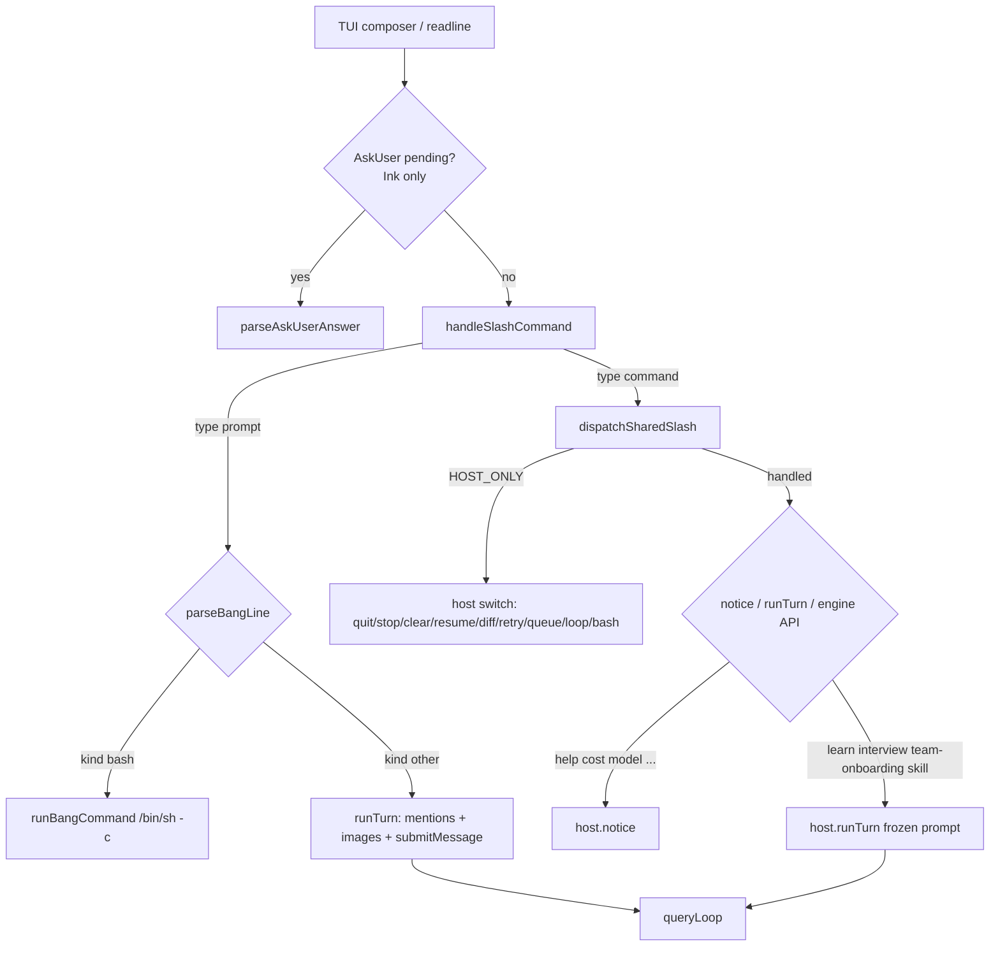

# RavenClaw 슬래시 커맨드

English: [SLASH_COMMANDS.md](SLASH_COMMANDS.md)

대화형 TUI(Ink 기본, `--tui opentui`) 안에서 `/`로 시작하는 한 줄이 슬래시 커맨드다. 이 문서는 `packages/cli/src/commands.ts`의 `SLASH_COMMANDS`와 `packages/cli/src/slash/dispatch.ts`의 `dispatchSharedSlash` / `HOST_ONLY`를 기준으로, 파싱·디스패치·호스트별 부작용을 적는다.

슬래시는 **세션 안의 한 줄**이다. `raven resume`, `raven mcp`, `raven skills` 같은 **CLI 서브커맨드와는 다른 경로**다. 이름이 겹쳐도 구현·부작용·필요 키가 다르다. 헤드리스 `raven exec`, ACP, `raven serve`, Slack, Discord, `chat-host`는 `handleSlashCommand`를 거치지 않는다. 그 표면에 `/help`를 보내면 그냥 사용자 프롬프트다.

관련 문서: [ARCHITECTURE.ko.md](ARCHITECTURE.ko.md), [README.md](README.md), [docs/headless.md](docs/headless.md).

## 목차

1. [파싱과 디스패치](#파싱과-디스패치)
2. [host-only vs shared](#host-only-vs-shared)
3. [TUI 키보드 대응](#tui-키보드-대응)
4. [커맨드 목록](#커맨드-목록) (`SLASH_COMMANDS` 순서)
5. [frozen prompt 커맨드](#frozen-prompt-커맨드)
6. [스킬 표면](#스킬-표면)
7. [tasks / steer / queue / loop](#tasks--steer--queue--loop)
8. [resume / clear / undo / rewind / compact](#resume--clear--undo--rewind--compact)
9. [슬래시가 아닌 CLI 커맨드](#슬래시가-아닌-cli-커맨드)
10. [슬래시 추가 방법](#슬래시-추가-방법)

## 파싱과 디스패치

입력 한 줄은 호스트(`packages/cli/src/app.tsx`의 Ink `App`, `packages/cli/src/opentui-app.ts`의 `runOpenTuiApp`)가 `handleSlashCommand`에 넘긴다.

```
handleSlashCommand(line)          packages/cli/src/commands.ts
        │
        ├─ trim 후 `/`로 시작하지 않음 → { type: 'prompt', text }
        ├─ /^\/(\S+)(?:\s+([\s\S]+))?$/ 불일치 → prompt (예: `/` 단독)
        ├─ 첫 토큰이 `skill:`로 시작 → { type: 'command', name: 'skill', arg }
        └─ 그 외 → { type: 'command', name: CANONICAL_NAME.get(raw) ?? raw, arg? }
                 raw = 첫 토큰 toLowerCase()
```

- 알 수 없는 `/foo`도 prompt가 아니라 command로 남는다. 호스트가 `unknown command: /foo`로 거절한다.
- alias는 `CANONICAL_NAME`으로 정규화한다: `cancel` → `stop`, `new` → `clear`, `onboard` → `team-onboarding`, `?` → `help`.
- `/skill:review extra`는 name `skill`, arg `review extra`다. 스킬 이름과 나머지 인자를 한 문자열로 붙인다.
- `!cmd`는 슬래시가 아니다. prompt로 떨어진 뒤 `parseBangLine`이 `/bin/sh -c`로 돌린다. `/bash cmd`는 슬래시(host-only)이고, 실행 경로는 같다.

Ink는 AskUser 대화가 열려 있으면 슬래시를 파싱하지 않고 `parseAskUserAnswer`로 답을 보낸다.



`dispatchSharedSlash`는 Ink와 OpenTUI가 공유한다. `HOST_ONLY`면 `'host'`를 돌려 주고, 그 외는 여기서 처리한 뒤 `'handled'`를 돌려 준다. 기본 분기는 `unknown command: /${name}`이다.

Ink의 frozen prompt는 `void runTurn(...)`이라 fire-and-forget이다. OpenTUI는 dispatcher가 `await host.runTurn(...)`하므로 그 턴이 끝날 때까지 readline 루프가 막힌다.

## host-only vs shared

`HOST_ONLY` (`packages/cli/src/slash/dispatch.ts`):

`quit`, `stop`, `clear`, `resume`, `diff`, `retry`, `queue`, `loop`, `bash`

이 아홉 개는 호스트 프로세스 상태(종료, abort gate, 새 세션, git 패널, 메시지 큐, composer retry, loop ref, 로컬 셸)를 만진다. 나머지는 shared다.

| name | 분류 | idle | mid-turn | 주 부작용 |
|---|---|---|---|---|
| `resume` | host | 피커/목록 또는 id로 복원 | Ink는 입력 가능. 복원 시 엔진을 갈아끼움 | `resumeRuntime`; 툴을 다시 실행하지 않음 |
| `compact` | shared | `compactNow()` | 한 슬롯 플래그; `liveTurn` null 뒤에 실행 (라이브 transcript splice 안 함) | `compact requested` |
| `cost` | shared | 추정 한 줄 | 세션 usage 스냅샷 | `CostTracker.display()` |
| `search` | shared | 현재 세션 검색 | 동일 | FTS, 최대 8건 |
| `mode` | shared | `setPermissionMode` | liveTurn에도 즉시 반영 | `mode ${next}` |
| `learn` | shared | frozen turn | busy면 `runTurn`이 enqueue | `LEARN_PROMPT` |
| `review` | shared | 분리 스트림 + `MEMORY.md` | 현재 턴을 막지 않음 | `wrote ${path}` 등 |
| `title` | shared | 세션 title persist | 동일 | `title ${name}` |
| `stop` | host | `nothing to stop` | `engine.abort()` | OpenTUI는 3초 안 두 번째가 `killAll` |
| `clear` | host | 새 세션 | 현재 엔진 close 후 교체 | `new session ${shortId}` |
| `model` | shared | 다음 턴 프로필 | **진행 중 `queryLoop`는 안 바꿈** | `model ${id}` |
| `permissions` | shared | 규칙 파일 경로 | 동일 | 경로 또는 `no extra rules` |
| `tasks` | shared | list/kill/steer | 백그라운드 레지스트리 | `no background tasks` 등 |
| `undo` | shared | 마지막 체크포인트 | 턴이 열려 있으면 block | `formatUndoNotice` |
| `rewind` | shared | 파일 + 마지막 user turn | live turn / running agent / pending ask면 거부 | `a turn is in progress` 등 |
| `diff` | host | git 패널 토글 | 패널만 | working-tree + staged |
| `job` | shared | `raven/*` job worktree 진입 / commit on\|off | 동일 | `session.job`, cwd → worktree |
| `pr` | shared | shadow draft PR | 동일 | job 없거나 dirty면 notice만 |
| `steer` | shared | 다음 툴 라운드/턴 | 다음 툴 라운드에 inject | `steered (next round)` |
| `add-dir` | shared | notice-only | notice-only | 루트를 추가하지 않음 |
| `effort` | shared | notice-only | notice-only | persist 없음 |
| `agents` | shared | 카탈로그 목록 | 동일 | `id  displayName` |
| `hooks` | shared | 이벤트 이름 | 동일 | `LIFECYCLE_EVENTS` |
| `reload` | shared | 시스템 파트 재구성 | 다음 턴 프롬프트 | `skills reloaded` |
| `mcp` | shared | boot-time config 목록 | 동일 | 새 서버를 띄우지 않음 |
| `skills` | shared | list/show/disable/enable/prune | disable/enable은 `reloadSystem` | `~/.ravenclaw/skills-disabled.json` |
| `loop` | host | 시작/상태/중지 | 호스트 ref | 최대 20회, `completed`만 진행 |
| `cron` | shared | 로컬 jobs.json | 동일 | TUI 15s ticker와 별개 |
| `queue` | host | 목록/drop/clear | 같은 큐 | mid-turn drain 또는 다음 턴 |
| `follow` | shared | one-slot next-turn 표시/설정/clear | 세션 필드만 | `session.followup` |
| `retry` | host | rewind 후 composer 복원 또는 resubmit | `/rewind`와 같은 거부 | composer / `runTurn` |
| `copy` | shared | 클립보드 | 동일 | text 블록만 markdown |
| `interview` | shared | frozen turn | busy면 enqueue | `INTERVIEW_PROMPT` |
| `team-onboarding` | shared | scan + frozen turn | busy면 enqueue | alias `/onboard` |
| `bash` | host | 로컬 셸 | 모델에 안 감 | `!cmd`와 동일 backend |
| `skill` | shared | Skill 툴 로드 프롬프트 | busy면 enqueue | `/skill:<name>` |
| `config` | shared | 공개 설정 | 동일 | 시크릿은 `set (N chars)` |
| `context` | shared | compact 세대 + 메시지 수 | 동일 | `compact N  messages M` |
| `help` | shared | `SLASH_HELP` | 동일 | alias `/?` |
| `quit` | host | 프로세스 종료 | 동일 | Ink `exit()`, OpenTUI `return 0` |

mid-turn 입력:

- **Ink**: `useInput`이 항상 살아 있다. 슬래시는 즉시 `dispatchSharedSlash`로 간다. 일반 텍스트만 `queued (${n})`로 enqueue한다.
- **OpenTUI**: 일반 프롬프트는 `await runTurn`이라 그 동안 readline이 막힌다. `void runTurn`으로 시작한 경우(loop 첫 턴, leftover steer/queue, mailbox)에만 다음 줄을 받을 수 있다.

busy 중 `runTurn`이 다시 호출되면(frozen prompt, leftover, mailbox) 둘 다 `enqueue`하고 `queued (${n})`를 낸다.

## TUI 키보드 대응

슬래시와 겹치거나 같은 엔진 API를 부르는 키. OpenTUI는 줄 단위 readline이라 Ink 전용 키가 많다.

| 입력 | 표면 | 대응 |
|---|---|---|
| Enter | Ink | `submitLine(draft)` — 슬래시/프롬프트/`!cmd` |
| readline 한 줄 | OpenTUI | 같은 `handleSlashCommand` |
| `Ctrl+C` | Ink | `exit()` (`/quit`과 같음). 확인 없음 |
| `Escape` | Ink | diff가 열려 있고 permission ask가 없으면 패널 닫기. pending ask는 abort. `engine.abort()`. 3초 안 두 번째면 `tasks.killAll()` (`formatKilledBackgroundNotice`). resume 피커가 있으면 닫고, idle이면 draft를 비움 |
| `/stop` | Ink | `engine.abort()`만. 두 번째 `/stop`이 백그라운드를 죽이지 않음 |
| `/stop` | OpenTUI | abort + `createSecondAbortGate` (3s). 두 번째가 `killAll` |
| `Shift+Tab` | Ink | `cyclePermissionMode`: `default` → `acceptEdits` → `plan` → `default`. `dontAsk`는 그대로. notice `mode ${next}` |
| `y` / `n` / `a` | Ink permission | allow / deny / allow_always |
| `y` / `n` / `a` 한 줄 | OpenTUI permission | 그 외는 deny |
| `Ctrl+O` | Ink | 선택(또는 마지막) 툴 행 expand 토글 |
| `Shift+Up` / `Shift+Down` | Ink | transcript 행 선택 |
| Up / Down | Ink composer | `~/.ravenclaw` prompt history |
| Left / Right | Ink `/diff` files | 파일 선택 |
| Up / Down / Enter | Ink `/resume` 피커 | 세션 선택 후 `resumeRuntime` |
| 빈 줄 | 둘 다 | 클립보드 이미지가 있으면 `runTurn('')`, 없으면 no-op |

Ink status line은 모델·mode·usage·`shortSessionId`·funding·near-compact·USD를 보여 준다. OpenTUI는 턴이 끝난 뒤 `formatStatusLine` 한 줄을 찍는다.

15초 ticker(둘 다): idle이면 mailbox `[mailbox]` 턴, 세션 lock 갱신, `maybePruneSkillsOnIdle`(7일 간격, 2시간 idle). cron due job은 `fireCronJob`(dontAsk 자식 세션). notice 예: `cron ${id} ${status}`.

## 커맨드 목록

아래 순서는 `SLASH_COMMANDS` 배열 순서다. usage/summary는 테이블 문자열 그대로다.

### `/resume [id]`

- alias: 없음
- 분류: host-only
- idle: id가 있으면 `resumeRuntime`. 없으면 이 cwd 세션 최대 20개. 없으면 `no sessions to resume`
- mid-turn: 호스트가 엔진을 교체한다. 진행 중 턴은 이전 엔진 `close` 경로를 탄다
- Ink: id 없으면 피커(`shortSessionId`, model, title 또는 ISO `updatedAt`). OpenTUI: `formatResumeSessionLine` 목록
- 성공 notice: `resumed ${shortSessionId}`
- 복원은 메시지·세션 레코드를 다시 연다. **툴을 다시 실행하지 않는다.** 다음 입력이 새 턴이다
- included 세션은 게이트웨이가 없으면 `INCLUDED_RESUME_UNAVAILABLE`로 실패하고 BYOK로 조용히 떨어지지 않는다
- 관련: `raven resume [id]`, `raven sessions` (키 없이 목록)

### `/compact`

- 분류: shared
- `engine.compactNow()`. notice `compact requested`
- `liveTurn !== null`이면 한 슬롯 플래그만 **queues**하고 라이브 transcript를 splice하지 않는다. `liveTurn`이 null이 된 뒤에 실행한다
- protect-last 꼬리를 남기고 앞을 접는다. `compact.llmSummarize`가 true면 LLM 요약, 실패 시 mechanical. false면 mechanical만
- 실행 후 `compactGeneration`을 올린다
- 관련: 자동 compact(`maybeCompact`), `/context`

### `/cost`

- 분류: shared
- `formatCostNotice({ usage, profile, funding, remaining, compactGeneration })`
- BYOK: `$` + 소수 둘째 자리. included: `$0.00 included`에 남은 슬롯이 있으면 `included N left`
- compact 세대가 있으면 뒤에 `  compact ${n}`
- 세션 누적 usage와 **현재** `runtime.config.profile` 단가. `/model` 이후 단가는 새 프로필, 과거 토큰은 다시 계산하지 않음

### `/search <q>`

- 분류: shared
- 인자 없음: `usage: /search <query>`
- 기본: 현재 `sessionId`만. `/search --all q`는 스토어 전체 (`--all ` 접두, 공백 필수)
- `searchSessionStore`, `SEARCH_LIMIT` 8. 없으면 `no matches`
- 한 줄: `${sessionId.slice(0, 8)}  ${snippet}`
- 관련: `raven search [--all] <query>` — CLI는 기본이 이 cwd의 세션 집합

### `/mode <mode>`

- 분류: shared
- 인자 없음: `usage: /mode default|acceptEdits|plan|dontAsk`
- `parsePermissionMode`: 소문자. `acceptedits` → `acceptEdits`, `dontask` → `dontAsk`. 그 외 `unknown mode: ${arg}`
- `engine.setPermissionMode`: 세션 persist, liveTurn이 있으면 그 mode도 변경, volatile 시스템 라인 `Current permission mode: …`
- `plan` 진입 시 이전 mode를 `prePlanMode`에 저장. plan에서 나가면 삭제
- notice `mode ${next}`. Ink `onModeChanged`가 status line을 갱신
- `dontAsk`: leftover ask는 deny. in-tree Edit/Write와 읽기 전용 툴은 진행. `Fetch`/`AskUser`는 auto-allow 아님
- `Shift+Tab`은 `dontAsk`를 순환에 넣지 않는다

### `/learn`

- 분류: shared · frozen prompt
- `host.runTurn(LEARN_PROMPT)`. 세션에 user 턴으로 들어간다
- 프롬프트는 아래 [frozen prompt](#frozen-prompt-커맨드)와 동일
- 관련: 10 툴 라운드 후 `consider /learn` nudge. `raven skills new`

### `/review`

- 분류: shared · **턴이 아님**
- 기본 프롬프트 `REVIEW_PROMPT`. 인자가 있으면 그 문자열이 프롬프트
- `forkMemoryReview`: 툴 없는 분리 스트림. 시스템: `Read-only memory review. You cannot call Edit, Write, or Bash. Reply with durable bullets only.`
- 성공 시 `.ravenclaw/MEMORY.md`에 `## YYYY-MM-DD review` append. notice `wrote ${path}`
- 빈 본문: `review produced no memory to write`. 예외: `review failed: ${text}`
- 파일 캡 `MEMORY_FILE_CHAR_CAP`. 백그라운드 review(`config.review.background`)와는 별개

### `/title <name>`

- 분류: shared
- 인자 없음: `usage: /title <name>`
- `applySessionTitle`: `session.title`, `updatedAt`, `upsertSession`
- notice `title ${name}`
- 제목이 비어 있으면 첫 user 텍스트로 자동 title이 붙을 수 있다
- 관련: `raven title <session-id> <title>`

### `/stop`

- alias: `/cancel`
- 분류: host-only
- `engine.abort()` — live turn AbortController, 백그라운드 review 취소
- Ink: busy면 `stopped`, 아니면 `nothing to stop`. 백그라운드 kill은 `Escape` 두 번
- OpenTUI: 같은 notice + 3초 창 두 번째 `/stop`이 `tasks.killAll()` → `killed 1 background task` / `killed N background tasks` / `no background tasks to kill`

### `/clear`

- alias: `/new`
- 분류: host-only
- `engine.close()`, `mcpCloser?.()`, `openNewSession`
- 새 세션은 boot config의 model/permissionMode/funding. included면 새 슬롯을 소모할 수 있다
- notice `new session ${shortSessionId}`
- Ink: transcript/todos/tasks/선택 초기화. OpenTUI: `view.reset()`, included면 광고 dock 재로드
- 이전 세션 메시지는 SQLite에 남는다. 파일 체크포인트는 새 `session.id`로 갈린다

### `/model [id]`

- 분류: shared
- 인자 없음: `model ${session.model}`
- 인자 있음: `getModelProfile(id, { contextWindow?, prices? })` — `runtime.config.contextWindow`, `runtime.config.prices[id]`
- 알려진 id는 카탈로그(window, thinking, 단가). 미지 id는 `conservativeProfile` pass-through
- `engine.setModel` + `config.model` / `config.profile` + persist. notice `model ${profile.id}`
- **다음 `submitMessage`부터** `queryLoop`가 새 프로필을 쓴다. 이미 돌고 있는 루프의 `state.model`은 바꾸지 않는다
- 관련: `--model`, `config.yaml` `model:`

### `/permissions`

- 분류: shared
- `formatPermissionsNotice`: 존재하는 `$home/permissions.json`, `$cwd/.ravenclaw/permissions.json`, 세션 규칙이 있으면 `session  N rules`
- 아무 것도 없으면 `no extra rules`
- 규칙을 편집하지 않는다. allow_always는 엔진이 세션 규칙으로 저장한다

### `/tasks [kill <id>|steer <id> <text>]`

- 분류: shared
- 인자 없음/빈 문자열: `tasks.list()`. 없으면 `no background tasks`. 있으면 `${id}  ${status}  ${description}` (+ `  exit N`)
- `kill <id>`: `tasks.kill`. 성공 `stopped ${id}`, 실패 `unknown task ${id}`
- `steer <id> <text>`: `tasks.steer`. 성공 `steered ${id}`, 실패 `TaskSteer failed: ${error}` (예: `agent not started`)
- `kill`/`steer`만 있고 인자가 모자라면 `usage: /tasks [kill <id>|steer <id> <text>]`
- 그 외 토큰은 list로 취급
- `/steer`(현재 턴)과 `/tasks steer`(자식 에이전트)는 다르다
- 관련 툴: `TaskOutput`, `TaskStop`, `TaskSteer`, `Agent`

### `/undo`

- 분류: shared
- `fileHistory.undo()` — 닫힌 마지막 generation
- 열 세대에 스냅샷이 있으면 `undo after the turn finishes`
- 없으면 `nothing to undo`
- 있으면 `undo: restored N, removed M` (해당 항목만)
- 대화 메시지는 그대로. 메시지도 버리려면 `/rewind`
- 백업: `~/.ravenclaw/file-history/<sessionId>/`

### `/rewind`

- 분류: shared
- live turn이거나 running `type === 'agent'` 태스크가 있으면 `a turn is in progress`
- unpaired owned `pending_asks`가 있으면 `pending permission ask` (drop 없음)
- **job 세션** (`session.job`): `rewindToCheckpoint` — 마지막 user 턴 drop, compact `rewind` persist를 `git reset --hard` **전에**, job worktree에서 이전 assistant 체크포인트 sha(또는 `job.baseCommitSha`)로 reset, 해당 todo 스냅샷 복원, 프로젝트 `.ravenclaw/todo.json` 기록. 실패 notice: `rewind persist failed` (HEAD 불변) / `rewind reset failed: …` (drop 유지) / `nothing to rewind`. projection I/O 실패는 `; todo.json write failed: …`를 붙이고 `ok` 유지
- **job 없는 세션**: 열린 file-history generation이면 `a turn is in progress`. 아니면 마지막 user부터 drop + 그 generation undo. persist 실패: `rewind persist failed` (메시지는 그대로)
- 성공 시 `droppedText`는 마지막 user text 블록 연결(이미지 무시). `/rewind` 슬래시는 notice만 출력
- notice: `nothing to rewind` / `dropped 1 message` / `dropped N messages` / 파일 부분과 `; `로 결합
- compact 세대에 `rewind`로 기록
- 관련: `/undo`, `/retry`, `/job`

### `/retry [text]`

- 분류: host-only (composer 필요)
- `engine.rewindLast()` 먼저. 항상 notice 출력. 거부 규칙은 `/rewind`와 동일
- 인자 없음: ok이고 `droppedText`가 있으면 composer에 넣음 (Ink `setDraft`, OpenTUI draft). **`runTurn` 하지 않음**
- 인자 있음: ok이면 `runTurn(arg)`로 재제출
- serve 대응: `POST /v1/session/:id/edit` `{ text }` — 빈 text 400, rewind 실패 200 `{ ok:false, notice }`, 성공 202 후 `submitMessage`
- `/rewind`는 notice-only. 관련: `/rewind`, `/follow`

### `/job [name]` / `/job commit on|off`

- 분류: shared
- 카탈로그: `/job [name] | /job commit on|off` — named `raven/*` job worktree 진입; opt-in turn-end commit 토글
- 인자 없음: 기본 `raven/<slug>` shadow로 job worktree 진입
- `<name>`: 해당 slug로 진입
- `commit on` / `commit off`: `session.jobAutoCommit` 설정 후 upsert. notice `job commit on|off`
- 진입 성공 시 `session.job = { baseBranch, shadowBranch, baseCommitSha, worktreePath }`, cwd를 worktree로 바꾸고 upsert. notice `job ${shadowBranch}`
- 모델 턴을 시작하지 않는다. auto-commit 기본은 off
- 관련: `/pr`, `/rewind`, CLI `--worktree`

### `/pr [title]`

- 분류: shared
- 카탈로그: `/pr [title]` — 세션 shadow 브랜치에서 draft PR 열기/갱신
- `session.job` 없으면 notice `no job record` (`gh` 호출 없음)
- 있으면 `gh`로 draft `shadow → base`. 인자 있으면 PR title
- 전제: job 기록, clean worktree, 인증된 `gh`. dirty / `gh` 없음은 notice만 (턴 실패 아님)
- job의 PR 필드를 in-place 갱신; 마지막 assistant에 annotation 가능
- 기본 off — 턴 종료 시 자동 실행하지 않음. serve 대응: `POST /v1/session/:id/pr`
- 관련: `/job`, `docs/headless.md`

### `/diff [n|close]`

- 분류: host-only
- 인자 없음: 토글. `close`: 닫기. 양의 정수: 1-based 파일 선택. 그 외 `usage: /diff [n|close]`
- `git rev-parse --is-inside-work-tree`, `git diff --no-color --no-ext-diff`, `git diff --cached …`. timeout 30s, `GIT_TERMINAL_PROMPT=0`
- 뷰: `not a git repository` / `no uncommitted changes` / 파일 목록 + 선택된 패치(기본 40줄)
- 라벨 `staged` / `unstaged` / `staged+unstaged`. 패치 텍스트 cap 20_000
- Ink: `DiffPanel`, Escape로 닫음(별도 notice 없음). OpenTUI: 닫을 때 `diff closed`
- Ink는 턴이 끝나면 열린 패널을 다시 읽는다

### `/steer <text>`

- 분류: shared
- 인자 없음: `usage: /steer <text>`
- `engine.enqueueSteer`. notice `steered (next round)`
- live turn: 다음 툴 배치 후 마지막 tool row에 suffix. status `steered: ${preview}` (80자)
- 턴이 끝난 뒤 남은 steer는 `drainSteering()`이 새 `runTurn`으로 올린다
- 관련: `/queue`, `/tasks steer`

### `/add-dir <path>`

- 분류: shared · **notice-only**
- 인자 없음: `usage: /add-dir <path> — this slash does not add a root; use the AddDir tool or --add-dir`
- 인자 있음: `this slash does not add a root; use the AddDir tool or --add-dir: ${path}`
- 실제 루트: 툴 `AddDir`(턴 `additionalDirectories`, permission ask `saveAs: session`) 또는 플래그 `--add-dir`(repeatable, boot 시 `addDirectory`)
- `dontAsk`에서도 AddDir는 leftover-ask다

### `/effort [low|medium|high|max]`

- 분류: shared · **notice-only**
- 인자 없음: `usage: /effort low|medium|high|max — hint only; does not persist (use --effort)`
- 인자 있음: `effort ${arg} (hint only; does not persist — use --effort)` — 값을 검증하지 않음
- 실제 persist: `--effort` → `config.effort` → volatile 시스템 `thinking effort: ${effort}`
- `/reload`는 boot config의 effort를 다시 넣는다. 슬래시 힌트는 넣지 않음

### `/agents`

- 분류: shared
- `agentCatalog(cwd)`: built-in `general`, `file-finder`, `command-runner`, `reviewer`, `researcher-web` + 디스크 에이전트(id 충돌 시 built-in 우선)
- 한 줄 `${id}  ${displayName}` (예: `general  General`)
- 관련: `--agent <id>`, `@general` mention

### `/hooks`

- 분류: shared
- `LIFECYCLE_EVENTS` 한 줄씩: `PreToolUse`, `PostToolUse`, `UserPromptSubmit`, `SessionStart`, `SessionEnd`, `Stop`
- `SubagentStart` / `PreCompact` 등은 카탈로그에 없다
- 설정된 훅이 아니라 **발생 가능한 이벤트 이름**이다. onboarding scan의 `hookEvents`가 “설정된 것”

### `/reload`

- 분류: shared
- `reloadSystem`: `buildSystemParts({ cwd, permissionMode })`로 시스템 파트를 갈아끼움. 스킬 인덱스가 volatile에 다시 실린다
- notice `skills reloaded`
- `config.yaml` / MCP 서버 / 이미 spawn된 MCP 툴을 다시 읽지 않는다. `/reload` 후 `/mcp`에 새 서버가 나타나지 않는다
- MCP를 확인하려면 프로세스를 재시작하거나 `raven mcp tools`

### `/mcp`

- 분류: shared
- `formatMcpList(runtime.config.mcp?.servers ?? [])` — **boot 시 로드된 설정**
- 없으면 `no mcp servers`
- stdio: `${name}  ${command} ${args}  env: KEY,…` (값은 안 찍음). HTTP/SSE: `${name}  ${type}  ${url}`
- spawn하지 않고 툴 목록도 안 가져온다. 검증은 `raven mcp tools`(또는 `probe`)
- 관련: `ListMcpResources` / `ReadMcpResource`

### `/skills [show|disable|enable <name>|prune]`

- 분류: shared
- 인자 없음: `discoverSkills` 목록. 없으면 `no skills`. 줄: `${name}  ${source}[  disabled][  stale]  ${desc≤60}`
- `show <name>`: `SKILL.md` 최대 4000자. 없으면 `unknown skill: ${name}`. 읽기 실패 `could not read SKILL.md`
- `disable|enable <name>`: `~/.ravenclaw/skills-disabled.json`, 이어서 `reloadSystem`. notice `disabled ${name}` / `enabled ${name}`. home 없으면 `no home directory`. 없는 이름도 파일에는 기록된다
- `prune`: `pruneSkills` — 30일 stale, 90일 archive(`.archive`). `no skills to prune` 또는 `stale …` / `archived …` / `active …`
- 잘못된 인자: `usage: /skills [show|disable|enable <name>|prune]`
- 관련: `/skill:<name>`, `raven skills`, idle prune

### `/loop [stop|<n> <prompt>]`

- 분류: host-only
- 호스트 `LoopState`. 엔진 API 아님
- 인자 없음: `loop idle` 또는 `loop ${done}/${total} remaining ${remaining}`
- `stop` / `off` / `cancel`: `loop stopped`
- `<n> <prompt>`: `n`은 1..20 정수. 초과 `loop times max is 20`. prompt 없음 `usage: /loop <n> <prompt>`. 숫자 아님 `usage: /loop [stop|<n> [prompt]]`
- 각 턴 텍스트: `${prompt}\n\n[loop ${index}/${total}]`
- `shouldAdvanceLoop`: `reason === 'completed'`만. 예외 시 loop를 버린다
- 관련: `/queue` (한 번 enqueue vs 같은 프롬프트 반복)

### `/cron [add|rm|on|off]`

- 분류: shared
- `applyCronMutate` → `~/.ravenclaw` JSON store. 사용법: `usage: /cron | /cron add <spec> <prompt> | /cron rm|on|off <id>`
- 목록: `no cron jobs` 또는 `${id}  on|off  ${spec}  ${prompt≤60}`
- spec: `every <n>s|m|h`(최소 15s), `@hourly`, `@daily`, 5필드 cron
- add extras: `--timeout-ms`(15s–3600s), `--skip-memory`, `--pre-script`, `--verify-on-stop`
- `scanCronPrompt`: 보이지 않는 유니코드, `ignore previous instructions`, `cat`+시크릿 경로, `curl`+$TOKEN/$SECRET 거부
- TUI 15s ticker가 due job을 쏜다. `/cron` 자체는 fire하지 않음
- 관련: `raven cron …`, 툴 `CronCreate` / `CronList` / `CronDelete` / `CronSetEnabled`. cron fire는 `dontAsk`

### `/queue [drop n|clear]`

- 분류: host-only
- 호스트 배열. 파서: `usage: /queue [drop <n>|clear]`
- 목록: `queue empty` 또는 `1. …`
- `clear`: 비우고 `queue empty`. `drop n`: 1-based. 없으면 `unknown queue item ${n}`
- busy 중 일반 텍스트는 enqueue, notice `queued (${n})`
- live turn: 툴 배치마다 하나 drain, status `queued: ${preview}`
- 턴 종료 후 leftover는 다음 `runTurn`. leftover steer가 큐보다 앞선다
- `/follow`(세션에 저장된 one-slot)과 다름
- 관련: `/steer`, `/loop`, `/follow`

### `/follow [text|clear]`

- 분류: shared
- 세션 one-slot `session.followup` (schema v10). `/queue`·`SuggestFollowups` 아님
- 인자 없음: 현재 슬롯 표시 (`no follow-up` 또는 텍스트)
- `clear`: 슬롯 삭제, notice `no follow-up`
- 그 외 텍스트: `setFollowup`. 빈/공백만이면 `follow-up text required`
- 턴 종료 후 `runFollowupAfterSubmit`이 이번에 쓴 `lastEnd`의 성공 reason이면 자동 실행, cancel/abort/error면 clear (owned leftover-ask면 skip)
- serve: `POST/DELETE /v1/session/:id/followup`, 스냅샷 `queued`
- 관련: `/queue`, `/retry`

### `/copy`

- 분류: shared
- 현재 세션 메시지 **text 블록만**. `# conversation` / `## ${role}`
- Darwin: `pbcopy`, 그리고 OSC 52 (`\x1b]52;c;…\x07`, 24_000자). 다른 플랫폼은 OSC 52
- `copied conversation` / `copy failed`

### `/interview`

- 분류: shared · frozen prompt
- `host.runTurn(INTERVIEW_PROMPT)`
- `AskUser`는 `askUserHost`가 있는 TUI에서만 살아 있다. `dontAsk`/headless는 leftover deny

### `/team-onboarding`

- alias: `/onboard`
- 분류: shared · frozen prompt + scan JSON
- `scanTeamOnboarding({ cwd, home, store, mcp: runtime.config.mcp })` 후 `formatOnboardingTurn(scan)`
- scan에 없는 것: MCP env/headers/oauth/command args, 메시지 본문, 다른 cwd 세션
- 포함: `teamName`, `projectFiles`, 스킬 이름/source/disabled/stale, agent id+displayName, 설정된 hook 이벤트, MCP `name`+`transport`, usage
- `usage.label`은 정확히 `your last 30 days in this workspace`
- `teamName`: 첫 `# ` 제목(`AGENTS.md` → `RAVEN.md` → `CLAUDE.md`) → `git remote get-url origin` basename → `this workspace`
- 슬래시 카운트: 이 cwd, `parentSessionId: null`, 최근 30일, user 줄 `^/([A-Za-z][\w-]*)`, **`team-onboarding` 제외**, 상위 8개
- `missing` 고정 문자열: `no AGENTS.md/RAVEN.md/CLAUDE.md in cwd`, `no MCP servers in config`, `no project skills`
- `askUserHost`가 false이거나 `dontAsk`이면 가이드만. `ONBOARDING.md`는 사람이 명시하기 전에는 쓰지 말 것(프롬프트 지시)

### `/bash <cmd>`

- 분류: host-only
- 인자 없음: `usage: /bash <cmd>`
- `runBangCommand`: `/bin/sh -c`, cwd = 세션 cwd, 30s, stdout+stderr 20_000자. 빈 커맨드 `empty command` exit 1
- 모델/권한 게이트를 거치지 않는다. transcript에만 남는다
- Ink user 행은 `!${cmd}`. `!cmd`는 슬래시 파서를 우회하는 같은 backend

### `/skill:<name>`

- 분류: shared · frozen prompt
- 파서: `/skill:foo` → name `skill`, arg `foo`
- 인자 없음: `usage: /skill:<name>`
- 턴 텍스트: `Use the Skill tool to load "${arg}" and follow its instructions.`
- 실제 로드는 모델이 `Skill` 툴을 호출할 때. disabled 스킬은 `unknown skill`
- 관련: `/skills`, `/learn`

### `/config`

- 분류: shared
- home이 있으면 `formatPublicConfig`: home, provider, model, permissionMode, maxRounds, childMaxRounds, compact.*, ads.feedUrl, included.gatewayUrl, terminal, mcp 이름, 키는 `unset` 또는 `set (N chars)`
- home 없으면 `see raven config`
- 관련: `raven config` (플래그 반영)

### `/context`

- 분류: shared
- `formatContextNotice(compactGeneration, messageCount)` → `compact ${n}  messages ${m}`
- 메시지 수는 `store.loadSession`. 실패 시 0

### `/help`

- alias: `/?`
- 분류: shared
- `SLASH_HELP`: 각 커맨드의 `usage` + `summary` (usage 폭으로 pad)
- 관련: `raven --help`는 CLI `HELP_TEXT` (슬래시 목록이 아님)

### `/quit`

- 분류: host-only
- Ink: `exit()`. OpenTUI: `return 0`
- `SessionEnd`는 `engine.close()`에서. Ink `Ctrl+C`도 종료

## frozen prompt 커맨드

아래는 호스트가 **고정 문자열을 user 턴으로** 넣는다. 모델이 해석한다. 슬래시 핸들러가 파일을 쓰지 않는다.

### `LEARN_PROMPT` (`/learn`)

```
Write a new skill that captures the reusable procedure we just figured out. Create SKILL.md under .ravenclaw/skills/<name>/ (this project) or ~/.ravenclaw/skills/<name>/ (user). Front matter must include a name and a description of at most 60 characters (the skill index clips at 60). The body is steps plus pointers. Put long scripts and templates in references/ next to SKILL.md. Do not retype a script that already exists in the repo; link it. Do not add a core tool — just write the skill files.
```

### `INTERVIEW_PROMPT` (`/interview`)

```
Interview me before writing code. Use AskUser for multiple-choice questions (at least two options each). Ask only what you need to pin down the spec, then summarize the spec and wait.
```

### `ONBOARDING_PROMPT` (`/team-onboarding`)

```
Walk this human through onboarding for this RavenClaw workspace. Use only the JSON facts in the following scan. Do not invent rules, skills, MCP servers, or git remotes. Structure the reply as: (1) usage context using the scan.usage.label, (2) setup checklist with done/missing from the scan, (3) team information quoted only from projectFiles — if those files were not read, say so and do not fabricate tips. Greet using scan.teamName. If askUserHost is true, use AskUser for at most one missing item at a time. If they decline, skip it. If askUserHost is false, print the guide and stop. Do not run install commands in dontAsk/headless. Do not write ONBOARDING.md unless the human explicitly asks.
```

호스트가 뒤에 붙이는 것 (`formatOnboardingTurn`): 빈 줄, `scan:`, 그다음 펜스된 JSON (` ```json ` + `JSON.stringify(scan)` + 닫는 펜스). 시크릿·메시지 본문·MCP args는 stringify 대상에 없다.

### `/skill:<name>`

```
Use the Skill tool to load "${name}" and follow its instructions.
```

`/review`는 frozen **턴이 아니다**. 툴 없는 분리 스트림이다. 기본 문구:

```
Summarize durable lessons from this session as short bullets. No tools. No secrets.
```

## 스킬 표면

세 겹이 있다.

| 표면 | 하는 일 | 하지 않는 일 |
|---|---|---|
| `/skills` | 목록/본문/disable/enable/prune | 스킬을 실행하지 않음 |
| `/skill:<name>` | Skill 툴을 쓰라는 턴 | 파일을 직접 읽지 않음 |
| `Skill` 툴 | `SKILL.md` 또는 디렉터리 파일. `allowed-tools`는 턴 스코프 | disable된 이름은 실패 |
| `/learn` | 새 스킬을 쓰라는 턴 | 경로를 강제 생성하지 않음 |
| `raven skills new\|rm\|prune` | 디스크 템플릿/삭제/archive | 라이브 세션 인덱스를 안 바꿈 (`/reload` 또는 재시작) |
| idle prune | 7일마다, 2시간 idle | 알림만 (`stale` / `archived`) |

탐색: built-in → `~/.ravenclaw/skills/<name>/SKILL.md` → `<cwd>/.ravenclaw/skills/<name>/SKILL.md`. 프로젝트 이름이 이긴다. description은 인덱스에서 60자.

disable 목록: `~/.ravenclaw/skills-disabled.json`. `/reload`와 disable/enable만 라이브 volatile 스킬 줄을 다시 그린다.

## tasks / steer / queue / loop

네 갈래는 대상이 다르다.

```
사용자 한 줄 (busy)
        │
        ├─ 슬래시 /steer     → engine.steering[]     → 다음 툴 라운드 suffix
        ├─ 슬래시 /queue     → 호스트 items[] 편집
        ├─ 슬래시 /loop      → 호스트 LoopState
        ├─ 슬래시 /tasks     → TaskRegistry (자식)
        └─ 일반 텍스트        → enqueue → drainQueued (툴 배치당 1) 또는 다음 runTurn
```

턴 `finally` 순서 (Ink / OpenTUI 동일):

1. `drainSteering()` leftover → 새 `runTurn` (줄바꿈 join)
2. 아니면 `dequeue` 하나 → 새 `runTurn`
3. 아니면 `reason === 'completed'`이고 loop가 남아 있으면 `takeLoopTurn`
4. 아니면 loop를 버리고 mailbox peek. 메일 있으면 `[mailbox]`

`/loop`는 호스트 전용이라 엔진이 모른다. `/steer`는 엔진 버퍼. `/queue`는 호스트 배열을 `bindDrainQueued`로 루프에 연결. `/tasks steer`는 자식 레지스트리만.

## resume / clear / undo / rewind / compact

세션·파일·대화를 되돌리는 축.

| 커맨드 | 파일 | 대화 | 세션 id | 진행 중 턴 |
|---|---|---|---|---|
| `/undo` | 마지막 닫힌 generation 복원/삭제 | 유지 | 유지 | 열려 있으면 block |
| `/rewind` | job: `git reset --hard` + todo 스냅샷. no-job: file-history undo | 마지막 user부터 drop | 유지 | `a turn is in progress` / `pending permission ask` |
| `/retry` | `/rewind`와 동일 | drop 후 composer 복원 또는 새 text로 `runTurn` | 유지 | `/rewind`와 동일 |
| `/job` | `raven/*` worktree + job 기록; `commit on\|off` | 유지 | 유지 (cwd → worktree) | 모델 턴 아님 |
| `/pr` | shadow draft PR (없거나 dirty면 notice) | 마지막 assistant annotation 가능 | 유지 | 모델 턴 아님 |
| `/compact` | 없음 | 앞부분 요약/접기 | 유지, `compactGeneration++` | mid-turn은 큐; live splice 안 함 |
| `/clear` | 새 id의 빈 history | 빈 transcript | **새 id** | 이전 엔진 close |
| `/resume` | 대상 세션 history | 저장된 메시지 로드 | **대상 id** | 엔진 교체 |
| `/stop` | 없음 | 유지 | 유지 | abort |

`/resume` 다음 메시지는 새 턴이다. 과거 툴을 재생하지 않는다.

`/clear`는 included 슬롯을 새로 쓸 수 있다. `/resume`의 included 세션은 게이트웨이 없이는 재개하지 않는다.

## 슬래시가 아닌 CLI 커맨드

`packages/cli/src/args.ts` + `index.ts` + `HELP_TEXT`. 슬래시 테이블에 넣지 말 것.

키 없이 동작: `help`, `version`, `sessions`, `show`, `rm`, `search`, `export`, `title`, `doctor`, `config`, `init`, `completions`, `mcp`, `skills`, `cron`(list/add/rm/on/off), `pairing`.

| CLI | 슬래시 대응 | 차이 |
|---|---|---|
| `raven` / `raven --tui opentui` | (세션 시작) | 슬래시 호스트를 연다 |
| `raven exec [--json] <prompt>` | 없음 | 강제 `dontAsk`, 한 샷 |
| `raven acp` | 없음 | 에디터 ask. `--dont-ask` optional |
| `raven resume [id]` | `/resume` | 프로세스 시작. id 없으면 `sessions`로 degrade |
| `raven sessions` | `/resume` 목록 | 키 없음, 이 cwd |
| `raven show` / `export` / `rm` / `title` | `/title`만 겹침 | 키 없음 |
| `raven search [--all]` | `/search` | CLI 기본은 cwd 세션 집합 |
| `raven mcp [list\|tools]` | `/mcp` | `tools`가 spawn+툴 이름. `/mcp`는 설정 목록만 |
| `raven skills [new\|rm\|prune]` | `/skills` | CLI는 `show/disable/enable` 없음. `--project` |
| `raven cron …` | `/cron` | CLI만 `tick`/`watch` |
| `raven config` | `/config` | CLI는 플래그 반영 |
| `raven setup` / `doctor` / `init` / `smoke` | 없음 | |
| `raven serve` / `slack` / `discord` | 없음 | 채팅 텍스트는 슬래시가 아님 |
| `--model` / `--effort` / `--add-dir` / `--dont-ask` / `--agent` | `/model` `/effort` `/add-dir` `/mode` `/agents` | 플래그는 boot persist. `/effort` `/add-dir` 슬래시는 notice-only |

`raven --help`는 CLI 도움말이다. 세션 안 목록은 `/help`다.

## 슬래시 추가 방법

1. `packages/cli/src/commands.ts`의 `SLASH_COMMANDS`에 `name` / `usage` / `summary` / 필요하면 `aliases`를 넣는다. `SLASH_HELP`와 `CANONICAL_NAME`이 여기서 나온다.
2. 호스트 상태(종료, abort, 세션 교체, git 패널, 큐, loop, 로컬 셸)면 `HOST_ONLY`에 이름을 넣고 **Ink와 OpenTUI 둘 다** `case`를 구현한다.
3. 그 외는 `dispatchSharedSlash`에 `case`를 넣는다. notice는 `host.notice`, 모델 턴은 `host.runTurn`.
4. 테스트: `commands.test.ts`(파서·테이블 순서), `slash/dispatch.test.ts`(shared), host-only는 `opentui-app.test.ts` / Ink 경로.
5. frozen prompt면 문자열을 `commands.ts`에 상수로 두고 테스트에서 내용을 고정한다. 호스트에 긴 프롬프트를 복제하지 않는다.
6. CONTRIBUTING은 README도 같은 PR에서 갱신하라고 한다. 플래그와 겹치면 CLI는 `args.ts` / `HELP_TEXT` / `COMPLETION_COMMANDS`가 별도다.

하지 말 것: Discord/Slack/serve에 슬래시 테이블을 복제하기. `queryLoop` 안에 슬래시 파서를 넣기. notice-only(`/add-dir`, `/effort`)를 몰래 persist하기.

구현 위치 요약:

- 테이블·파서·frozen 문자열: `packages/cli/src/commands.ts`
- shared 디스패치: `packages/cli/src/slash/dispatch.ts`
- host-only: `packages/cli/src/app.tsx`, `packages/cli/src/opentui-app.ts`
- loop 파서: `packages/core/src/loop/slash.ts` (`LOOP_MAX_TIMES = 20`)
- onboarding scan: `packages/core/src/onboarding/scan.ts`
- 큐: `packages/cli/src/message-queue.ts`
- diff: `packages/cli/src/diff-cmd.ts`
- review fork: `packages/cli/src/review.ts` → `packages/core/src/review/fork.ts`
- 스킬 목록: `packages/cli/src/skills-list.ts`
- 엔진 API (`setModel`, `compactNow`, `enqueueSteer`, `rewindLast`, `abort`): `packages/core/src/loop/session-engine.ts`
