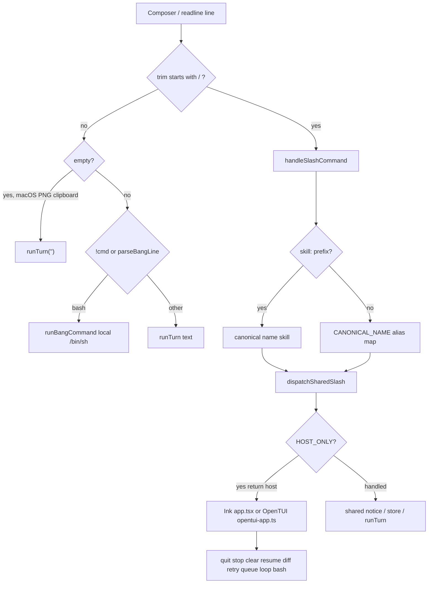
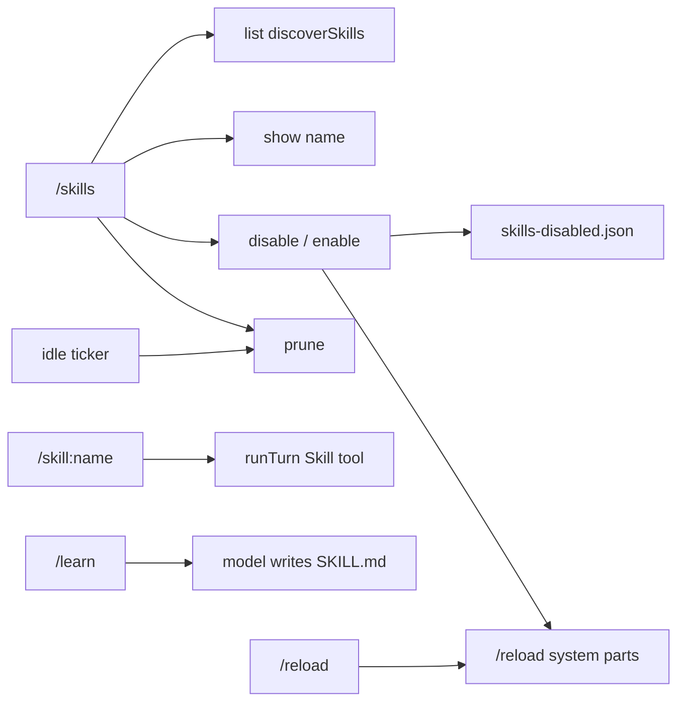

# Slash commands

In-session `/` commands for the RavenClaw TUI (Ink default, OpenTUI via `--tui opentui`). This is the default English reference. It is generated from the source, not from the shorter README table.

- Architecture overview: [ARCHITECTURE.md](ARCHITECTURE.md)
- Short command table and TUI keys: [README.md](README.md)
- Korean: [SLASH_COMMANDS.ko.md](SLASH_COMMANDS.ko.md)

CLI subcommands (`raven exec`, `raven discord`, `raven mcp`, …) are **not** slashes. `!cmd` is a bash shortcut, not a slash name.

Source of truth:

| Area | File |
|---|---|
| Catalog, parse, frozen prompts | `packages/cli/src/commands.ts` |
| Shared dispatch | `packages/cli/src/slash/dispatch.ts` |
| Ink host-only | `packages/cli/src/app.tsx` |
| OpenTUI host-only | `packages/cli/src/opentui-app.ts` |
| Slack/Discord session reuse | `packages/cli/src/chat-host/session-host.ts`, `stream-turn.ts` |
| `/loop` max 20 | `packages/core/src/loop/slash.ts` |
| `/team-onboarding` scan | `packages/core/src/onboarding/scan.ts` |

---

## How slashes are parsed and dispatched



`handleSlashCommand` (`packages/cli/src/commands.ts`):

1. `line.trim()`. If it does not start with `/`, return `{ type: 'prompt', text }`.
2. Match `^/(\S+)(?:\s+([\s\S]+))?$`. No match (for example a lone `/`) is a **prompt**, not a command.
3. The first token is lowercased.
4. If it starts with `skill:`, the name is `skill` and the arg is `<name> [rest]`.
5. Otherwise the name is `CANONICAL_NAME.get(raw) ?? raw`. Known aliases (`cancel`, `new`, `?`, `onboard`) become their canonical names. Unknown names stay as the raw token so dispatch can reject them.
6. The remainder after the first space is the arg, unchanged (not lowercased).

Both TUI hosts then call `dispatchSharedSlash`. That function returns:

- `'host'` if `parsed.name` is in `HOST_ONLY`
- `'handled'` for every shared command, including unknown names (`unknown command: /foo`)

`HOST_ONLY` is exactly:

`quit`, `stop`, `clear`, `resume`, `diff`, `retry`, `queue`, `loop`, `bash`

Slack and Discord reuse `createChatSessionHost` + `streamChatTurn` to open/resume a `SessionEngine` and stream text. They do **not** call `handleSlashCommand`. A Discord/Slack message that starts with `/help` is a user prompt to the model.

---

## Host-only vs shared

| Kind | Commands | Where implemented | Surfaces |
|---|---|---|---|
| Host-only | `/quit`, `/stop` (`/cancel`), `/clear` (`/new`), `/resume`, `/diff`, `/retry`, `/queue`, `/loop`, `/bash` | `app.tsx` and `opentui-app.ts` (must stay in sync) | Ink and OpenTUI only |
| Shared | everything else in `SLASH_COMMANDS` | `dispatchSharedSlash` | Any `SlashHost` (both TUIs) |
| Not a slash | `raven exec`, `raven discord`, `raven slack`, `raven serve`, `raven acp`, `raven pairing`, … | `packages/cli/src/args.ts` + `index.ts` | CLI process |

`SlashHost` (`dispatch.ts`):

- `runtime()` — current `CliRuntime`
- `notice(text)` — status line / stdout
- `runTurn(prompt)` — submit a model turn (queued if a turn is already live)
- `onModelChanged?(model)` — Ink updates the status model
- `onModeChanged?(mode)` — Ink updates the status mode
- `writeOsc52?(text)` — `/copy` OSC-52 fallback

---

## Keyboard / TUI equivalents

These are **not** slash names. They live on the Ink input handler (`app.tsx`). OpenTUI is line-oriented (`readline`); it has the same slash catalog and `!cmd` / empty-submit paste, but not the Ink keybindings.

| Input | Effect |
|---|---|
| Shift+Tab | Cycle permission mode `default → acceptEdits → plan → default`. `dontAsk` is **not** in the cycle (`cyclePermissionMode` returns `dontAsk` unchanged). Notice: `mode <next>`. Same store write as `/mode`. |
| Escape | If the diff panel is open and no AskUser is pending: close diff. Else reject a pending AskUser as `AbortError`, call `engine.abort()`, and run the second-abort gate (see `/stop`). If a resume picker is open, close it. If idle (not busy, no AskUser): clear the draft. Esc abort stays `ABORTED_TEXT` (not `'ignored'`). |
| Permission ask | Leftover-ask skip: Ink `i`, OpenTUI `i`/`skip`/`ignored`. `y` allow / `n` deny / `a` always unchanged. Esc abort. Slack/Discord/ACP stay 3-way. Spec: [`2026-09-21-ignored-dismiss.md`](docs/superpowers/specs/2026-09-21-ignored-dismiss.md). |
| Ctrl+C (Ink) | `exit()` — leave the TUI |
| `!cmd` | Local `/bin/sh -c` via `parseBangLine` + `runBangCommand`. Not a slash. Same runner as `/bash`. |
| `/bash cmd` | Same runner; see `/bash`. |
| ↑ / ↓ (Ink) | Walk `~/.ravenclaw/prompt-history.jsonl` (max 500 lines). OpenTUI uses Node readline history, not this file walker; it still **appends** prompts to the same JSONL. |
| `@path` | `expandMentions` inlines up to 3 cwd-confined files (20 000 chars each) as `<file path="…">`. Image extensions are skipped here and attached as images instead. |
| `@agent` | Names a catalog agent (`general`, `file-finder`, `command-runner`, `reviewer`, `researcher-web`, plus disk agents). Mentions are collected; they do not by themselves spawn a child. |
| Empty submit | On macOS only, `readClipboardImage` (`osascript` PNG). If a PNG is on the clipboard, `runTurn('')` with that image. Otherwise the submit is ignored. Not applied on Linux/Windows. Clipboard is **not** attached to non-empty prompts. |
| Mid-turn typed text | `runTurn` sees `busy` / `turnBusy` and `enqueue`s the text. Notice: `queued (n)` where `n` is the new queue length. |
| Mid-turn `/steer <text>` | Shared: `engine.enqueueSteer`. Injected on the **next tool round**, not as a new user turn. |
| Mid-turn `/queue` | Host-only: list / drop / clear the same FIFO that mid-turn text uses. |

Second-abort gate (`createSecondAbortGate`, window 3 000 ms):

- Ink **Escape**: first press aborts the live turn; a second press inside 3 s calls `tasks.killAll()` and notices `killed N background task(s)` or `no background tasks to kill`.
- OpenTUI **`/stop` / `/cancel`**: same gate (OpenTUI has no Escape handler).
- Ink **`/stop` / `/cancel`**: abort only. It does **not** use the second-abort gate.

After a turn finishes, both hosts:

1. Drain leftover steering (`drainSteering`) into a new `runTurn` if any remain.
2. Else dequeue one queued prompt and `runTurn` it.
3. Else if the turn `reason === 'completed'` and a `/loop` is active, take the next loop turn.
4. Else clear the loop and, if the mailbox has mail, `runTurn('[mailbox]')`.

During a live turn the query loop also calls `drainQueued` once per tool batch (`injectQueued` in `packages/core/src/loop/phases.ts`). That **removes one queue item and injects it into the live turn**. Status: `queued: <preview>` (80-char preview). `/steer` injects as `steered: <preview>`.

---

## Mid-turn vs idle (summary)

Shared dispatch and host-only handlers run even while a turn is live. They do **not** wait for idle unless the implementation itself refuses.

| Behavior | Commands |
|---|---|
| Abort the live turn | `/stop`, `/cancel`; Ink Escape |
| Enqueue a **new** turn if busy (`queued (n)`) | Any `host.runTurn`: `/learn`, `/interview`, `/skill:<name>`, `/team-onboarding`; also `/loop`’s first prompt; leftover steering / mailbox |
| Inject into the **live** turn (next tool round) | `/steer <text>`; `/queue` items via `drainQueued`; `/tasks steer <id> <text>` (child agent) |
| Refuse if a turn (or running agent task) is live | `/rewind`, `/retry` → `a turn is in progress` (also pending unpaired asks → `pending permission ask`) |
| Refuse file undo of the **open** generation | `/undo` → `undo after the turn finishes` (a **closed** previous generation can still undo) |
| Run immediately (notice / store / panel) | `/help`, `/cost`, `/search`, `/mode`, `/model`, `/title`, `/permissions`, `/tasks`, `/diff`, `/retry` (no-arg composer restore), `/queue`, `/follow`, `/cron`, `/copy`, `/mcp`, `/skills`, `/reload`, `/agents`, `/hooks`, `/config`, `/context`, `/add-dir`, `/effort`, `/compact`, `/review`, `/bash`, `/quit`, `/clear`, `/resume` |
| `/compact` mid-turn | sets a one-slot flag; runs after `liveTurn` is null |
| `/mode` mid-turn | Writes `liveTurn.permissionMode` as well as the session |
| `/model` mid-turn | Updates session + `config.profile` for the **next** `queryLoop`. Does not mutate the in-flight loop’s captured profile |
| `/clear` mid-turn | `engine.clearKeepId()`: refuse unpaired child leftover-asks, then `abort('cancel')`, wait for idle, persist-first wipe. Same `session.id` |
| `/resume` mid-turn | Replace the runtime (`resumeRuntime`). Does not call `abort()` first |

---

## Full catalog

Order matches `SLASH_COMMANDS` in `packages/cli/src/commands.ts`.

### `/resume [id]`

- **Aliases:** none
- **Kind:** host-only
- **When:** idle or mid-turn (replaces the runtime)
- **Usage:** `/resume` lists; `/resume <id>` loads that session

Without an id, list up to 20 sessions for the current cwd (`store.listSessions({ cwd, limit: 20 })`).

- Empty list notice: `no sessions to resume`
- Ink: open the resume picker (↑↓, Enter). Selecting calls `resumeRuntime`.
- OpenTUI: print one line per session via `formatResumeSessionLine`:
  `<id[:8]>  <title or model>  <updatedAt ISO>`

With an id, `resumeRuntime` → `resumeSession(store, id)`:

- Exact id (`loadSession`). Prefix resolve is a **CLI** `raven resume` / `raven show` feature, not this slash.
- Unpaired `tool_use` blocks throw `resumeSession: unpaired tool_use: …`
- Missing id: store error `session not found: <id>` (shown as the notice)
- Success notice: `resumed <shortSessionId>` (`shortSessionId` is the UUID prefix before `-`, else first 8 chars)
- Next typed message is a **new** turn. Tools from the restored transcript are **not** re-run.
- Re-binds AskUser, reloads todos/tasks, writes included ads on OpenTUI

Related CLI: `raven resume [id]`, `raven sessions`, `raven show <id>`.

---

### `/compact`

- **Aliases:** none
- **Kind:** shared
- **When:** idle or mid-turn
- **Behavior:** `runtime.engine.compactNow()` then notice `compact requested`

`compactNow` (`session-engine.ts`):

- While `liveTurn !== null`, **queues** a one-slot flag and does not splice the live transcript
- Runs after `liveTurn` is null (source = persisted / engine buffer messages)
- Protects the last `compact.protectLastMessages` rows
- If there is nothing before that tail, it returns without writing
- Otherwise runs autocompact (LLM summarize when `compact.llmSummarize` is on; else a mechanical summary)
- Increments `session.compactGeneration`, `upsertSession`

The notice is always `compact requested`, even when nothing was cut.

Related: automatic compact near the context window; `/context` shows the generation.

---

### `/cost`

- **Aliases:** none
- **Kind:** shared
- **When:** idle or mid-turn (read-only notice)
- **Behavior:** `formatCostNotice`

BYOK: `$<usd>` from the current model profile’s token prices (input / output / cache read / write).

Included funding: `$0.00 included`. If `runtime.remainingSessions` is a finite number, that suffix becomes `included N left`.

Always appends `  compact <compactGeneration>`.

Example: `$0.21  compact 0` or `$0.00 included 5 left  compact 2`.

Related CLI: none. Status line also shows the same USD helper.

---

### `/search <q>`

- **Aliases:** none
- **Kind:** shared
- **When:** idle or mid-turn
- **Usage:** `/search <query>` or `/search --all <query>`

`searchNotice`:

- Missing / empty query: `usage: /search <query>`
- `--all` is recognized only as a **prefix with a trailing space** (`--all `). `/search --all` alone is a query for the literal `--all`.
- Default: FTS5 in **this session** (`sessionId`)
- `--all`: every session in the store
- Limit: 8 hits
- No hits: `no matches`
- Hits: `<sessionId[:8]>  <single-line snippet>`

Related CLI: `raven search [--all] <query>` (CLI default is this cwd’s sessions, not the live session; `--all` is every session). Limit there is 32 before cwd filtering.

---

### `/mode <mode>`

- **Aliases:** none
- **Kind:** shared
- **When:** idle or mid-turn (writes the live turn’s mode too)
- **Usage:** `/mode default|acceptEdits|plan|dontAsk`

No arg: `usage: /mode default|acceptEdits|plan|dontAsk`

`parsePermissionMode` (case-insensitive):

| Input | Stored mode |
|---|---|
| `default` | `default` |
| `plan` | `plan` |
| `acceptedits` | `acceptEdits` |
| `dontask` | `dontAsk` |
| anything else | notice `unknown mode: <arg>` |

On success: `engine.setPermissionMode(next)`, `onModeChanged`, notice `mode <next>`.

`setPermissionMode` also:

- Entering `plan` stores `prePlanMode` (the previous mode) on the session and live turn
- Leaving `plan` deletes `prePlanMode`
- Rewrites the volatile system line `Current permission mode: …`

Related: Shift+Tab cycles `default → acceptEdits → plan → default` only. `--dont-ask` / `permissionMode` in `config.yaml` set the session start mode. Plan mode denies mutating tools.

---

### `/learn`

- **Aliases:** none
- **Kind:** shared
- **When:** calls `runTurn(LEARN_PROMPT)`. Mid-turn: that prompt is **queued**.
- **Behavior:** no store write of its own. The model is asked to write a skill.

Frozen `LEARN_PROMPT`:

> Write a new skill that captures the reusable procedure we just figured out. Create SKILL.md under .ravenclaw/skills/\<name\>/ (this project) or ~/.ravenclaw/skills/\<name\>/ (user). Front matter must include a name and a description of at most 60 characters (the skill index clips at 60). The body is steps plus pointers. Put long scripts and templates in references/ next to SKILL.md. Do not retype a script that already exists in the repo; link it. Do not add a core tool — just write the skill files.

Related: Skill tool; `/skills`; `/skill:<name>`; after long tool-heavy turns the engine may inject the mid-turn hint `consider /learn`.

---

### `/review`

- **Aliases:** none
- **Kind:** shared
- **When:** idle or mid-turn (forked provider call, not `runTurn`)
- **Usage:** `/review` uses `REVIEW_PROMPT`. `/review <text>` uses that text as the review prompt instead.

Frozen `REVIEW_PROMPT`:

> Summarize durable lessons from this session as short bullets. No tools. No secrets.

`runSessionReview` → `forkMemoryReview`:

- Separate provider stream, **no tools**
- System: `Read-only memory review. You cannot call Edit, Write, or Bash. Reply with durable bullets only.`
- Appends `## YYYY-MM-DD review\n<body>` to `<cwd>/.ravenclaw/MEMORY.md` (creates the file with `# Memory\n` if needed)
- Caps the memory file (`MEMORY_FILE_CHAR_CAP`)

Notices:

- `wrote <path>`
- `review produced no memory to write` (empty model text)
- `review failed: <error>`

This is **not** the optional background review (`config.review.background`), which is a persist-detached child with Memory/Skill/Read/Grep.

---

### `/title <name>`

- **Aliases:** none
- **Kind:** shared
- **When:** idle or mid-turn
- **Usage:** `/title <name>`

No arg: `usage: /title <name>`

`applySessionTitle`: sets `session.title`, `updatedAt`, `store.upsertSession`. Notice: `title <name>`.

Related CLI: `raven title <session-id> <name>`.

The first user prompt of a new session also auto-titles from that text when title is empty.

---

### `/stop`

- **Aliases:** `/cancel` (canonical name `stop`)
- **Kind:** host-only
- **When:** always

Both hosts: `engine.abort('cancel')` (cancels the live turn and any detached background review). `abort('cancel')` is tree-stop of descendants and abort-pairs this session’s leftover-asks whether or not this session is live. Idle `/stop` is work if this session has parked asks. `abort('interrupt')` abort-pairs this session only (not tree-stop). Spec: [`2026-09-20-leftover-ask-abort-pair.md`](docs/superpowers/specs/2026-09-20-leftover-ask-abort-pair.md).

- Ink notice: `stopped` if the parent was live or `whenTreeStop()` reports `descendantWork` or `thisSessionWork`, else `nothing to stop`
- OpenTUI: same, **unless** the second-abort gate returns `kill_all` (second `/stop` within 3 s) → `tasks.killAll()` and `killed N background task(s)` / `no background tasks to kill`

Does not clear `/loop` or `/queue`.

---

### `/clear` / `/new`

- **Aliases:** `/new` → `clear`
- **Kind:** host-only
- **When:** idle or mid-turn

Both hosts call `engine.clearKeepId()`. Same `session.id`, same engine, lock, MCP, job, and worktree. Does not call `close()`, `mcpCloser`, or `openNewSession`. Does not consume an included-session cap.

1. Refuse if an owned unpaired **child** leftover-ask exists (`pending permission ask`). No persist, no abort, no view reset.
2. If a turn is live, `abort('cancel')` and wait until `liveTurn === null`, then wipe.
3. Persist-first `store.clearConversation` (inactivate messages via `recordCompact` summary `'clear'`, delete this session’s pending asks and stream events). Persist fail leaves the old transcript and the view.
4. On success, reset the transcript / OpenTUI view.
5. Notice: `cleared session <shortSessionId>` of **this** id. Never `new session`.

Ink also clears todos/selection/expanded rows. OpenTUI may rewrite included ads (same runtime).

Related CLI: starting `raven` with no id still mints via `openNewSession`.

---

### `/model [id]`

- **Aliases:** none
- **Kind:** shared
- **When:** idle or mid-turn (applies to the **next** turn)

No arg: notice `model <session.model>`.

With an id:

1. `getModelProfile(id, { contextWindow?, prices? })` using `runtime.config.contextWindow` and `runtime.config.prices[id]` when set
2. Known catalog / alias ids load window, thinking, and list prices. Unknown ids stay pass-through (`conservativeProfile`: 32 k window, no thinking, $0 prices)
3. `engine.setModel(profile)` — writes `session.model`, `updatedAt`, `upsertSession`
4. `runtime.config.model = profile.id` and `runtime.config.profile = profile`
5. `onModelChanged?.(profile.id)`
6. Extra `store.upsertSession` from dispatch
7. Notice: `model <profile.id>` (canonical built-in id if the input was an alias)

Does **not** mutate the in-flight `queryLoop` options object. The live turn keeps the profile captured at `submitMessage`.

Related: `--model <id>`, `model:` in `config.yaml`. README models table.

---

### `/permissions`

- **Aliases:** none
- **Kind:** shared
- **When:** idle or mid-turn (read-only)

`formatPermissionsNotice`:

- Lists `~/.ravenclaw/permissions.json` if it exists (`runtime.config.home`)
- Lists `<cwd>/.ravenclaw/permissions.json` if it exists
- If the session has extra rules: `session  N rules`
- If none of the above: `no extra rules`

This does **not** edit rules. Extra roots are the AddDir tool / `--add-dir`.

---

### `/tasks [kill <id>|steer <id> <text>]`

- **Aliases:** none
- **Kind:** shared
- **When:** idle or mid-turn

`parseTasksArg`:

| Arg | Action |
|---|---|
| missing / empty / anything that is not `kill`/`steer` | list |
| `kill <id>` | `tasks.kill(id)` |
| `steer <id> <text>` | `tasks.steer(id, text)` |
| `kill` or `steer` with bad arity | `usage: /tasks [kill <id>\|steer <id> <text>]` |

List: `no background tasks` or one line per task:

`<id>  <status>  <description>[  exit <code>]`

Ids are `b_` + 8 hex (`nextTaskId`).

Kill notice: `stopped <id>` or `unknown task <id>`.

Steer notice: `steered <id>` or `TaskSteer failed: <error>` where error is one of `not a live agent task`, `agent not started`, `empty text`.

Related tools: `TaskOutput`, `TaskStop`, `TaskSteer`; Bash `run_in_background`; Agent children. Escape / OpenTUI double `/stop` can `killAll`.

---

### `/undo`

- **Aliases:** none
- **Kind:** shared
- **When:** see file-history rules below

`fileHistory.undo()` restores the last **closed** generation:

- Files that did not exist are unlinked (`removed`)
- Files that existed are copied back from `$RAVENCLAW_HOME/file-history/<sessionId>/` **on the host**
- When Bash is actually docker and FileHistory was injected, restore/remove of **workspace** files runs in that container (`tee` / `rm`). Omit/local stays host `writeFileSync` / `unlinkSync`.

Notices (`formatUndoNotice`):

- `nothing to undo`
- `undo after the turn finishes` — the only generation is still **open** (live turn snapshots)
- `undo: restored N` / `undo: removed N` / `undo: restored A, removed B`

Does **not** drop conversation messages. That is `/rewind`.

---

### `/rewind`

- **Aliases:** none
- **Kind:** shared
- **When:** refused while a turn or a running **agent** task is live

`engine.rewindLast()`:

1. If `liveTurn` or a running `type === 'agent'` task: `{ ok: false, notice: 'a turn is in progress' }`
2. **Job session** (`session.job`): `rewindToCheckpoint` — drop the last user turn, persist compact `rewind` **before** `git reset --hard` in the job worktree to the nearest earlier assistant checkpoint sha (or `job.baseCommitSha`), restore that todo snapshot, write project `.ravenclaw/todo.json`. Failure notices: `rewind persist failed` (HEAD unchanged) / `rewind reset failed: …` (drop kept) / `nothing to rewind`. Projection I/O fail appends `; todo.json write failed: …` and stays `ok`.
3. **No-job session:** if the last file-history generation is still open → `a turn is in progress`; else drop messages from the last user turn onward (`dropLastUserTurn`), persist via `store.recordCompact(..., 'rewind', droppedIds)` (failure: `rewind persist failed`, messages unchanged), then `fileHistory.undo()`. After a successful drop, restore `session.todos` from the last remaining assistant `todoSnapshot` (persist-first upsert) and re-project `.ravenclaw/todo.json` under `session.cwd`. No remaining assistant → `[]`. Remaining assistants with no checkpoint (pre-horizon) leave todos and do not write the file. Projection I/O fail appends `; todo.json write failed: …` and stays `ok`. `/undo` does not restore todos.
4. Notice (`formatRewindNotice`):
   - no file change and no drop: `nothing to rewind`
   - files only: same as `/undo`
   - messages only: `dropped 1 message` / `dropped N messages`
   - both: `undo: …; dropped N messages`

Related: `/undo` (files only), `/retry` (rewind then composer or resubmit), `/job` (enters a job so rewind becomes checkpoint-based), `/clear` (same id, empty conversation).

---

### `/retry [text]`

- **Aliases:** none
- **Kind:** host-only (needs the composer)
- **When:** same refuse rules as `/rewind` (live turn, running agent, pending unpaired ask, nothing to rewind)

`engine.rewindLast()` first. Always print `notice`.

| Arg | Action |
|---|---|
| missing / empty | if `ok` and `droppedText` is set, put `droppedText` in the composer (`setDraft` / OpenTUI draft). **Do not** `runTurn`. |
| non-empty text | if `ok`, `runTurn(arg)` with the new text |

Does not call serve. Headless twin: `POST /v1/session/:id/edit` `{ text }` (empty text is 400; rewind fail is 200 `{ ok: false, notice }`; success is 202 then `submitMessage`).

`/rewind` stays notice-only and never fills the composer or submits.

Related: `/rewind`, `/follow` (park next prompt without dropping the last turn).

---

### `/job [name]` / `/job commit on|off`

- **Aliases:** none
- **Kind:** shared
- **When:** idle or mid-turn (host epilogue / session cwd change; not a model turn)

Catalog: `/job [name] | /job commit on|off` — enter a named `raven/*` job worktree; flip opt-in turn-end commit.

| Arg | Action |
|---|---|
| missing / empty | Enter a job worktree with a default `raven/<slug>` shadow branch |
| `<name>` | Enter a job worktree named from that slug |
| `commit on` | Set `session.jobAutoCommit = true` and upsert (opt-in turn-end commit epilogue) |
| `commit off` | Set `session.jobAutoCommit = false` and upsert |

Enter path (`enterSessionWorktree`):

- Cuts a worktree from the session’s original cwd (or current cwd), creates a **named** shadow branch (not detached-only).
- Persists `session.job = { baseBranch, shadowBranch, baseCommitSha, worktreePath }`, updates `session.cwd` / host cwd, upserts.
- Notice: `job ${shadowBranch}` on success; `job failed` / enter error string on failure.
- Does **not** start a model turn. Auto-commit stays **off** until `/job commit on` (or equivalent config).

Related: `/pr` (draft PR from the shadow), `/rewind` (checkpoint path once a job exists), CLI `--worktree`.

---

### `/pr [title]`

- **Aliases:** none
- **Kind:** shared
- **When:** idle or mid-turn (host epilogue; never a model turn)

Catalog: `/pr [title]` — open or update a draft PR from the session shadow branch.

- No `session.job` → notice `no job record` (no `gh`).
- Otherwise `openDraftPr` / `applySessionDraftPr` via `gh` if present: draft `shadow → base`. Optional arg is the PR title.
- Preconditions: job record, clean worktree, authenticated `gh`. Dirty tree / missing `gh` → notice only (not a thrown turn, not 5xx on serve).
- Updates `session.job` PR fields in place when a number/url is recorded; may annotate the last assistant message.
- Default **off** — never auto-runs at turn end. Serve twin: `POST /v1/session/:id/pr`.

Related: `/job`, `docs/headless.md` serve `/pr`.

---

### `/diff [n|close]`

- **Aliases:** none
- **Kind:** host-only
- **When:** idle or mid-turn (UI only)

`parseDiffArg`:

| Arg | Action |
|---|---|
| missing / empty | toggle panel |
| `close` | close |
| positive integer `n` | select file index `n - 1` (1-based) |
| `0` / other | `usage: /diff [n\|close]` |

`loadGitDiff(cwd)`:

- Not a work tree: panel text `not a git repository`
- Clean: `no uncommitted changes` (OpenTUI `formatDiffPanel`; Ink still opens the panel)
- Else merge `git diff` (unstaged) + `git diff --cached` (staged), no color, no ext-diff, 30 s timeout
- Panel header `diff  N file(s)`, `>` on the selected path, label `staged` / `unstaged` / `staged+unstaged`, then the patch (default 40 hunk lines, then `… K more`)

Ink: pinned `DiffPanel`. Left/right arrows change the selected file. Escape closes the panel. After a turn, an open panel refreshes.

OpenTUI: prints the panel text; `/diff` again or `/diff close` prints `diff closed`.

This is a viewer. It does not stage, commit, or revert.

---

### `/steer <text>`

- **Aliases:** none
- **Kind:** shared
- **When:** intended for a live turn; harmless if idle (held until the next tool round or leftover drain)

No arg: `usage: /steer <text>`

`engine.enqueueSteer(arg)` (trimmed empty strings are ignored). Notice: `steered (next round)`.

The query loop injects steered text after a tool batch (`injectSteering`). After the turn, leftover steering is submitted as a **new** `runTurn`.

Different from `/tasks steer <id> <text>` (child agent) and from `/queue` (next user turn / `drainQueued`).

---

### `/add-dir <path>`

- **Aliases:** none
- **Kind:** shared
- **When:** any
- **Honesty:** **notice only. Does not add a root.**

No arg:

`usage: /add-dir <path> — this slash does not add a root; use the AddDir tool or --add-dir`

With a path:

`this slash does not add a root; use the AddDir tool or --add-dir: <path>`

Real extra roots:

- Tool: `AddDir`
- CLI: `--add-dir <path>` (repeatable; applied at engine open via `addDirectory`)

---

### `/effort [low|medium|high|max]`

- **Aliases:** none
- **Kind:** shared
- **When:** any
- **Honesty:** **notice only. Does not persist.**

No arg:

`usage: /effort low|medium|high|max — hint only; does not persist (use --effort)`

With an arg (not validated against that enum):

`effort <arg> (hint only; does not persist — use --effort)`

Real thinking-effort hint: `--effort <level>` at process start. `buildSystemParts` then includes `thinking effort: <level>` in the volatile prompt. `/reload` rebuilds parts **without** re-passing `effort`, so a start-of-process `--effort` line is not preserved across `/reload`.

---

### `/agents`

- **Aliases:** none
- **Kind:** shared
- **When:** any (read-only)

`agentCatalog(cwd)`: built-ins then disk agents that do not collide on id.

Built-ins: `general`, `file-finder`, `command-runner`, `reviewer`, `researcher-web`.

Each line: `<id>  <displayName>`.

Related: `--agent <id>`, `@agent` mentions, Agent tool.

---

### `/hooks`

- **Aliases:** none
- **Kind:** shared
- **When:** any (read-only)

Prints the fixed `LIFECYCLE_EVENTS` list, one per line:

```
PreToolUse
PostToolUse
UserPromptSubmit
SessionStart
SessionEnd
Stop
```

This is the event **name** list, not the configured commands. Configured events come from `hooks.json` (`listConfiguredHookEvents`). Subagent/compact hook names are not in this list.

---

### `/reload`

- **Aliases:** none
- **Kind:** shared
- **When:** any; takes effect on the **next** assemble (system parts pointer is replaced)

`reloadSystem`: `engine.reloadSystem(buildSystemParts({ cwd, permissionMode }))`.

That rebuilds stable / context / volatile parts: project files (`AGENTS.md` / `RAVEN.md` / `CLAUDE.md`), memory snapshot, file tree, git snapshot, coding posture, skill index (disabled skills omitted from the volatile list).

Notice: `skills reloaded`.

Does **not**:

- Re-spawn MCP servers
- Re-read `config.yaml` MCP blocks into the live tool pool
- Re-apply `--effort`

Newly registered MCP servers are verified with `raven mcp tools`, not by `/mcp` after `/reload`.

`/skills disable|enable` also calls this same reload.

---

### `/mcp`

- **Aliases:** none
- **Kind:** shared
- **When:** any (read-only)

Lists `runtime.config.mcp.servers` (already-loaded config), not a live probe.

- Empty: `no mcp servers`
- HTTP/SSE with `url`: `<name>  <type or http>  <url>`
- stdio: `<name>  <command> [args]  [env: KEY,KEY]`

Env **keys** may appear; values are not printed. Headers / OAuth / command secrets are not dumped as a blob, but stdio `command` and `args` **are** shown (this is the configured list, not the onboarding scan).

Related CLI: `raven mcp` (list) and `raven mcp tools` (spawn and list tool names).

---

### `/skills [show|disable|enable <name>|prune]`

- **Aliases:** none
- **Kind:** shared
- **When:** any

`parseSkillsSlashArg`:

| Arg | Action |
|---|---|
| missing / empty | list |
| `show <name>` | print SKILL.md (first 4 000 chars) |
| `disable <name>` | add to `~/.ravenclaw/skills-disabled.json`, reload system |
| `enable <name>` | remove from that file, reload system |
| `prune` | `pruneSkills` |
| `show`/`disable`/`enable` without a name | `usage: /skills <verb> <name>` |
| anything else | `usage: /skills [show\|disable\|enable <name>\|prune]` |

List (`formatSkillsList`): `no skills` or

`<name>  <builtin|user|project>[  disabled][  stale]  <description clipped to 60>`

Show unknown: `unknown skill: <name>`. Unreadable: `could not read SKILL.md`.

Disable/enable:

- Requires `runtime.config.home`; else `no home directory`
- Does **not** check that the skill exists. `/skills disable missing-skill` still writes the JSON and notices `disabled missing-skill` / `enabled <name>`
- Then `reloadSystem`

Prune (`formatSkillPruneResult`):

- `stale <names>` — unused 30–90 days (`SKILL_STALE_AFTER_MS`)
- `archived <names>` — unused ≥ 90 days, directory moved under `.archive`
- `active <names>` — previously stale, now used again
- `no skills to prune`

Built-ins and human-authored skills (`createdBy` set and not `agent`) are skipped.

Idle TUI ticker may also prune after 2 h idle and 7 d since last prune (`maybePruneSkillsOnIdle`).

Related CLI: `raven skills [new|rm <name>|prune] [--project]`.

---

### `/loop [stop|<n> <prompt>]`

- **Aliases:** none
- **Kind:** host-only
- **When:** start may queue the first prompt if a turn is live

`parseLoopArg` (`LOOP_MAX_TIMES = 20`):

| Arg | Action |
|---|---|
| missing / empty | status: `loop idle` or `loop <done>/<total> remaining <n>` |
| `stop` / `off` / `cancel` (case-insensitive) | `loop stopped` (clears host loop state) |
| `<n> <prompt>` | start |
| non-integer / unknown | `usage: /loop [stop\|<n> [prompt]]` |
| `n < 1` | `loop times must be a positive integer` |
| `n > 20` | `loop times max is 20` |
| `<n>` without a prompt | `usage: /loop <n> <prompt>` |

Start: `startLoop` then `takeLoopTurn`. Each submitted prompt is:

```
<prompt>

[loop i/total]
```

The loop advances only when the turn ends with `reason === 'completed'` (`shouldAdvanceLoop`). Errors, abort, or other reasons clear the loop.

Priority after a turn: leftover **steer** > **queue** > **loop** > mailbox. A non-empty queue therefore delays loop turns.

`/stop` does not clear the loop. `/loop stop` does.

---

### `/cron [add|rm|on|off]`

- **Aliases:** none
- **Kind:** shared
- **When:** any (mutates `~/.ravenclaw` cron JSON)

`parseCronSlashArg` / `applyCronMutate`. Usage string:

`usage: /cron | /cron add <spec> <prompt> | /cron rm|on|off <id>`

| Arg | Action |
|---|---|
| missing / `list` | `formatCronList` or `no cron jobs` |
| `add <spec> <prompt>` | create enabled job in **this cwd** |
| `rm <id>` | `deleted <id>` or `unknown job <id>` |
| `on <id>` / `off <id>` | enable/disable; reprint the job line |
| bad parse | `CRON_USAGE` |

Add specs:

- `every <n>s|m|h` with `n` such that interval ≥ 15 000 ms
- `@hourly` → `0 * * * *`
- `@daily` → `0 0 * * *`
- five cron fields + prompt (`0 9 * * 1-5 standup`)

Optional tokens in the add prompt (`parseCronAddExtras`):

- `--skip-memory`
- `--verify-on-stop`
- `--timeout-ms <n>` or `--timeout-ms=n` (clamped 15 000–3 600 000)
- `--pre-script <cmd>` or `--pre-script=cmd`

Prompt scan refusals (`scanCronPrompt`):

- `prompt refused: contains invisible unicode`
- `prompt refused: ignore previous instructions`
- `prompt refused: reads secrets from disk`
- `prompt refused: exfiltrates $TOKEN/$SECRET`

Job id: `c_` + 8 hex. List line:

`<id>  on|off  <spec>  <prompt clipped to 60>[  last <status>]`

The TUI 15 s ticker fires due jobs (`fireDueJobs`) and notices `cron <id> <status>`.

Related CLI: `raven cron [list|add|rm|on|off|tick|watch]`. `tick`/`watch` are **not** slash verbs.

---

### `/queue [drop n|clear]`

- **Aliases:** none
- **Kind:** host-only
- **When:** idle or mid-turn (edits the in-memory FIFO)

`parseQueueArg` usage: `usage: /queue [drop <n>|clear]`

| Arg | Action |
|---|---|
| missing / empty / `list` | print the queue |
| `clear` | empty the array; notice `queue empty` |
| `drop <n>` | 1-based index; reprint the queue or `unknown queue item <n>` |
| extra tokens / bad n | usage error |

Empty list: `queue empty`. Otherwise:

```
1. first
2. second
```

Sources of queue items:

- Typing a prompt (or a `runTurn` slash) while `busy`
- Not `/steer` (separate buffer)

Sinks:

- `drainQueued` mid-turn (one item per tool batch)
- After the turn, if no leftover steering

There is no `/queue add` verb; enqueue happens by submitting text mid-turn.

Different from `/follow` (one persisted next-turn slot on the session, not the in-memory FIFO).

---

### `/follow [text|clear]`

- **Aliases:** none
- **Kind:** shared
- **When:** idle or mid-turn (session field only; does not start a turn by itself)

One-slot persisted next-turn follow-up on `session.followup` (schema v10). Not `/queue`, not `SuggestFollowups`.

| Arg | Action |
|---|---|
| missing / empty | show current slot via `followupNotice` (`no follow-up` or the text) |
| `clear` | `clearFollowup()`; notice `no follow-up` |
| other text | `setFollowup(text)`; empty/whitespace → notice `follow-up text required`; success notices the stored text |

After a real host turn ends, `runFollowupAfterSubmit` may auto-run the slot (success reasons on a newly written `lastEnd`) or clear it (`cancelled` / `aborted` / model/persist errors). Owned leftover-asks (parent + child) skip. Serve twins: `POST/DELETE /v1/session/:id/followup`; GET snapshot field `queued`.

Related: `/queue` (host FIFO), `/retry` (edit last user).

---

### `/copy`

- **Aliases:** none
- **Kind:** shared
- **When:** any

Loads this session’s messages, keeps **text** blocks only, formats:

```
# conversation

## <role>
<text>
```

Copy:

- macOS: `pbcopy` when it exits 0
- Always also builds an OSC-52 payload (capped at 24 000 chars) and `writeOsc52`s it

Notices: `copied conversation` or `copy failed` (load error). `copyConversationToClipboard` itself reports `ok: true` for the OSC-52 path even when `pbcopy` was not used.

---

### `/interview`

- **Aliases:** none
- **Kind:** shared
- **When:** `runTurn(INTERVIEW_PROMPT)` (queued if busy)

Frozen `INTERVIEW_PROMPT`:

> Interview me before writing code. Use AskUser for multiple-choice questions (at least two options each). Ask only what you need to pin down the spec, then summarize the spec and wait.

Requires an AskUser host (TUI). Headless/`dontAsk` will not present choices the same way.

---

### `/team-onboarding` / `/onboard`

- **Aliases:** `/onboard` → `team-onboarding`
- **Kind:** shared
- **When:** `scanTeamOnboarding` then `runTurn(formatOnboardingTurn(scan))` (queued if busy)

Frozen `ONBOARDING_PROMPT`:

> Walk this human through onboarding for this RavenClaw workspace. Use only the JSON facts in the following scan. Do not invent rules, skills, MCP servers, or git remotes. Structure the reply as: (1) usage context using the scan.usage.label, (2) setup checklist with done/missing from the scan, (3) team information quoted only from projectFiles — if those files were not read, say so and do not fabricate tips. Greet using scan.teamName. If askUserHost is true, use AskUser for at most one missing item at a time. If they decline, skip it. If askUserHost is false, print the guide and stop. Do not run install commands in dontAsk/headless. Do not write ONBOARDING.md unless the human explicitly asks.

`formatOnboardingTurn` is that paragraph plus a fenced `scan:` JSON blob. `askUserHost` is mentioned in the frozen prompt; it is **not** a field on `OnboardingScan`.

Scan (`packages/core/src/onboarding/scan.ts`):

| Field | Source |
|---|---|
| `teamName` | First `# heading` in `AGENTS.md`, then `RAVEN.md`, then `CLAUDE.md`; else `git remote get-url origin` basename (strip `.git`); else `this workspace` |
| `projectFiles` | Those three filenames when they exist as files in **cwd** |
| `skills` | `discoverSkills` — `name`, `source`, optional `disabled` / `stale` |
| `agents` | `agentCatalog` ids + display names |
| `hookEvents` | Configured lifecycle event names only |
| `mcpServers` | `{ name, transport }` where `transport` is `server.type ?? 'stdio'` |
| `usage.label` | exactly `your last 30 days in this workspace` |
| `usage.days` | `30` |
| `usage.sessionCount` | Sessions with this cwd, `parentSessionId: null`, `updatedAt` within 30 days |
| `usage.slashCounts` | Top 8 slash names from **user** text lines matching `^/([A-Za-z][\w-]*)`, this cwd only, skip `team-onboarding`, sort by count desc then name |
| `missing` | `no AGENTS.md/RAVEN.md/CLAUDE.md in cwd`; `no MCP servers in config`; `no project skills` |

The scan **never** includes MCP `env`, headers, OAuth, command args, or message bodies. Slash counting uses `loadMessages` when present (not `loadSession`) so it does not persist pairing repairs.

Related: project files, `/skills`, `/mcp`, `/hooks`.

---

### `/bash <cmd>`

- **Aliases:** none as a slash; `!cmd` is the bang shortcut
- **Kind:** host-only
- **When:** any (does not go through the model)

No arg: `usage: /bash <cmd>`

`runBangCommand`: `/bin/sh -c <cmd>` in the session cwd, 30 s timeout, combined stdout+stderr capped at 20 000 chars.

- Empty command: `empty command` (exit 1)
- Ink: appends a user row `!<cmd>` and a status row with the output or `exit <code>`
- OpenTUI: prints the output or `exit <code>`
- `!cmd` on a **prompt** line is parsed **before** slash dispatch (`parseBangLine`)

This is not the Bash **tool**. It does not ask permissions and does not record a model turn.

---

### `/skill:<name>`

- **Aliases:** none (special parse prefix, not `CANONICAL_NAME`)
- **Kind:** shared
- **When:** `runTurn(...)` (queued if busy)

Parse: `/skill:foo extra` → `{ name: 'skill', arg: 'foo extra' }`. `/skill:` with no name → no arg.

No arg: `usage: /skill:<name>`

Otherwise:

`Use the Skill tool to load "<arg>" and follow its instructions.`

The Skill tool loads builtin / `~/.ravenclaw/skills` / `<cwd>/.ravenclaw/skills` (project wins), skips disabled names, and may apply frontmatter `allowed-tools` for the rest of the turn.

Related: `/skills`, `/learn`.

---

### `/config`

- **Aliases:** none
- **Kind:** shared
- **When:** any

Bare `/config`: `formatPublicConfig({ home })` — resolved home, provider, model, permissionMode, `instructionFiles` (`claude` | `agents-fallback` | `both`, default `both`), maxRounds, childMaxRounds, compact flags, ads feed URL, included gateway URL, terminal backend, MCP server **names**, and whether selected env keys are `unset` or `set (N chars)` (values not printed). Home unset: `see raven config`.

`/config instructions`: print the current mode plus the three token lines. No write.

`/config instructions claude|agents-fallback|both`: write `instructionFiles` in `$RAVENCLAW_HOME/config.yaml` (surgical upsert), set the live runtime, `setInstructionFiles`, rebuild system parts. Notice `instructionFiles: <mode>`. Unknown token: `usage: /config instructions claude|agents-fallback|both`. No home: `no home directory`. Write fail: `failed to write config.yaml` (runtime unchanged).

Related CLI: `raven config` (dump only).

---

### `/context`

- **Aliases:** none
- **Kind:** shared
- **When:** any (read-only)

`formatContextNotice(compactGeneration, messageCount)`:

`compact <n>  messages <m>`

`messageCount` comes from `store.loadSession(id).messages.length`; load failure → `0`.

---

### `/help` / `/?`

- **Aliases:** `/?` → `help`
- **Kind:** shared
- **When:** any

Notice is `SLASH_HELP`: one line per `SLASH_COMMANDS` entry, `usage` padded to the longest usage, then the summary. Same list the catalog in this file is built from.

---

### `/quit`

- **Aliases:** none
- **Kind:** host-only
- **When:** any

Ink: `exit()`. OpenTUI: return code `0` from `runOpenTuiApp`. Both hosts close the engine in their teardown path.

---

### Unknown `/name`

Not in `SLASH_COMMANDS`. Parse still returns `{ type: 'command', name }`. Shared dispatch notices `unknown command: /<name>`. Host-only default branches use the same string if a new host-only name is forgotten.

A line that does not match `^/(\S+)(?:\s+([\s\S]+))?$` (for example `/` or `/mode ` with only trailing spaces) is a **prompt**, not an unknown command.

---

## Frozen prompt commands

These four slashes ask the model (or a review fork) to follow a **string constant** in `commands.ts`. Do not invent extra rules beyond those strings.

| Slash | Mechanism | Prompt constant |
|---|---|---|
| `/learn` | `runTurn(LEARN_PROMPT)` | Write a skill under project or user `skills/<name>/`; 60-char description; `references/` for long scripts; do not add a core tool |
| `/interview` | `runTurn(INTERVIEW_PROMPT)` | AskUser multiple-choice (≥2 options); pin the spec; summarize and wait |
| `/review` | `forkMemoryReview` with `REVIEW_PROMPT` (or a custom arg) | Durable bullets; no tools; no secrets; append `.ravenclaw/MEMORY.md` |
| `/team-onboarding` | scan JSON + `runTurn(formatOnboardingTurn)` | Use only scan facts; greet `teamName`; checklist from `missing`; quote `projectFiles` only; AskUser at most one missing item when `askUserHost` is true; do not write `ONBOARDING.md` unless asked |

Full prompt text is quoted in the catalog sections above.

---

## Skills surface



Discovery order (later wins on name): builtin → `~/.ravenclaw/skills` → `<cwd>/.ravenclaw/skills`.

`/reload` refreshes the **index in the system prompt**. MCP tools are a different pool (`raven mcp tools`).

---

## Tasks / steer / queue / loop

| Channel | Buffer | When it lands | Command |
|---|---|---|---|
| Live-turn steer | `engine.enqueueSteer` | Next tool round; leftovers become a new turn | `/steer <text>` |
| Child-agent steer | `tasks.steer` | That agent’s next round | `/tasks steer <id> <text>` |
| Next-turn / mid-turn queue | host `MessageQueue` | `drainQueued` mid-turn, else after the turn | mid-turn text, `/queue` |
| Loop | host `LoopState` | After a **completed** turn, if queue and leftover steer are empty | `/loop n prompt` |
| Mailbox | store agent mail | Idle after the above | automatic `[mailbox]` |

`/tasks` lists Bash background jobs and Agent children. `/stop` aborts the parent turn only (OpenTUI double-stop / Ink Escape-Escape can kill backgrounds).

---

## Session surgery

| Command | Files | Transcript | Session id |
|---|---|---|---|
| `/undo` | Restore last **closed** edit checkpoint | Unchanged | Same |
| `/rewind` | Job: persist compact then `git reset --hard` + todo snapshot + project `todo.json`. No-job: file-history undo + drop last user turn + restore `session.todos` / `todo.json` from remaining `todoSnapshot` | Truncated | Same |
| `/job` | Enter `raven/*` worktree + job record; `/job commit on\|off` flips auto-commit | Unchanged | Same (cwd → worktree) |
| `/pr` | Draft PR from shadow (notice-only if no job / dirty) | May annotate last assistant | Same |
| `/compact` | Unchanged | Prefix summarized; `compactGeneration++` | Same |
| `/clear` / `/new` | Unchanged (job/files stay) | Empty transcript (inactivated) | **Same** (`clearKeepId`) |
| `/resume [id]` | Unchanged | Load stored messages | **Other** (or list) |

`/rewind` and open-generation `/undo` are the commands that **refuse** a live turn. `/clear` abort-then-wipes the same id. `/resume` replaces the engine.

---

## What is not a slash

From `HELP_TEXT` / `parseArgv` (`packages/cli/src/help.ts`, `args.ts`):

| CLI | Role |
|---|---|
| `raven` (default) | Interactive TUI (Ink; `--tui opentui`) |
| `raven exec` | One-shot prompt; forces `--dont-ask` |
| `raven acp` | Agent Client Protocol on stdin/stdout |
| `raven setup` | Write `~/.ravenclaw/.env` |
| `raven smoke` | One live text-only turn |
| `raven sessions` / `show` / `rm` / `export` / `title` | Session store (no key) |
| `raven resume [id]` | List or **open the TUI** on a session (prefix resolve) |
| `raven search` | CLI FTS5 |
| `raven doctor` / `config` / `init` / `completions` | Housekeeping |
| `raven mcp [list\|tools]` | Config list or spawn + tool names |
| `raven skills [new\|rm\|prune]` | Skill files on disk |
| `raven cron [list\|add\|rm\|on\|off\|tick\|watch]` | Same store as `/cron`; tick/watch are CLI-only |
| `raven serve` | Local HTTP + HMAC webhook |
| `raven slack` / `raven discord` | Chat gateways (`session-host` + `stream-turn`; no slash dispatch) |
| `raven pairing` | Discord DM pairing ledger |

Flags that look related but are **not** slashes: `--model`, `--effort`, `--add-dir`, `--dont-ask`, `--agent`, `--worktree`, `--json-schema`, `--allowed-tools`, `--tools-preset`, `--fallback-model`, `--bare`, `--verify-on-stop`.

`!cmd` is a bang shortcut, not `/cmd`.

---

## How to add a slash

From [CONTRIBUTING.md](CONTRIBUTING.md) and the current split in `dispatch.ts`:

1. Add a `SlashCommandSpec` to `SLASH_COMMANDS` in `packages/cli/src/commands.ts` (`name`, `usage`, `summary`, `aliases?`). `/help` is generated from this table.
2. If the command must own TUI state (process exit, transcript reset, picker, diff panel, prompt queue, loop, local shell), add the canonical name to `HOST_ONLY` in `dispatch.ts` and implement the same behavior in **both** `app.tsx` and `opentui-app.ts`.
3. Otherwise handle it in `dispatchSharedSlash` so every `SlashHost` gets it.
4. Add parse tests in `packages/cli/src/commands.test.ts` and behavior tests in `packages/cli/src/slash/dispatch.test.ts` (shared) or `opentui-app.test.ts` / Ink tests (host-only).
5. Update the short table in `README.md` in the same PR (CONTRIBUTING requires this). Keep this file in sync with the real flags and notices.

Do not add vendor brand strings to builtin skill frontmatter. `bun test packages/core/src/skills/` checks that.

---

## Honest notices (do not “fix” in docs)

- `/add-dir` and `/effort` print how to do the real thing. They do not change roots or thinking effort.
- `/model <id>` **does** reload `ModelProfile` (window, thinking, prices) for the next turn via `engine.setModel` + `config.profile`.
- `/mcp` lists configured servers. `/reload` rebuilds system parts (skills, memory, project files). Confirm new MCP tools with `raven mcp tools`.
- `/team-onboarding` scan usage label is exactly `your last 30 days in this workspace`. Slash counts are this cwd only, top 8, skip `/team-onboarding`.
