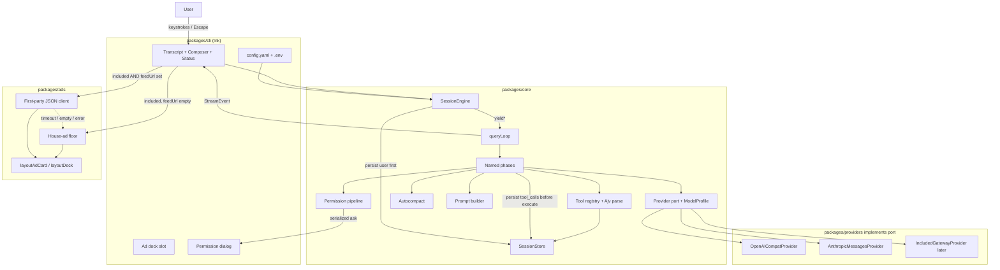
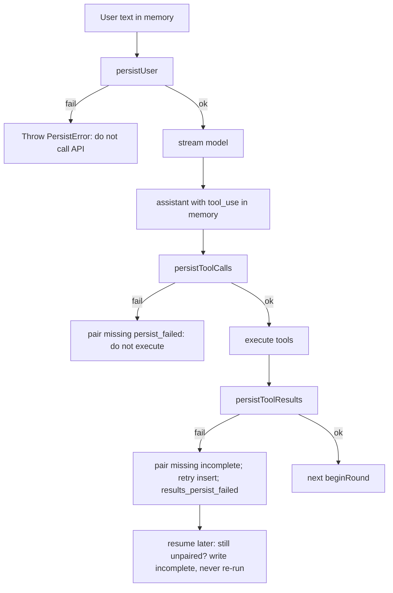
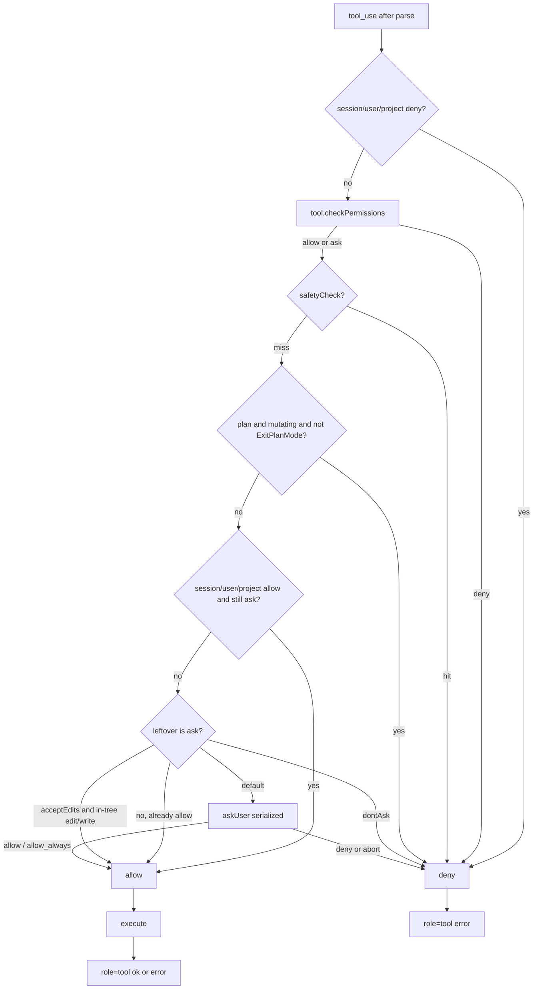
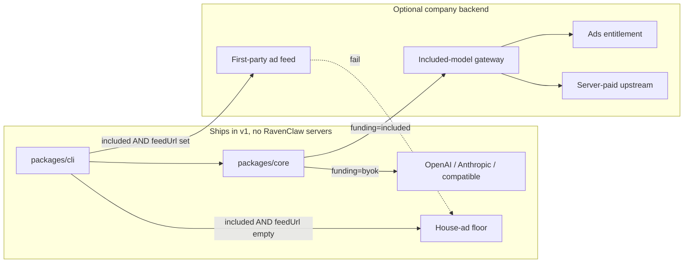

# RavenClaw Coding Agent — System Design

| Field | Value |
|---|---|
| **Title** | RavenClaw: Open-Source Coding Agent |
| **Author** | TBD |
| **Date** | 2026-09-08 |
| **Revised** | 2026-09-10 (review 8de138c2, second pass) |
| **Status** | Draft |
| **License** | Apache-2.0 |
| **Audience** | Senior engineers implementing v1 from an empty repo |

---

## Overview

RavenClaw is a real coding agent: a typed, abortable, streaming query loop that reads and edits a workspace, runs a shell, and resumes after crash. It is not a chatbot wrapper and it is not a messaging platform. The v1 product is a Bun/TypeScript CLI that is complete with the user's own API keys (BYOK). A later hosted gateway can attach included models; those sessions are ad-funded. Ads are the price of included compute, not a punishment, and they never appear on BYOK sessions.

The loop is a clean-room reimplementation of the agent-loop *semantics* documented in `docs/research/claude-code-analysis.md`: one user **Turn** owns an `AbortController` and a message list; inside it, a **Round** is stream → pair tools → continue. Persist-before-execute and the pairing invariant are law. The product surface is Hermes-narrow (skills, sessions, named phases, byte-stable prompts) without Hermes' 25 messaging adapters, pets, or Electron desktop. Monetization follows Freebuff's ad-as-capacity idea, implemented as a first-party JSON feed plus a house-ad floor — not their marketplace.

---

## Background & Motivation

Three prior-art systems define the design space. RavenClaw steals architecture from all three and vendors none of them.

**Claude Code loop semantics** (`docs/research/claude-code-analysis.md`). A session owner holds messages and an abort controller. `queryLoop` is an async generator: each iteration streams the model, collects `tool_use` blocks, executes them under a permission pipeline, and continues only if at least one `tool_use` was observed. Every `tool_use.id` gets exactly one matching `role: 'tool'` message. Permission deny is a tool message, never a thrown miss. Autocompact runs before the next API call. This is the control-flow contract RavenClaw reimplements. Semantics come from that research note only. No prompts, brand strings, or code are copied from any vendor tree.

**Hermes Agent** (Nous Research, MIT; `docs/research/hermes-agent-analysis.md`). A narrow waist: one conversation loop, named phases returning verdicts, persist user row before the API call, persist `tool_calls` before side effects, byte-stable system prompt, cache-safe mid-turn injections on the newest tool result, agentskills.io progressive disclosure, SQLite WAL, subagents as a fresh child with goal+context only. Hermes also demonstrates the complexity trap: ~40 `turn_*.py` phases and a 25-platform gateway. RavenClaw takes the *phase idea* (~8 phases), not the museum.

**Freebuff / Codebuff** (`docs/research/freebuff-analysis.md`). Ads fund included models. A paid plan buys more sessions, not silence. Terminal ads are a character-grid layout function of width + creative, never covering the composer. Activity-gated rotation, https-only destinations, ANSI/bidi strip, always disclose `Ad`, send only chat text + coarse device signals. The live Freebuff harness is **base3**: a single root loop that owns read/edit/search/shell. base2 (spawn-everything orchestrator) is the kill switch they moved *off*. RavenClaw starts at base3.

**Pain points this design removes.** Chatbot wrappers lose pairing, abort, and resume. Spawn-everything orchestrators burn included-model budget on file-finders. Subscription-or-nothing CLIs lock out users who will not pay. Ad systems that treat ads as a defect train users to buy silence. RavenClaw's answer: a real loop, a single root, BYOK always free of ads, included compute paid for by a first-party ad slot.

---

## Goals & Non-Goals

### Goals (v1 — must be implementable)

- Core `queryLoop` + Escape abort + pairing invariant.
- Tools: `Read`, `Grep`, `Glob`, `Edit`, `Write`, `Bash`, `Skill`, nested `Agent`, plus `EnterPlanMode` / `ExitPlanMode` on the root.
- Permission modes: `default`, `acceptEdits`, `plan`, `dontAsk`.
- Autocompact: mechanical prune first; optional LLM summary of the middle.
- Byte-stable three-tier system prompt + cache-safe mid-turn injections.
- Project instructions: `AGENTS.md` / `RAVEN.md` / `CLAUDE.md` (read; never write vendor prompts).
- Skills: agentskills.io progressive disclosure.
- Session persist/resume on SQLite WAL. Persist user message before the API call. Persist assistant `tool_use` before execute. On resume, unpaired `tool_use` becomes a durable `incomplete` tool message and is **never** re-executed.
- Streaming TUI: text deltas + tool progress + cost/token status line.
- Provider port owned by `core`; adapters in `packages/providers` (OpenAI-compatible Chat Completions + Anthropic Messages).
- First-party ads module, **disabled** unless the session is included-model. Empty `feedUrl` uses the house floor and opens no socket.
- CLI is complete with no RavenClaw backend.

### Non-goals (explicitly out of v1)

Messaging gateway, Electron desktop, pets/buddy/grove, computer-use, voice, kanban, mixture-of-agents, Honcho, sponsored-in-repo proposals, plugin marketplace, teammate swarms, engagement marketplace, third-party ad auctions, geo Trust ladders, Freebucks dual meters, worktree isolation, Docker terminal backend, MCP, FTS5 session search, `MEMORY.md`/`USER.md`, ACP, background memory/skill review, cheap specialist agents, hooks, image tool results, OpenAI Responses / Codex API.

### v1.x seams (design now, do not implement)

MCP tool append, FTS5 on the same `state.db`, `MEMORY.md`/`USER.md` snapshot slot, Docker `TerminalBackend`, ACP adapter, background review fork, `AgentDefinition` cheap specialists, hosted included-model gateway + ads entitlement, OpenTUI view swap, `'hook'` as a `PermissionReason`, on-disk plan file (one-path write exception), skill `allowed-tools` shrinking the live tool pool.

---

## Key Decisions

1. **TypeScript on Bun.** One language for the loop, tools, TUI, and ads layout. Aligns with a typed Claude-like loop and Freebuff-style Ink/OpenTUI CLIs. Node-compatible so the later SDK embeds in Node hosts. Python/Hermes is rejected for v1 (see Alternatives).

2. **Bun/TypeScript monorepo.** `packages/core` (loop, tools, permissions, compact, sessions, **Provider port**), `packages/providers` (LLM adapter *implementations*), `packages/ads` (pure layout + first-party client), `packages/cli` (Ink TUI). Later: `packages/sdk`. `core` does not import `@ravenclaw/providers`. No shared "utils" bag that all four import cyclically.

3. **Claude-like async-generator `queryLoop` with ~8 named phases.** One round = compact → stream → tools → continue. Hermes-style phase functions return a verdict (`continue` / `break` / `return`). The pairing invariant is law. Permission deny is a `role: 'tool'` message.

4. **Single-loop root (Freebuff base3).** The root owns Read/Edit/Write/Grep/Glob/Bash. Nested `Agent` is a fresh child loop for isolated sub-tasks, not an orchestrator that outsources every file find. Cheap specialists arrive later as `AgentDefinition` files.

5. **BYOK is complete and ad-free. Included-model sessions are ad-funded.** Ads buy included compute. A future paid plan buys *capacity* (more included sessions), not silence. **Resolved 2026-09-08:** no paid no-ads SKU as the core story. Do not invert this into "Pro = silence." Enterprise "no third-party data / house ads or flat compute fee" can be discussed later, after included-model burn numbers exist.

6. **v1 ads are first-party JSON + house-ad floor.** `feedUrl?: string` — if missing or empty, do not open a socket; return house immediately. Character-grid slot that never covers the composer. Activity-gated rotation. https-only destinations. ANSI/bidi strip. Always disclose `Ad`. The CLI passes `enabled: boolean` (`session.funding === 'included'`). Send chat text + `{os, locale, tz}` only when `enabled` **and** `feedUrl` is set. Never send the repo. `@ravenclaw/ads` does not import `@ravenclaw/core`.

7. **CLI is complete without a RavenClaw backend.** The hosted gateway is an optional remote `Provider` plus an ads entitlement service. **Resolved 2026-09-08:** first public release is BYOK-only. Ship the `funding` field, the ads module, empty-`feedUrl` house floor, and `hasPaidCapacityPlan: false`. Turn the gateway on only when admission, spend caps, and the feed are real.

8. **Apache-2.0.** Permissive, patent grant, compatible with consuming Hermes ideas (MIT) without pasting Hermes modules.

9. **Clean-room loop.** Semantics from `docs/research/claude-code-analysis.md` only. Original TypeScript, original prompts, original brand. PR template asks whether the author viewed any leaked vendor tree. This spec does not name those paths.

10. **Ink for v1 TUI.** Larger React-in-terminal ecosystem, easier hire/review surface. OpenTUI is a v1.x view swap behind the same `StreamEvent` consumer, not an open product question.

11. **No `bypass` mode in v1.** The four modes are `default`, `acceptEdits`, `plan`, `dontAsk`. Headless uses `dontAsk` (leftover ask → deny). There is no yolo classifier.

12. **One nesting level.** Children cannot spawn `Agent`. Independent child budget (config default 30). Child history is empty; `readFiles` is not cloned; child `model` defaults to the parent and is immutable when `funding === 'included'`.

13. **SQLite WAL, one live writer per session id.** A process-local mutex plus `busy_timeout=5000`. A second `raven` process may *read* the same `state.db` and may create a *different* session; it must not write the same `session_id`. Persist failures fail the turn rather than continue unsafely.

14. **Built-in tools are a contiguous, sorted prefix** of the tool pool (prompt-cache breakpoint). Future MCP tools append after.

15. **JSON Schema on the wire; Ajv in `Tool.parse`.** Providers need JSON Schema anyway. One schema, not Zod plus a converter. See Alternatives A6.

16. **`core` owns the `Provider` port.** `ProviderRequest.system` is an ordered list of cache-tagged tiers. `packages/providers` implements the port; it does not define it.

17. **Plan mode is a closed loop, not a file.** Shift+Tab is the human shortcut. `EnterPlanMode` / `ExitPlanMode` are root tools (not on the child) with empty-object schemas. Plan text lives in assistant `text`. Mutating tools are denied until `ExitPlanMode`. `ExitPlanMode` is allowed in `dontAsk` so headless can leave plan. An on-disk plan file is a v1.x seam.

18. **Application-level retries live in `streamModel` (core).** Adapters throw typed `ProviderError`. They may retry a single dropped TCP connection; they do not run the 8×/500 ms loop. There is no 8×8 retry storm.

19. **Canonical conversation model.** Assistant messages hold `text` / `thinking` / `tool_use`. Each tool outcome is a `role: 'tool'` message keyed by `toolUseId`. No `ContentBlock` of type `tool_result`. Provider mappers convert at the wire.

20. **Unpaired `tool_use` on load is `incomplete`, never a re-run.** Crash after execute, failed result `INSERT`, and mid-flight child `Agent` all synthesize a durable error tool message. Side-effecting tools are not replayed.

---

## Proposed Design

### 1. Architecture



**Layering rules.**

- `core` owns `Provider`, `ProviderRequest`, `ProviderChunk`, `ModelProfile`, `SessionStore`. It does **not** import `@ravenclaw/providers`, Ink, or ads.
- `packages/providers` implements the port. It imports message types from `@ravenclaw/core`.
- `ads` depends on nothing in `core`. It does **not** import `@ravenclaw/core` (not even `Funding`). It is a pure function of width + `AdCreative`, plus an optional HTTPS client that is a no-op when `feedUrl` is unset. The CLI passes `enabled: boolean` (`session.funding === 'included'`).
- `cli` composes all three. It is the only package that knows about a TTY.
- A later `packages/sdk` will call `createSessionEngine` the same way `cli` does.

### 2. Repository shape

```
ravenclaw/
  LICENSE                          # Apache-2.0
  README.md
  package.json                     # workspaces, "packageManager": "bun@1.x"
  bun.lock
  tsconfig.base.json
  packages/
    core/
      package.json                 # name: @ravenclaw/core
      src/
        index.ts
        types.ts                   # Turn, Message, StreamEvent, Provider port, ...
        home.ts                    # $RAVENCLAW_HOME
        config.ts                  # config.yaml + .env resolution
        loop/
          session-engine.ts        # createSessionEngine()
          query-loop.ts
          phases.ts
          pairing.ts
          repair.ts                # repairRoleAlternation
          abort.ts
          budget.ts                # maxRounds + grace
        tools/
          registry.ts
          parse.ts                 # Ajv wrapper
          read.ts
          grep.ts
          glob.ts
          edit.ts
          write.ts
          bash.ts
          agent.ts
          skill.ts
          plan-mode.ts             # EnterPlanMode / ExitPlanMode
          partition.ts
        permissions/
          types.ts
          pipeline.ts              # decidePermission total function
          modes.ts
          rules.ts                 # merge session SQL + JSON files
          safety.ts
        compact/
          policy.ts
          prune.ts
          summarize.ts
        prompt/
          builder.ts
          project-files.ts
          cache.ts
        session/
          store.ts                 # SessionStore interface
          memory-store.ts
          sqlite-store.ts
          schema.ts
          resume.ts                # unpaired → incomplete
        agent/
          definition.ts
          root.ts
          general.ts
        cost/
          tracker.ts
          models.ts                # ModelProfile table
    providers/
      package.json                 # @ravenclaw/providers
      src/
        openai-compat.ts
        anthropic.ts
        errors.ts                  # ProviderError
        registry.ts
    ads/
      package.json                 # @ravenclaw/ads
      src/
        types.ts
        sanitize.ts
        layout.ts
        client.ts                  # no-op when feedUrl empty
        house.ts
        rotation.ts
    cli/
      package.json                 # @ravenclaw/cli, bin: raven
      src/
        index.ts
        app.tsx
        transcript.tsx
        composer.tsx
        status-line.tsx
        ad-dock.tsx
        permission-dialog.tsx
        commands.ts
  later:
    packages/sdk/
```

Home directory (`$RAVENCLAW_HOME`, default `~/.ravenclaw/`):

| Path | Role |
|---|---|
| `config.yaml` | model, permission default, `maxRounds`, compact, `ads.feedUrl`, price overrides |
| `.env` | secrets only (`OPENAI_API_KEY`, `ANTHROPIC_API_KEY`, …), mode 0600 |
| `state.db` | sessions + messages + **session-scoped** permission rules (WAL) |
| `permissions.json` | user-scoped allow/deny/ask rules |
| `skills/` | user skills |
| `RAVEN.md` | user-level instructions |
| `logs/ravenclaw.log` | rotating log |
| `tool-results/` | oversized Bash bodies |

Project files (walk `cwd` → filesystem root; closer wins): `AGENTS.md`, `RAVEN.md`, `CLAUDE.md`, `.ravenclaw/RAVEN.md`. Cap **40_000 chars per file** and **60_000 chars concatenated** (including `@path` includes). Closer files fill the budget first; farther files are truncated or dropped. `@path` includes are text-only, cycle-safe, and count toward the 60k total. Project permission rules: `.ravenclaw/permissions.json`.

#### `config.yaml` (defaults)

```yaml
model: anthropic/claude-sonnet-4
provider: anthropic          # anthropic | openai_compat
permissionMode: default      # default | acceptEdits | plan | dontAsk
maxRounds: 80
childMaxRounds: 30
compact:
  enabled: true
  llmSummarize: true
ads:
  feedUrl: ""                # empty ⇒ house only, no socket
# optional:
# contextWindow: 200000      # override ModelProfile
# prices: { "anthropic/claude-sonnet-4": { input: 3.0, output: 15.0 } }
```

Resolution order for provider/model: explicit `--provider` / `--model` → `config.yaml` → env (`OPENAI_API_KEY`, `ANTHROPIC_API_KEY`, `OPENAI_BASE_URL`) → error with a setup hint. Saved config beats a stale shell export for the *choice* of provider; env still supplies the secret.

### 3. Runtime knobs

Split so implementers know what a user can change.

#### 3.1 Constants (code, not `config.yaml`)

| Knob | Value | Why |
|---|---|---|
| Tool parallelism cap | **8** | Matches Hermes worker cap; keeps TTY readable |
| Never-parallel | `Bash` (mutating), `Edit`, `Write`, `Agent` | Path-overlap + side effects |
| Autocompact buffer | **13_000** tokens | Leaves room for the next reply |
| Hard blocking buffer (compact off) | **3_000** tokens | Fail closed rather than 413-loop |
| `reserveOutputTokens` | **`min(20_000, floor(0.10 * contextWindow))`** | Locked formula; `ModelProfile` stores the result |
| Protect last N messages | **20** | Never split a `tool_use` / tool-message pair |
| Compact circuit-breaker | **3** consecutive failures | Then skip until next user turn |
| Restored recent files | **5** files × **5_000 chars**, **50_000 chars** total | Post-compact working set |
| Restored skill bodies | **5_000 chars**/skill, **25_000 chars** total | On `CompactPolicy` |
| Tool-result disk persist | **100_000 chars**, **Bash only** | Grep/Glob never reach this |
| Grep/Glob in-message cap | **20_000 chars** | Preview only; no `persistPath` |
| Grep/Glob walk | max **200** files, depth **20**, **10 MB** scanned | Disk-fill guard |
| Grep/Glob default ignore | `node_modules`, `.git`, `dist`, `build`, `.next`, `coverage`, `vendor`, `target` | First prompt-injection / noise sink |
| Project-instruction cap | **40_000 chars/file**, **60_000 chars total** | Prompt-cache hygiene |
| Skill index description | **≤ 60** chars | Progressive disclosure level 0 |
| Application API retries | **8**, 500 ms base, jittered exp backoff, **in `streamModel`** | 429/5xx; 401 is not retried |
| Empty-response retries | **3** (drop to 1 if estimated input > $0.25) | Cost-aware empty ladder |
| SQLite | WAL, `busy_timeout=5000`, one live writer **per session id** | Crash-safe resume |
| Ad card height | **4** rows inline, **5** landing | Character-grid, not CSS |
| Ad min width | **20** cols | A cut title must not become a different product |
| Ad destination dropped | width **< 48** | Drop domain before claim |
| Ad rotate | **60s**; pause after **3** idle impressions; activity = keystroke in last **30s** | Do not burn view-acks on an idle TTY |
| Accidental click | **< 300 ms** labelled, not dropped | Fraud/quality signal |
| Escape | first press aborts the turn | Rejects in-flight `askUser`; no second-press kill in v1 |

#### 3.2 `config.yaml` defaults (user-overridable)

| Knob | Default | Notes |
|---|---|---|
| Parent `maxRounds` | **80** | Plus one grace stream (see §4.8). Per `AgentDefinition` / config, not a compile-time constant |
| Child `maxRounds` | **30** | Same grace rule |
| Bash per-call timeout | **120s** | Wins for that call |
| Concurrent batch timeout | **300s** | Cancels *remaining* parallel work in that batch; already-finished results are kept |
| `permissionMode` | `default` | `--dont-ask` forces `dontAsk` |
| `compact.enabled` / `llmSummarize` | true / true | Mechanical prune always runs when enabled |
| `ads.feedUrl` | `""` | Empty = house floor, no network |
| Price table | built-in `ModelProfile` | Config may override USD rates |

Per-call tool `timeout` wins over the batch timer for that tool's own deadline. The batch timer fires `AbortSignal` on the still-running siblings in a parallel batch. Serial unsafe tools (Bash/Edit/Write) only see their per-call timeout.

### 4. The query loop

A **Turn** is one user submission. It owns the `AbortController`, the live message list, permission mode, and usage counters. A **Round** is one model call plus the tool batch that follows.

`createSessionEngine(opts)` is the only constructor. `cli` and a future SDK both call it.

`SessionEngine.submitMessage(text)`:

1. Append the user message in memory.
2. **`store.persistUser`.** If the store cannot commit, throw `PersistError` and do not call the API.
3. `yield*` `queryLoop(...)`.
4. **`store.upsertSession(session)`** with the terminal `usage`, `compactGeneration`, `permissionMode`, and `prePlanMode`. `SessionStore` is the only writer for a session: messages, the `sessions` row, session-scoped permission rules, and compact boundaries all go through it. Do not open a second SQLite handle.

`queryLoop` is an async generator. It yields `StreamEvent`s and returns a `RoundEnd`. It does **not** trust `stop_reason === 'tool_use'`. The only "keep going" signal is "we observed at least one `tool_use` block while streaming."

`askUser` is a **constructor** callback on `SessionEngineOptions`. The generator still yields `permission_ask` so the TUI can render a dialog; the dialog resolves the same promise `askUser` returned. If `turn.abort` fires while an ask is in flight, `askUser` **rejects** with `AbortError`. The pipeline treats that as deny + `aborted` pairing. Escape cannot hang the turn.

#### 4.1 Named phases

About eight functions, each returning `{ action: 'continue' | 'break' | 'return'; end?: RoundEnd }` plus rebound state. This is the Hermes idea without the 40-file museum.

| Phase | File | Responsibility |
|---|---|---|
| `beginRound` | `loop/phases.ts` | Honor abort; **grace / maxRounds check before the next API call**; else increment `round`; yield `round_start` |
| `prepareContext` | `loop/phases.ts` | Take `messages` where `active=1`; run `repairRoleAlternation` |
| `maybeCompact` | `compact/` | Tool-result budget → microcompact → autocompact; hard-limit check using `ModelProfile.contextWindow` (not `CompactPolicy`) |
| `assembleRequest` | `prompt/builder.ts` | Three cache-tagged system tiers + sorted tools prefix. Grace assembles with `tools: []`. |
| `streamModel` | `loop/phases.ts` | Stream; **owns** the 8×/500 ms retry + overflow/empty ladder; collect complete `tool_call`s |
| `normalizeResponse` | `loop/phases.ts` | Shared by normal rounds **and grace**. If abort: pair missing, `return aborted`. If no `tool_use`: `persistAssistant` (text-only row), then `return completed` (or `max_rounds` when `graceUsed`). If grace observed `tool_use`: `persistToolCalls` + pair as `tools_omitted`, **do not execute**, persist results, `return max_rounds`. |
| `runToolRound` | `tools/` + `permissions/` | **`persistToolCalls` only** (do not also `persistAssistant`). Partition. `parse` → permission → execute → tool message |
| `finalizeRound` | `loop/phases.ts` | `persistToolResults` (must be durable before the next assemble); cache-safe suffix on newest tool message; loop to `beginRound` |

#### 4.2 State machine

```mermaid
stateDiagram-v2
  [*] --> BeginRound
  BeginRound --> EndAborted: abort
  BeginRound --> GracePrepare: last round had tool_use AND round >= maxRounds AND not yet graced
  BeginRound --> EndMaxRounds: round >= maxRounds AND already graced or last had no tools
  BeginRound --> PrepareContext: round < maxRounds
  GracePrepare --> AssembleRequest: graceUsed set; next assemble uses tools []
  PrepareContext --> MaybeCompact
  MaybeCompact --> EndContextFull: over hard limit and compact off
  MaybeCompact --> AssembleRequest
  AssembleRequest --> StreamModel
  StreamModel --> NormalizeResponse
  StreamModel --> EndAborted: abort mid-stream
  StreamModel --> EndModelError: unrecoverable
  NormalizeResponse --> EndCompleted: no tool_use and not grace
  NormalizeResponse --> EndMaxRounds: no tool_use and grace
  NormalizeResponse --> PairGraceTools: grace AND observed tool_use
  PairGraceTools --> PersistToolCalls: persist assistant+tool_use, then pair tools_omitted, no execute
  NormalizeResponse --> PersistToolCalls: observed tool_use and not grace
  PersistToolCalls --> EndPersistFailed: commit failed
  PersistToolCalls --> PersistToolResults: grace path (error results only)
  PersistToolCalls --> RunToolRound: normal path
  RunToolRound --> PairMissing: abort mid-tools
  PairMissing --> PersistToolResults
  RunToolRound --> PersistToolResults
  PersistToolResults --> EndResultsPersistFailed: error results could not be made durable
  PersistToolResults --> EndMaxRounds: grace path, results durable
  PersistToolResults --> BeginRound: results durable and not grace
  EndCompleted --> [*]
  EndAborted --> [*]
  EndContextFull --> [*]
  EndModelError --> [*]
  EndPersistFailed --> [*]
  EndResultsPersistFailed --> [*]
  EndMaxRounds --> [*]
```



#### 4.3 Sequence (one turn)

```mermaid
sequenceDiagram
  participant User
  participant CLI
  participant Engine as SessionEngine
  participant Store as SessionStore
  participant Loop as queryLoop
  participant Prov as Provider
  participant Perm as decidePermission
  participant Tool as Tool.execute

  User->>CLI: submit prompt
  CLI->>Engine: submitMessage(text)
  Engine->>Store: persistUser
  Store-->>Engine: ok
  Engine->>Loop: yield* queryLoop
  loop each round
    Loop->>Loop: beginRound / maybe grace
    Loop->>Loop: maybeCompact
    Loop->>Prov: stream(system tiers, messages, tools)
    Prov-->>Loop: text_delta / complete tool_call
    Loop-->>CLI: StreamEvent
    alt no tool_use
      Loop->>Store: persistAssistant
      Loop-->>Engine: RoundEnd.completed or max_rounds if grace
    else tool_use on grace stream
      Loop->>Store: persistToolCalls
      Loop->>Loop: pair tools_omitted (no execute)
      Loop->>Store: persistToolResults
      Loop-->>Engine: RoundEnd.max_rounds
    else tool_use observed
      Loop->>Store: persistToolCalls
      Note over Store: do not also persistAssistant
      Store-->>Loop: ok
      loop each call arrival order
        Loop->>Perm: decidePermission
        alt ask
          Perm->>CLI: permission_ask (serialized)
          CLI-->>Perm: allow / deny / allow_always
        end
        alt deny
          Loop->>Loop: role=tool error message
        else allow
          Loop->>Tool: execute
          Tool-->>Loop: output / progress
        end
      end
      Loop->>Store: persistToolResults
      Note over Store: must be durable before next assembleRequest
    end
  end
  Engine->>Store: upsertSession usage compactGeneration permissionMode
  Engine-->>CLI: terminal usage
```

#### 4.4 Pairing invariant

`packages/core/src/loop/pairing.ts` is a small module with tests that must not be "flexed":

- Every `tool_use.id` emitted in a round has exactly one `role: 'tool'` message with that `toolUseId` before the next `assembleRequest`.
- Unknown tool name → error tool message (not a throw).
- `Tool.parse` failure → error tool message.
- Permission deny → error tool message whose text explains the deny.
- Abort mid-stream or mid-tools → `pairMissing(ids, 'aborted')`.
- `persistToolCalls` failure → `pairMissing(ids, 'persist_failed')` and `RoundEnd.persist_failed`. **Do not execute.**
- Grace stream with `tools: []` that still emits `tool_use` → `pairMissing(ids, 'tools_omitted')`. **Do not execute.** Persist those error tool messages, then `return { reason: 'max_rounds' }`.
- Thrown `execute` → error tool message, then continue the rest of the batch.
- `persistToolResults` failure → synthesize `incomplete` for any still-unpaired id, retry that insert once; if it still fails, `RoundEnd.results_persist_failed`. **Do not** start the next `assembleRequest`.
- **Resume / load:** any assistant `tool_use` without a tool message is paired with a durable `incomplete` tool message and is **never** executed. This is the crash-after-Bash rule.

Never drop an unanswered `tool_use`. Dual representations (a `tool_result` block *and* a `role: 'tool'` row) are how providers 400 on orphans. There is one stored form (§4.9).

#### 4.5 Persist-before-execute — and persist-results-before-continue



`PersistError.code` is `'busy' | 'locked' | 'corrupt' | 'readonly' | 'unknown'`. The store retries `busy` / `locked` **once** inside `withWrite`. `corrupt` / `readonly` / unknown fail the turn.

Do not execute tools whose `tool_use` row is not durable. Do not send the next provider request until every `tool_use` in the last assistant message has a durable tool message (ok, error, aborted, incomplete, or `tools_omitted`).

**Which persist method writes the assistant row:**

| Situation | Method | Also call the other? |
|---|---|---|
| Assistant has no `tool_use` (text / thinking only, including a clean grace reply) | `persistAssistant` | No |
| Assistant has ≥1 `tool_use` (normal tool round **or** grace hallucination) | `persistToolCalls` | **No** — this *is* that assistant row |

Calling both for the same `messages.id` is a unique-key bug. The memory store and SQLite store share this contract.

#### 4.6 Resume rule (crash after execute)

`loadSession` algorithm:

1. Read the `sessions` row.
2. Read `messages WHERE session_id = ? AND active = 1 ORDER BY created_at`. Compact boundaries are **audit** only; they are not a second filter.
3. Run `repairRoleAlternation`, which inserts `incomplete` tool messages for unpaired `tool_use`.
4. **`persistToolResults` those inserted messages** before returning to the caller. If that persist fails, surface the error; do not start a turn that would call the model with orphans.
5. Restore `cwd`, `permissionMode`, `prePlanMode`, `usage`, `funding`. Recompute `readFiles` from successful `Read` tool messages in the active list. Do **not** resurrect in-flight child agents. Session-scoped rules come from `listPermissionRules`, not a second SQL reader.

`incomplete` text (stable, for tests):

```
incomplete: the process ended before this tool result was saved. The tool was not re-run.
```

`/resume <childSessionId>` starts a **new** parent turn on that session. It is not a silent replay into the original parent. A parent that died mid-`Agent` sees an `incomplete` result for that call; the child row remains listable.

#### 4.7 Abort

Shared `AbortController` on the `Turn`. CLI Escape (`chat:cancel`) calls `turn.abort.abort('interrupt')`.

- Mid-stream: stop reading the iterator, pair any collected `tool_use` with `'aborted'`, persist those tool messages, return `{ reason: 'aborted' }`.
- Mid-tools: each tool sees `ctx.signal`. `Bash` is `interruptBehavior: 'cancel'` (SIGTERM then SIGKILL). File tools are `'block'` only through the current syscall; they do not start if the signal is already set.
- In-flight `askUser` rejects; treated as deny + aborted.
- No synthetic user "you were interrupted" row if a queued prompt will follow (type-ahead drain is a v1.x attachment). v1 may emit a single `status` event.

#### 4.8 Grace round and `maxRounds`

Check the budget at **`beginRound`, before the next API call**, not after tools.

- After a round that observed `tool_use`, if `round >= maxRounds` and `graceUsed` is false: set `graceUsed`, suffix the newest tool message with a cache-safe notice (`This is the last round; answer the user now. Do not call tools.`), and run the **normal** `assembleRequest` → `streamModel` → `normalizeResponse` path with `tools: []`.
- `normalizeResponse` on a grace stream:
  - no `tool_use` → `return { reason: 'max_rounds', round }` (do not `completed`).
  - observed `tool_use` (models hallucinate tools even on an empty list) → `persistToolCalls` (this is the assistant+`tool_use` row; do **not** also `persistAssistant`), `pairMissing(ids, 'tools_omitted')` with stable text `tools_omitted: tools were disabled on the final round; the call was not executed.`, `persistToolResults`, **do not execute**, `return { reason: 'max_rounds', round }`.
  - abort → same as any other stream (`pairMissing` aborted, persist, `return aborted`).
- If the last round had no `tool_use`, `beginRound` would not run (already `completed`).
- If grace already ran, `return { reason: 'max_rounds', round }`.
- `maxRounds` comes from `AgentDefinition.maxRounds`, defaulting to `config.maxRounds` (80) / `config.childMaxRounds` (30).

PR 2 fixtures:

- `maxRounds: 2` with a tool-use on round 2 → one grace stream with `tools: []`, no third tool batch.
- Same setup, fake provider emits a `tool_use` on the grace stream → `tools_omitted` tool message, `execute` is not called, terminal reason is `max_rounds`, pairing holds.

#### 4.9 Canonical message model

One in-memory and on-disk form. Provider conversion happens only in the adapters.

| `role` | `blocks` allowed | Extra fields |
|---|---|---|
| `user` | `text` | — |
| `assistant` | `text`, `thinking`, `tool_use` | `usage?` |
| `tool` | `text` (the result body) | `toolUseId`, `ok`, `persistPath?` |

There is **no** `ContentBlock` of type `tool_result`. `ToolResult` is the ephemeral return of `execute`; `runToolRound` maps it to a `role: 'tool'` `Message`. `persistPath` lives on that stored tool message.

**Thinking (v1).** Persist `thinking` on the assistant row that produced it. Resend that assistant message, thinking included, for the whole `tool_use` → tool-message → next-request trajectory. When falling back to a `ModelProfile` with `supportsThinking: false`, strip `thinking` blocks from the *request* (do not delete them from the store). v1 does not emit image results; `Read` of a binary/image file returns a short error string.

**Wire mapping.**

- Anthropic Messages: assistant stays assistant. Consecutive `role: 'tool'` messages become one `user` message whose content is `tool_result` blocks (`tool_use_id`, `content`, `is_error: !ok`).
- OpenAI Chat Completions: assistant `tool_use` blocks become `tool_calls[]`. Each `role: 'tool'` message becomes `{ role: 'tool', tool_call_id, content }`.

**`repairRoleAlternation(messages): Message[]`** — pure, tested with the fixtures below. It does not invent a synthetic user mid-loop.

| Input | Output |
|---|---|
| Leading `tool` (orphan result) | Drop the tool message |
| Assistant `tool_use` id `X` with no following `tool` whose `toolUseId === X` | Insert `{ role:'tool', toolUseId:'X', ok:false, blocks:[{type:'text', text: incomplete…}] }` immediately after that assistant |
| Two consecutive `user` messages | Join their text blocks with `\n\n` into one `user` |
| Two consecutive `assistant` with no tools | Join text; keep thinking from the first; drop an empty second |
| Already alternating, every `tool_use` paired | Identity |
| Compact tail would start on a `tool` row (pair cut) | Expand tail backward to include the owning `assistant` (see §8). Repair then sees a paired group |
| Compact tail starts on `user` after pair expansion | Prepend `assistant` stub + `user` summary **before** that tail so repair does not join the summary into the real user message |
| Compact tail starts on `assistant` after pair expansion | Prepend a single `user` summary. Legal alternation; repair is identity |

#### 4.10 Empty / overflow / retry ladder (owned by `streamModel`)

Adapters throw `ProviderError { retryable: boolean; status?: number; bytes?: number }`. They do not loop.

1. `retryable` (429/5xx/529, or a single mid-stream drop) → jittered backoff, up to 8 tries **in `streamModel`**. 401/403 → `model_error`, no retry.
2. After a stream drop, the next try may be non-streaming on the same provider (one time).
3. Context overflow (413 or provider "context length") → one reactive compact, then retry. If already compacted this round, `context_full`.
4. Empty / think-only / `output_tokens === 0` → up to 3 retries; drop to 1 if estimated input cost > $0.25. Two consecutive empties from the same `(model, provider, finish_reason)` stop early.
5. All-invalid tool names → error tool messages (pairing), continue; 3-strike then `completed`.

Do not implement a larger empty-recovery museum.

### 5. Prompt construction and cache hygiene

Highest-leverage cost idea in Hermes, kept.

Three cached tiers, assembled once per session and **byte-stable for the life of the conversation**. They are **not** flattened to a single string before the adapter.

| Tier | Contents | When it changes | Cache breakpoint |
|---|---|---|---|
| **Stable** | Identity ("RavenClaw is a coding agent…"), tool-use guidance, permission-mode explanation | Never mid-session | yes |
| **Context** | Concatenated project instruction files (60k budget), short git snapshot (branch, `HEAD`, dirty flag — not the diff) | Frozen at session start | yes |
| **Volatile snapshot** | Skills *index* (name + ≤60-char description), cwd, locale | Frozen at session start. Mid-session skill installs apply next session unless `/reload` | no (last prefix; vendors vary) |

`ProviderRequest.system` is `SystemPart[]` in that order. The Anthropic adapter sets `cache_control: { type: 'ephemeral' }` on the last block of each `cacheBreakpoint: true` part. OpenAI-compat adapters that expose a prefix-cache field map the same breakpoints; others concatenate in order (byte-stable even if uncached).

**Original prompts only.** Do not copy vendor system prompt text. The identity paragraph is RavenClaw's, written in `packages/core/src/prompt/builder.ts`.

**Cache-safe mid-turn injections** (never a synthetic user message mid-loop):

- Skill-discovery hints, compact notices, iteration-budget warnings, grace notice, `/steer`-like composer appends → suffix on the **newest tool message's text**.
- Type-ahead queue (v1.x) drains as a well-formed **next** user row, after the turn ends.

A per-turn `instructionsPrompt` re-injected after every user message is **forbidden** on the root: it breaks the prompt cache.

Built-in tools are sorted and sent as a contiguous prefix. That prefix is the cache breakpoint. Future MCP tools append, also sorted; built-in names win on collision.

### 6. Tools

#### 6.1 Registry

One table. No inline-executor sidecar.

```ts
// packages/core/src/tools/registry.ts
export interface ToolRegistry {
  register(tool: Tool): void
  get(name: string): Tool | undefined
  list(filter?: { names?: string[] }): Tool[]
}
```

`list` omits tools whose `isEnabled?(ctx)` is false. JSON Schema on `inputSchema` is validated by Ajv inside `Tool.parse` (shared helper in `tools/parse.ts` if the tool does not override `parse`).

v1 ships: `Read`, `Grep`, `Glob`, `Edit`, `Write`, `Bash`, `Skill`, `Agent`, `EnterPlanMode`, `ExitPlanMode`.

**Partial tool-call JSON.** Adapters **must not** yield `ProviderChunk.tool_call` until arguments are a complete JSON value. There is no `tool_call_delta` in v1. `streamModel` therefore always sees `input: unknown` as the parsed-or-raw complete arguments and immediately runs `Tool.parse`.

#### 6.2 Built-ins

| Name | Concurrency | Read-only | Notes |
|---|---|---|---|
| `Read` | safe | yes | `path`, optional `offset`/`limit`. Self-bounded. **Exempt** from disk-persist. Records `path` on `turn.readFiles` only in *this* session. |
| `Grep` | safe | yes | ripgrep if on `PATH`, else a bounded walk (200 files / depth 20 / 10 MB). Ignore list in §3.1. In-message cap **20k chars**. No `persistPath`. |
| `Glob` | safe | yes | cwd-relative. Same walk bounds, ignore list, 20k cap. No `persistPath`. |
| `Edit` | unsafe | no | Exact-string replace. **Requires a prior successful `Read` of that path on this `Turn.readFiles`.** Children start with an empty set. |
| `Write` | unsafe | no | Create or overwrite. Destructive; permission treats overwrite as such. |
| `Bash` | unsafe unless `checkPermissions` says the command is read-only | usually no | `bash -c` via `TerminalBackend` (`local` only in v1). Cwd via in-band marker. Per-call timeout default 120s. Bodies over 100k chars → `persistPath`. |
| `Skill` | safe | yes | Progressive disclosure. Level-2 paths: `realpath` + prefix check (§10). |
| `Agent` | unsafe | n/a | Fresh child `queryLoop`. One nesting level. Root only. |
| `EnterPlanMode` | safe | yes | Input schema `{}`. Sets `prePlanMode`, then `permissionMode = 'plan'`. Calls `store.upsertSession` before returning. Root only. `checkPermissions` → allow. Result text: `mode=plan`. **No plan file.** Plan text is ordinary assistant `text`. |
| `ExitPlanMode` | safe | yes | Input schema `{}`. Restores `prePlanMode` (default `default`). Calls `store.upsertSession` with the restored mode before returning. Root only. Allowed in `dontAsk`. Result text: `mode=<restored>`. |

#### 6.3 Partition

`partitionToolCalls(calls)` (default cap 8):

1. `tool.parse(input)`. Parse failure → that call is serial and will error (still paired).
2. `isConcurrencySafe(value) === true` → may join a parallel batch with other safe calls.
3. Unsafe calls run **alone, in arrival order**.
4. Results are **emitted in arrival order** even if parallel work finishes out of order.
5. Path-overlap: a `Write`/`Edit` conflicts with any other file tool whose path is equal or a prefix. Overlap forces serial.
6. **`behavior: 'ask'` is serialized** through one `askUser` at a time, even inside a parallel-safe batch. Execution of already-allowed siblings may proceed; a second dialog does not open until the first resolves.

#### 6.4 Bash / path safety (defense in depth, not a security boundary)

The process is the same OS user. We still:

- Hard-deny writes under `~/.ssh/id_*`, `~/.ravenclaw/state.db`, `/etc/shadow`, and a small credential glob (`.env` write is **ask**, not hard-deny, because apps legitimately edit dotenv files).
- `DANGEROUS_PATTERNS` (`rm -rf /`, `curl | sh`, `dd if=`, `mkfs`, fork bombs) → `ask` even in `acceptEdits`.
- Refuse to start if `ctx.signal.aborted`.
- Resolve paths with `realpath` (or the platform equivalent) before the cwd-prefix check. Symlink escape out of `turn.cwd` is out-of-tree → `ask` (or deny, if a deny rule matches).
- No network sandbox in v1. Document this in the README.

### 7. Permission pipeline

Modes (`packages/core/src/permissions/modes.ts`):

| Mode | Semantics |
|---|---|
| `default` | Ask unless an allow rule or `tool.checkPermissions` allows. |
| `acceptEdits` | May **promote leftover asks** for **in-tree** `Edit`/`Write` to allow. Still ask for `Bash`, out-of-tree paths, dangerous paths. **Must not promote a deny.** |
| `plan` | Read-only explore. Mutating tools (`Edit`, `Write`, mutating `Bash`, `Agent`) → deny tool message until `ExitPlanMode`. Prior mode stored in `prePlanMode` (on both `Turn` and `SessionRecord`). Plan text lives in assistant `text`. There is **no** plan file in v1. |
| `dontAsk` | Leftover `ask` becomes `deny`. Headless / CI. `ExitPlanMode` remains allow. |

Shift+Tab cycles `default → acceptEdits → plan → default`. `dontAsk` is a flag (`--dont-ask` / `permissionMode: dontAsk`), not in the cycle. **No `bypass` in v1.**

#### 7.1 `decidePermission` — total function

Order is fixed. Denies never get promoted.

```
1. Blanket deny rules, precedence session > user > project.
2. tool.checkPermissions(input, ctx).
   If that returns deny → deny (stop).
3. safetyCheck (.git/, credential globs, shell rc). May only deny.
4. If permissionMode === 'plan' and the tool is mutating and is not ExitPlanMode → deny.
5. Blanket allow rules, precedence session > user > project.
   If decision is still ask and a matching allow exists → allow.
6. Mode rewrite of leftover **ask only**:
   - acceptEdits + in-tree Edit/Write → allow (reason: 'mode')
   - dontAsk → deny (reason: 'mode')
   - default → ask
7. If ask: serialize through askUser. allow_always writes one rule to the chosen scope, then allow.
```



Required fixtures (PR 6):

- `acceptEdits` + `checkPermissions` deny (path escape) → deny.
- `dontAsk` + `checkPermissions` allow → allow.
- Two `ask`s in one parallel batch → sequential dialogs, arrival-order results.

#### 7.2 Rule stores (one per scope)

| Scope | Store |
|---|---|
| session | SQLite `permission_rules` via **`SessionStore.setPermissionRules` / `listPermissionRules`** only. Die with the session. |
| project | `<cwd>/.ravenclaw/permissions.json` |
| user | `$RAVENCLAW_HOME/permissions.json` |

There is **no** `scope='project'|'user'` column in SQL. `allow_always` with `saveAs: 'project' | 'user'` writes the JSON file; `saveAs: 'session'` calls `store.setPermissionRules` (the store is the only SQL writer for that `session_id`). Do not open `state.db` from the permission package.

`SessionEngine.setPermissionMode` (Shift+Tab) and the plan-mode tools must `upsertSession` **before the next `assembleRequest`**, so resume cannot restore a stale mode while the log already shows enter/exit.

Precedence of matching rules is in §7.1 (all denies before all allows; session before user before project).

### 8. Autocompact

Cheapest first, all **before** the next API call (`maybeCompact`).

**One window.** `contextWindow` and `reserveOutputTokens` live **only** on `ModelProfile` (required at session start; config may override the profile, then the formula `reserveOutputTokens = min(20_000, floor(0.10 * contextWindow))` is reapplied). `CompactPolicy` holds buffers and restore caps only. `SessionEngineOptions.compact` must not carry a second window.

Threshold: usage-anchored tokens ≥ `model.contextWindow - model.reserveOutputTokens - compact.autoCompactBuffer`.

Hard blocking limit (compact off, or after circuit-breaker): `model.contextWindow - compact.blockingBufferWhenManual`. The first request uses this window from `ModelProfile` even before an anchored sample exists. Unanchored estimates must not trigger *autocompact* until one anchored sample exists, except on a proven 413 (reactive compact).

Child loops use the **same** `ModelProfile` (same window, same reserve). They start with empty history, so they rarely compact. They do not write compact boundaries into the parent session.

Steps:

1. **Tool-result budget.** Bash results over 100k chars are written to `$RAVENCLAW_HOME/tool-results/<uuid>.txt` and replaced with a preview + `persistPath` on the tool message. `Read` is exempt. Grep/Glob are already capped at 20k and never persist.
2. **Microcompact.** In place, clear stale `Read`/`Grep`/`Glob`/`Bash` *tool-message text* older than the protect-tail, leaving the `tool_use` and a one-line stub so pairing still holds. Set `active=1` still; this is not a generation bump.
3. **Autocompact** if over threshold.
   - Mechanical prune of the middle first (keep user text, paths, command strings).
   - Optional LLM summary of the pruned span via the same `Provider` with a small `maxTokens`. Failure is non-fatal.
   - Select the protected tail with `selectProtectedTail` (below). **Never split a pair.**
   - Mark pruned rows `active=0` and write the boundary through **`store.recordCompact(sessionId, generation, summary, inactivatedIds)`** (this is the only writer that flips `messages.active` and inserts `compact_boundaries`). Then `upsertSession` with the new `compactGeneration`.
4. Circuit-breaker: 3 consecutive failures → skip until the next user turn.

**`selectProtectedTail(messages, n = protectLastMessages)`** — lock this algorithm:

1. Take the last `n` messages.
2. While the first tail message is `role: 'tool'`, or an `assistant` in the tail has a `tool_use` whose matching `tool` message is *outside* the tail (or vice versa), prepend the missing sibling. Repeat until every `tool_use` in the tail has its `tool` message in the tail and no tail `tool` is missing its assistant. This is “never split a pair” as code, not a slogan.
3. The messages before this expanded tail are the pruned middle.

**`buildPostCompactMessages(summary, tail)`:**

- If the first tail message is `role: 'user'`: emit `[assistant stub, user summary, ...tail]`. Stub text (stable): `(conversation summary follows)`. This stops `repairRoleAlternation` from joining the summary into the real user message.
- Otherwise (tail starts on `assistant`, which after step 2 is the only other legal start): emit `[user summary, ...tail]`.
- Then append restored recent files (5 × 5_000 chars, 50_000 chars total, skip if already in the tail) and invoked skill bodies (5_000 chars/skill, 25_000 chars total) as additional `user` text **only if** they would not create two adjacent `user` rows; otherwise concatenate onto the last `user` (the summary, or a restored block already merged).

`selectProtectedTail` + `buildPostCompactMessages` are covered by the last three rows of the §4.9 fixture table.

Manual `/compact` uses `blockingBufferWhenManual` as the reserve. The hard blocking limit only fires when autocompact is off or broken.

All restore caps are **chars**, including `CompactPolicy.maxCharsPerRestoredFile` and `maxCharsPerRestoredSkill`.

### 9. Agent model

```ts
export const rootAgent: AgentDefinition = {
  id: 'root',
  displayName: 'RavenClaw',
  toolNames: [
    'Read', 'Grep', 'Glob', 'Edit', 'Write', 'Bash',
    'Skill', 'Agent', 'EnterPlanMode', 'ExitPlanMode',
  ],
  spawnableAgents: ['general'],
  inheritParentSystemPrompt: false,
  includeMessageHistory: false, // root is not spawned; field is for children
  maxRounds: 80,                // overwritten by config.maxRounds at engine create
  outputMode: 'last_message',
}

export const generalAgent: AgentDefinition = {
  id: 'general',
  displayName: 'General',
  // model omitted → parent.model; frozen at spawn
  toolNames: ['Read', 'Grep', 'Glob', 'Edit', 'Write', 'Bash', 'Skill'],
  spawnableAgents: [],
  inheritParentSystemPrompt: true,
  includeMessageHistory: false,
  maxRounds: 30,                // overwritten by config.childMaxRounds
  outputMode: 'last_message',
}
```

Nested `Agent` (`packages/core/src/tools/agent.ts`):

- Input: `{ prompt: string; context?: string; description?: string }`. No `model` field in v1.
- Child is a **fresh** `queryLoop` with **empty history**.
- `readFiles` is a **new empty `Set`**. The child must `Read` before `Edit`. The parent cache is not cloned.
- `child.model = generalAgent.model ?? parent.model`. When `parent.funding === 'included'`, this assignment is immutable (a definition that names another model is ignored).
- Same `cwd`, linked `AbortController`, same `ModelProfile`.
- Parent sees the child's final assistant text (bounded 32k chars) as the tool message. If the child is aborted or the parent dies, that tool message is `incomplete` / `aborted` and the child is **not** respawned on resume.
- Child sessions persist with `parentSessionId` so they can be listed. They are not replayed into the parent transcript.
- Children cannot spawn `Agent` and do not get plan-mode tools. If the parent is in `plan`, the child inherits `plan`.

v1.x cheap specialists (`file-finder`, `command-runner`) are additional `AgentDefinition` files on `spawnableAgents`. Included sessions pin helper models on the definition so a child cannot escalate.

### 10. Skills

On-disk, agentskills.io compatible:

```
~/.ravenclaw/skills/<name>/SKILL.md
<project>/.ravenclaw/skills/<name>/SKILL.md
```

Frontmatter: `name`, `description` (≤60 chars for the index), `version`, optional `allowed-tools`.

**`allowed-tools` in v1 is documentation, not a pool mutation.** Parse the field if present. Do **not** shrink `tools[]` for later rounds (that would break the contiguous, sorted, frozen built-in prefix). Surface the list as a sentence at the top of the level-1 body (`This skill suggests: Read, Grep.`). Changing the live tool list from a skill is v1.x / MCP.

Progressive disclosure:

- **Level 0:** name + description in the volatile snapshot of the system prompt.
- **Level 1:** `Skill({ name })` returns the `SKILL.md` body (capped 20k).
- **Level 2:** `Skill({ name, path })` returns a file under that skill's directory:

```
root   = realpath(skillDir)
target = realpath(join(skillDir, userPath))
allow  = target === root || target.startsWith(root + path.sep)
```

If `realpath` fails or `allow` is false → deny tool message (`reason` equivalent: path escape). Symlinks that leave `skillDir` fail the prefix check. Text files only; binary → short error.

`/learn` is a **user prompt**, not a tool. No curator, no idle prune, no background review in v1.

### 11. Providers

`packages/core` defines the port. `packages/providers` implements it.

```ts
// packages/core/src/types.ts  (owned here)

export type ApiMode = 'openai_compat' | 'anthropic_messages'

export type SystemTier = 'stable' | 'context' | 'volatile'

export interface SystemPart {
  tier: SystemTier
  text: string
  cacheBreakpoint?: boolean
}

export interface ModelProfile {
  id: string
  contextWindow: number
  reserveOutputTokens: number // min(20_000, floor(0.10 * contextWindow))
  inputUsdPerMTok: number
  outputUsdPerMTok: number
  cacheReadUsdPerMTok: number
  cacheWriteUsdPerMTok: number
  supportsThinking: boolean
}

export interface ProviderRequest {
  model: string
  system: SystemPart[]
  messages: Message[]          // canonical model, already repaired
  tools: Array<{ name: string; description: string; inputSchema: unknown }>
  maxTokens: number
}

export type ProviderChunk =
  | { type: 'text_delta'; text: string }
  | { type: 'thinking_delta'; text: string }
  | { type: 'tool_call'; id: string; name: string; input: unknown } // complete args only
  | { type: 'usage'; usage: TokenUsage }
  | { type: 'stop'; reason: string | null }

export interface ProviderErrorLike {
  retryable: boolean
  status?: number
}

export interface Provider {
  readonly id: string
  readonly apiMode: ApiMode
  profile(model: string): ModelProfile
  stream(req: ProviderRequest, signal: AbortSignal): AsyncIterable<ProviderChunk>
}
```

- `OpenAICompatProvider` — Chat Completions streaming. Yields `tool_call` only after the assembled `arguments` string is complete JSON. Works with OpenAI, Groq, Together, local servers, and (later) the RavenClaw gateway.
- `AnthropicMessagesProvider` — Messages API streaming. Maps `SystemPart` breakpoints to `cache_control`. Same complete-`tool_call` rule.

`Provider.profile(model)` is required at `createSessionEngine`. Unknown models get a conservative profile: `contextWindow: 32_000`, `reserveOutputTokens: 3_200`, `$0` prices, `supportsThinking: false`.

**Included models** are not special-cased in `core`. They are `OpenAICompatProvider` pointed at the gateway base URL, with `funding: 'included'` on the `SessionRecord`. The CLI sets that flag only when the user selected an included model *and* the gateway admitted the session.

Auxiliary calls (compact summary, session title) use the same `Provider` with a smaller `maxTokens`. No third client.

v1 does not implement the OpenAI Responses / Codex API. Chat Completions is the common denominator for BYOK hosts. A third `ApiMode` can be added later without changing `queryLoop`.

### 12. Hosted gateway split



Invariants:

- `raven` with `ANTHROPIC_API_KEY` or `OPENAI_API_KEY` is a complete product. CI, air-gapped boxes, and OSS contributors never talk to us.
- The gateway is a remote `Provider` + an entitlement probe (`GET /v1/entitlement` → `{ admitted, placementRequired, hasPaidCapacityPlan }`).
- Ads enable **only** when `session.funding === 'included'`.
- A future paid plan raises the gateway's session cap. It does not flip ads off. `hasPaidCapacityPlan` only suppresses *house creatives that sell the plan*.
- Coerce, do not 403, when an included model leaves the catalog.

**First public release is BYOK-only** (resolved 2026-09-08). The `funding` field, the ads module, empty-`feedUrl` house floor, and `hasPaidCapacityPlan: false` ship in v1. The hosted included-model gateway turns on only when admission, spend caps, and the feed are real.

### 13. Ads (v1)

`packages/ads` is dependency-free of React/Ink/`core`.

**When the dock mounts.** The CLI computes `enabled = session.funding === 'included'` and passes that boolean into `@ravenclaw/ads`. BYOK: the dock is not mounted and `client.ts` is not called. `packages/ads` never sees `Funding`.

**Feed URL.** `ads.feedUrl?: string` from config (default `""`).

- Missing or empty → **do not open a socket**; `fetchAds` returns house immediately. This is the OSS / dark-launch path (`RAVENCLAW_FUNDING_OVERRIDE=included` with no URL).
- Set → POST, 2s timeout, then house on error / empty / non-2xx.

**Inventory.** One dock slot above the composer (`raven-dock-1`). Optional lazy inline card after an assistant turn (`raven-inline-1`). No waiting-room wall, no interrupting breaks.

**Request body** (only if `enabled === true` **and** `feedUrl` is non-empty):

```ts
{
  sessionId: string
  placementIds: Array<'raven-dock-1' | 'raven-inline-1'>
  messages: Array<{ role: 'user' | 'assistant'; text: string }> // text only, last ~8
  device: { os: string; locale: string; tz: string }
  surface: 'cli'
}
```

Never: file tree, diffs, tool results, secrets, repo name, git remote.

**House-ad floor.** `houseAds({ hasPaidCapacityPlan: boolean }): AdCreative` — `hasPaidCapacityPlan` is **always `false` in v1**. When true (later), omit creatives that sell the capacity plan. The floor cannot return nothing.

**Render contract** — pure function of width + creative:

```ts
export interface AdCreative {
  id: string
  title: string
  body: string
  cta: string
  url: string            // post-sanitize, https only
  provider: 'first_party' | 'house'
}

export interface AdCardLayout {
  lines: string[]        // exactly `height` rows, each exactly `width` cells
  height: 4 | 5
  width: number
  destinationShown: boolean
  disclosure: 'Ad'
}

export function layoutAdCard(width: number, creative: AdCreative): AdCardLayout
export function layoutDock(
  width: number,
  termHeight: number,
  creative: AdCreative,
  composerReservedRows: number,
): { lines: string[]; opened: boolean }
```

Rules: always disclose `Ad`; width < 20 → one-line stub; width < 48 → drop destination; refuse dock expand if it would overlap the composer; degradation drop extra body → destination → refuse expand; `sanitizeAdUrl` / `sanitizeAdText` at receive.

**Rotation.** 60s; pause after 3 idle impressions; activity = keystroke in 30s; remount-dedupe; clicks < 300 ms labelled `accidental`.

**No v1:** engagement marketplace, sponsored-in-repo agents, third-party auctions, geo Trust, Freebucks, `/ads:disable`. BYOK users never see the slot.

PR 16 asserts: a BYOK session never calls `fetch` / `Bun.fetch` inside `@ravenclaw/ads` (client is a no-op unless `feedUrl` is set **and** `enabled === true`). `@ravenclaw/ads` must not import `@ravenclaw/core`.

### 14. CLI / TUI

`packages/cli` is an Ink app (`raven` binary).

```
┌─────────────────────────────────────────────┐
│ transcript (scrollback)                     │
│  assistant text_delta …                     │
│  • Read src/loop/query-loop.ts              │
│  • Edit src/loop/query-loop.ts  +12/-3      │
├─────────────────────────────────────────────┤
│ Ad  Acme CI — ship on every push     [open] │  ← only if funding=included
├─────────────────────────────────────────────┤
│ >  compose here                             │  ← never covered
├─────────────────────────────────────────────┤
│ opus  default  12.4k↑ 1.1k↓  $0.21  sess abc│
└─────────────────────────────────────────────┘
```

- Render `text_delta` immediately. Tool rows collapse (`Read`/`Grep`/`Glob` share a compact style).
- Escape → abort (and reject in-flight permission ask).
- Shift+Tab → cycle permission mode (including into/out of `plan`).
- Type-ahead is queued and submitted as the next user turn.
- Status line: model, mode, input/output/cache tokens, short session id. **USD arrives in PR 15**; until then the line may omit `$`.
- `/resume [id]`, `/compact`, `/mode <name>`, `/cost`, `/quit`.
- Headless: `raven exec "…"` uses `dontAsk`, prints text + JSONL events on `--json`. Plan-and-implement works because `ExitPlanMode` is a root tool allowed in `dontAsk`.

Ink is the v1 choice. The TUI consumes `AsyncIterable<StreamEvent>` only.

### 15. Cost tracking

`packages/core/src/cost/tracker.ts` accumulates `TokenUsage` per turn and per session against `ModelProfile` USD rates (overridable in `config.yaml`). Restored on resume. Included-model sessions still count tokens (for compact and for the gateway's capacity meter) and may show `$0.00 included` plus an `Ad-funded` badge.

---

## API / Interface Changes

There is no prior RavenClaw API. These are the v1 public types. They live in `packages/core/src/types.ts` unless noted. **Original TypeScript.**

```ts
// packages/core/src/types.ts

export type PermissionMode = 'default' | 'acceptEdits' | 'plan' | 'dontAsk'
export type PermissionReason = 'rule' | 'mode' | 'safety' | 'user'
export type PermissionScope = 'session' | 'project' | 'user'
export type Funding = 'byok' | 'included'
export type PersistErrorCode = 'busy' | 'locked' | 'corrupt' | 'readonly' | 'unknown'

export interface TokenUsage {
  input: number
  output: number
  cacheRead: number
  cacheWrite: number
}

export type ContentBlock =
  | { type: 'text'; text: string }
  | { type: 'thinking'; text: string }
  | { type: 'tool_use'; id: string; name: string; input: unknown }

export type Message =
  | {
      id: string
      role: 'user'
      blocks: Array<{ type: 'text'; text: string }>
      createdAt: number
    }
  | {
      id: string
      role: 'assistant'
      blocks: ContentBlock[]
      createdAt: number
      usage?: TokenUsage
    }
  | {
      id: string
      role: 'tool'
      toolUseId: string
      ok: boolean
      blocks: Array<{ type: 'text'; text: string }>
      persistPath?: string
      createdAt: number
    }

export interface Turn {
  id: string
  sessionId: string
  messages: Message[]
  round: number
  maxRounds: number
  graceUsed: boolean
  abort: AbortController
  permissionMode: PermissionMode
  prePlanMode?: PermissionMode
  usage: TokenUsage
  compactGeneration: number
  funding: Funding
  cwd: string
  model: string
  /** Paths successfully Read on THIS turn/session object. Edit requires membership. */
  readFiles: Set<string>
}

export interface Round {
  index: number
  startedAt: number
  model: string
  toolCalls: Array<{ id: string; name: string; input: unknown }>
  toolResults: ToolResult[]
  end?: RoundEnd
}

export type StreamEvent =
  | { type: 'round_start'; round: number }
  | { type: 'text_delta'; text: string }
  | { type: 'thinking_delta'; text: string }
  | { type: 'tool_call'; id: string; name: string; input: unknown }
  | { type: 'tool_progress'; id: string; text: string }
  | { type: 'tool_result'; id: string; result: ToolResult }
  | { type: 'status'; message: string }
  | { type: 'compact'; summary: string; generation: number }
  | {
      type: 'permission_ask'
      id: string
      tool: string
      input: unknown
      message: string
      saveAs?: PermissionScope
    }
  | { type: 'error'; message: string; recoverable: boolean }
  | { type: 'usage'; usage: TokenUsage }
  | { type: 'round_end'; end: RoundEnd }

export type RoundEnd =
  | { reason: 'completed' }
  | { reason: 'max_rounds'; round: number }
  | { reason: 'aborted' }
  | { reason: 'context_full' }
  | { reason: 'model_error'; error: unknown }
  | { reason: 'persist_failed'; error: unknown }
  | { reason: 'results_persist_failed'; error: unknown }

export interface Tool<I = unknown, O = unknown> {
  name: string
  description: string
  inputSchema: unknown // JSON Schema, sent on the wire as-is
  isEnabled?(ctx: ToolContext): boolean
  parse(input: unknown): { ok: true; value: I } | { ok: false; message: string }
  isConcurrencySafe(input: I): boolean
  isReadOnly(input: I): boolean
  checkPermissions(input: I, ctx: ToolContext): Promise<PermissionDecision>
  execute(input: I, ctx: ToolContext): Promise<O>
  renderResult?(output: O): string
  interruptBehavior?(): 'cancel' | 'block'
}

export interface ToolContext {
  turn: Turn
  signal: AbortSignal
  onProgress: (text: string) => void
}

export interface ToolResult {
  toolUseId: string
  ok: boolean
  content: string // text only in v1; no image
  persistPath?: string
}

export type PermissionDecision =
  | { behavior: 'allow'; reason: PermissionReason }
  | { behavior: 'deny'; reason: PermissionReason; message: string }
  | { behavior: 'ask'; message: string; saveAs?: PermissionScope }

export interface CompactPolicy {
  enabled: boolean
  autoCompactBuffer: number           // 13_000
  blockingBufferWhenManual: number    // 3_000
  protectLastMessages: number         // 20
  keepRecentFiles: number             // 5
  maxCharsPerRestoredFile: number     // 5_000
  maxCharsRestoredFilesTotal: number  // 50_000
  maxCharsPerRestoredSkill: number    // 5_000
  maxCharsRestoredSkillsTotal: number // 25_000
  maxConsecutiveFailures: number      // 3
  llmSummarize: boolean
  // contextWindow / reserveOutputTokens are NOT here. They live on ModelProfile.
}

export interface AgentDefinition {
  id: string
  displayName: string
  model?: string
  toolNames: string[]
  spawnableAgents: string[]
  systemPrompt?: string
  inheritParentSystemPrompt?: boolean
  includeMessageHistory: boolean
  maxRounds: number
  compactContext?: CompactPolicy
  outputMode: 'last_message' | 'all_messages'
}

export interface SessionRecord {
  id: string
  createdAt: number
  updatedAt: number
  cwd: string
  model: string
  permissionMode: PermissionMode
  prePlanMode?: PermissionMode
  compactGeneration: number
  usage: TokenUsage
  title?: string
  parentSessionId?: string
  funding: Funding
}

export interface SessionListFilter {
  cwd?: string
  parentSessionId?: string | null
  limit?: number
}

export interface PermissionRule {
  id: string
  sessionId: string
  tool: string
  spec: unknown // path glob / command prefix
  behavior: 'allow' | 'deny' | 'ask'
}

export class PersistError extends Error {
  readonly code: PersistErrorCode
  constructor(code: PersistErrorCode, message: string) {
    super(message)
    this.code = code
  }
}

/**
 * Sole writer for one session_id: sessions row, messages, session permission
 * rules, compact boundaries. Every persist* / rule / compact method takes
 * `withWrite` internally. Callers do not open state.db themselves.
 */
export interface SessionStore {
  createSession(session: SessionRecord): Promise<void>
  upsertSession(session: SessionRecord): Promise<void>
  listSessions(filter?: SessionListFilter): Promise<SessionRecord[]>
  loadSession(sessionId: string): Promise<{ session: SessionRecord; messages: Message[] }>

  persistUser(sessionId: string, message: Extract<Message, { role: 'user' }>): Promise<void>
  /**
   * Text-only assistant completions (no tool_use blocks).
   * Do not call this for a tool-use round.
   */
  persistAssistant(sessionId: string, message: Extract<Message, { role: 'assistant' }>): Promise<void>
  /**
   * Persist-before-execute. This IS the durable write of the assistant row
   * that contains tool_use blocks. Must resolve before any Tool.execute.
   * Do not also call persistAssistant for that same row (unique messages.id).
   */
  persistToolCalls(sessionId: string, message: Extract<Message, { role: 'assistant' }>): Promise<void>
  persistToolResults(sessionId: string, messages: Array<Extract<Message, { role: 'tool' }>>): Promise<void>

  setPermissionRules(sessionId: string, rules: PermissionRule[]): Promise<void>
  listPermissionRules(sessionId: string): Promise<PermissionRule[]>

  /** Flip messages.active=0 for inactivatedIds, insert compact_boundaries, bump generation. */
  recordCompact(
    sessionId: string,
    generation: number,
    summary: string,
    inactivatedIds: string[],
  ): Promise<void>

  withWrite<T>(fn: () => Promise<T>): Promise<T>
}

export interface SessionEngineOptions {
  session: SessionRecord
  messages?: Message[]
  provider: Provider
  store: SessionStore
  tools: Tool[]
  compact: CompactPolicy // buffers + restore caps only; window/reserve are on `model`
  model: ModelProfile
  maxRounds: number
  askUser: (
    e: Extract<StreamEvent, { type: 'permission_ask' }>,
    signal: AbortSignal,
  ) => Promise<'allow' | 'deny' | 'allow_always'>
}

export interface SessionEngine {
  readonly session: SessionRecord
  submitMessage(text: string): AsyncGenerator<StreamEvent, RoundEnd>
  compactNow(): Promise<void>
  /** Updates memory, then store.upsertSession (permissionMode + prePlanMode) before return. */
  setPermissionMode(mode: PermissionMode): Promise<void>
  abort(): void
}

export function createSessionEngine(opts: SessionEngineOptions): SessionEngine

export interface QueryLoopOptions {
  turn: Turn
  tools: Tool[]
  provider: Provider
  store: SessionStore
  compact: CompactPolicy
  model: ModelProfile
  askUser: SessionEngineOptions['askUser']
}

export function queryLoop(
  opts: QueryLoopOptions,
): AsyncGenerator<StreamEvent, RoundEnd>

export function repairRoleAlternation(messages: Message[]): Message[]

export function selectProtectedTail(
  messages: Message[],
  n: number,
): Message[]

export function buildPostCompactMessages(
  summary: string,
  tail: Message[],
): Message[]
```

`Provider`, `ProviderRequest`, `ProviderChunk`, `SystemPart`, and `ModelProfile` are in `packages/core/src/types.ts` as shown in §11. `packages/providers` does not re-define them.

```ts
// packages/ads/src/types.ts  (render contract)

export type AdSlot = 'raven-dock-1' | 'raven-inline-1'

export interface AdPlacement {
  id: AdSlot
  creative: AdCreative
  receivedAtMs: number
}

export interface AdCreative {
  id: string
  title: string
  body: string
  cta: string
  url: string
  provider: 'first_party' | 'house'
}

export interface HouseContext {
  hasPaidCapacityPlan: boolean // v1 callers pass false
}

export function houseAds(ctx: HouseContext): AdCreative
export function layoutAdCard(width: number, creative: AdCreative): AdCardLayout
export function fetchAds(opts: {
  feedUrl?: string
  enabled: boolean            // CLI: session.funding === 'included'. Ads does not import Funding.
  hasPaidCapacityPlan?: boolean
  // ...placement, messages, device
}): Promise<AdPlacement>
```

`fetchAds` short-circuits to `houseAds` when `!enabled` or `!feedUrl`. `@ravenclaw/ads` does not import `@ravenclaw/core`.

---

## Data Model Changes

SQLite WAL at `$RAVENCLAW_HOME/state.db`. Schema version in `meta(key, value)`. Migrations are numbered SQL files applied in a single writer transaction.

```sql
CREATE TABLE meta (
  key   TEXT PRIMARY KEY,
  value TEXT NOT NULL
);

CREATE TABLE sessions (
  id                 TEXT PRIMARY KEY,
  created_at         INTEGER NOT NULL,
  updated_at         INTEGER NOT NULL,
  cwd                TEXT NOT NULL,
  model              TEXT NOT NULL,
  permission_mode    TEXT NOT NULL,
  pre_plan_mode      TEXT,
  compact_generation INTEGER NOT NULL DEFAULT 0,
  usage_json         TEXT NOT NULL,
  title              TEXT,
  parent_session_id  TEXT REFERENCES sessions(id),
  funding            TEXT NOT NULL DEFAULT 'byok',
  active             INTEGER NOT NULL DEFAULT 1
);

CREATE TABLE messages (
  id          TEXT PRIMARY KEY,
  session_id  TEXT NOT NULL REFERENCES sessions(id),
  created_at  INTEGER NOT NULL,
  role        TEXT NOT NULL,          -- user | assistant | tool
  blocks_json TEXT NOT NULL,
  tool_use_id TEXT,                   -- role=tool only
  ok          INTEGER,                -- role=tool only
  persist_path TEXT,
  usage_json  TEXT,
  active      INTEGER NOT NULL DEFAULT 1, -- 0 = pre-compact archive
  generation  INTEGER NOT NULL DEFAULT 0
);

CREATE TABLE compact_boundaries (
  session_id  TEXT NOT NULL REFERENCES sessions(id),
  generation  INTEGER NOT NULL,
  created_at  INTEGER NOT NULL,
  summary     TEXT NOT NULL,
  PRIMARY KEY (session_id, generation)
);

-- session scope only
CREATE TABLE permission_rules (
  id         TEXT PRIMARY KEY,
  session_id TEXT NOT NULL REFERENCES sessions(id),
  tool       TEXT NOT NULL,
  spec_json  TEXT NOT NULL,
  behavior   TEXT NOT NULL            -- allow | deny | ask
);
```

**One live writer per session id.** `SessionStore.withWrite` holds a process-local mutex. SQLite WAL serializes two processes at the DB level, but compact generation, `allow_always`, and pairing assume a single writer for a given `session_id`. A second `raven` may read (resume picker) and may create a **different** session. README states this.

**Resume.** `loadSession` + `listPermissionRules` + `listSessions` for the picker. `sessions` row + `messages WHERE session_id=? AND active=1 ORDER BY created_at`. Then the unpaired → `incomplete` persist of §4.6. `compact_boundaries` is not consulted as a filter. Creating a session is `createSession`; updating usage / mode / generation is `upsertSession`. Compact is `recordCompact`, never a raw `UPDATE messages SET active=0`.

**v1.x FTS5** adds `messages_fts` against the same table. Fail-open on FTS rebuild.

**Migration strategy.** Fresh install writes `meta.schema_version = 1`. Write migrations as if they will be replayed.

---

## Alternatives Considered

### A1. Python / Hermes-shaped runtime

**Proposal.** Start from Hermes' loop in Python, strip the gateway, ship a prompt_toolkit CLI.

**For.** Hermes is MIT and already has skills, WAL, phases, providers. Fastest path to "an agent that runs."

**Against.** The TUI we want is Ink/OpenTUI (TS). Freebuff-style character-grid ads are TS. A typed `queryLoop` + JSON Schema tools are more natural in TypeScript. Two-language repos split the hire/review surface. Hermes' implementation is a 40-phase museum; forking it imports the museum.

**Decision.** Reject for v1. Steal the phase *idea*, the persist-before-execute contract, and skills/WAL. Write TypeScript.

### A2. Spawn-everything orchestrator (Freebuff base2)

**Proposal.** Root only plans and spawns `file-finder` / `basher` / reviewer.

**For.** Cheap specialists save the user's coding-model tokens. Parallelism looks impressive in a TUI.

**Against.** Freebuff moved the *live* free product onto base3 for a reason: spawn tax, session-model mismatch, reviewer cost, and a second failure domain. Included-model RavenClaw would pay for every spawn. Pairing and permissions across children is how loops go wrong in month one.

**Decision.** Single-loop root. `Agent` exists for isolated sub-tasks. Specialists are a v1.x `AgentDefinition` seam.

### A3. "Pro = no ads" monetization

**Proposal.** Included models show ads; $N/mo removes them.

**For.** Familiar SaaS story. Some users will pay only for silence.

**Against.** Trains users to treat ads as a defect. House ads that sell the plan must not render to people who already bought it — that only works if the plan sells *capacity*.

**Decision.** Ads are the price of included compute. Paid plan (later) buys capacity. **Resolved 2026-09-08:** no paid no-ads SKU as the core story. Do not invert this into "Pro = silence."

### A4. JSONL transcripts instead of SQLite

**Proposal.** Append-only JSONL per session.

**For.** Trivial to read, grep, and recover by hand.

**Against.** In-place compact (`active=0` + new generation), one-writer mutex, later FTS5, and session permission rules want a real DB. JSONL makes persist-before-execute a two-file dance.

**Decision.** SQLite WAL. Session export to JSONL can be a `/export` later.

### A5. Vercel AI SDK / existing Agent SDKs vs hand-rolled `Provider`

**Proposal.** Depend on the Vercel AI SDK (or similar) for streaming, tool encoding, and OpenAI+Anthropic.

**For.** Less adapter code. Broader model catalog for free.

**Against.** We need complete `tool_call` events (no partial JSON leaking into pairing), three explicit cache tiers, typed `ProviderError` for a *single* retry owner, and a conversation model that is not the SDK's. An SDK becomes a second source of truth the first time pairing or cache markers disagree. Hermes' Codex Responses support is useful later; it is not a reason to take an SDK now. Chat Completions + Anthropic Messages cover BYOK hosts.

**Decision.** Hand-roll two adapters against the `core` port. A third `ApiMode` (`openai_responses`) can be added without changing `queryLoop`.

### A6. Zod at the tool boundary vs JSON Schema + Ajv

**Proposal.** Define each `Tool` with Zod; generate JSON Schema for the wire via `z.toJSONSchema`.

**For.** Better TypeScript inference on `I`.

**Against.** The wire *is* JSON Schema. Two schemas drift. Ajv validates the same object the provider sent. `Tool.parse` is the typed boundary; tools can still use a local Zod schema *inside* `parse` if they want, but the registry type is JSON Schema.

**Decision.** JSON Schema + Ajv 8 in `tools/parse.ts`. No Zod requirement in `core`.

---

## Security & Privacy Considerations

### Threat model (v1)

| Threat | Severity | Mitigation |
|---|---|---|
| Agent runs `rm -rf` / exfiltrates secrets via Bash | High | Permission pipeline, dangerous-pattern `ask`, credential-path deny, `plan` mode. Not a sandbox. README states this. |
| Prompt injection in a file the agent `Read`s | High | Tools still go through permissions. `dontAsk` is for CI the user opted into. No URL-fetch tool in v1. |
| Edit/Write escapes the workspace | Medium | `realpath` + cwd prefix. Out-of-tree is `ask` even in `acceptEdits`. |
| Skill path / symlink escape | Medium | `realpath` + prefix under the skill directory; deny on failure. |
| Grep/Glob disk fill | Medium | 200 files / depth 20 / 10 MB / 20k preview / default ignore list. |
| Included-model session leaks the repo to advertisers | High | Ad client sends chat *text* + `{os,locale,tz}` only, and only when `feedUrl` is set. Tool results and file trees never leave. Tests assert the payload shape. BYOK never imports the fetch path. |
| Malicious ad creative (ANSI, bidi, `javascript:`) | High | `sanitizeAdText` / `sanitizeAdUrl` at receive. https-only. Disclosure `Ad`. Min width 20. |
| Click fraud / accidental billable clicks | Medium | <300 ms labelled. House floor is first-party. No third-party auction in v1. |
| Session DB stolen from disk | Medium | Same as any local CLI. `.env` is 0600. We do not put API keys in `state.db`. |
| Child `Agent` cost / data explosion | Medium | One nesting level, configurable 30-round cap + grace, 32k result bound, linked abort, no history clone. |
| Crash-resume re-runs Bash | High | Unpaired `tool_use` → durable `incomplete`; never re-execute. |
| Clean-room / copyright contamination | High | Implement from this doc + `docs/research/*`. PR template question. No vendor prompts. |

### Auth

- BYOK: user's keys in `~/.ravenclaw/.env` or the process environment. Never logged.
- Included (later): bearer token from `raven login`, stored next to `.env`. Gateway admission is server-side.

### Data handling

- Public privacy sentence, one string shared by README and CLI: *Prompts and messages may be used to choose first-party ads for included-model sessions. Repository contents are not sent to the ad feed. BYOK sessions do not contact the ad feed. An empty ad feed URL never opens a socket.*
- Crash reports (if we add them) are opt-in and strip `blocks_json`.

---

## Observability

v1 is a local CLI. Observability is for the user and for us when the gateway exists.

**Logging.** `$RAVENCLAW_HOME/logs/ravenclaw.log`, 5 MB rotating, default `info`. Events: `turn_start`, `round_start`, `provider_retry`, `compact`, `persist_failed`, `results_persist_failed`, `permission_decision`, `tool_error`, `ad_fetch_error`, `resume_incomplete_paired`. No prompt bodies at `info`. `debug` may include tool names and durations, not file contents.

**Metrics (in-process, shown on `/cost` and the status line).**

- `tokens_input`, `tokens_output`, `tokens_cache_read`, `tokens_cache_write`
- `usd_estimated` (after PR 15)
- `rounds`, `tool_calls`, `tool_errors`, `grace_rounds`
- `compact_count`, `compact_failures`
- `ad_impressions`, `ad_clicks`, `ad_house_fallbacks` (included sessions only)

**Alerting (gateway, later).** Session admission 5xx, upstream LLM 5xx, ad-feed miss rate > 10% (alert if the *floor* is hit more than 50% for 15 minutes), included-model $ burn vs. session cap.

**Pairing invariant tests** are the page-one alert of the core loop. CI fails if any fixture leaves an unpaired `tool_use`, or if resume after a failed result insert re-invokes `execute`.

---

## Rollout Plan

There is no existing user base. Rollout is the PR plan plus a launch switch.

1. **Internal dogfood** on BYOK only. Ads module compiled in but `funding` forced to `byok`.
2. **OSS public BYOK.** Tag `v0.1.0`. Apache-2.0. README states no backend required, and one live writer per session id.
3. **Ads dark-launch.** `RAVENCLAW_FUNDING_OVERRIDE=included` with **empty** `ads.feedUrl` → house only, no DNS. Then optionally point `feedUrl` at a staging host. Verify layout at 20 / 48 / 80 / 120 columns and at height 16 (composer must survive).
4. **Included-model gateway (after first public release).** First public tag is BYOK-only. Feature flag `included_models` later. Admission coerce-not-403. Session cap small (e.g. 4/day) until burn is known.
5. **Rollback.** Gateway off → CLI still works (BYOK). Ad feed unset or down → house floor. Compact off → hard blocking limit. A bad tool is `isEnabled(): false`.

No growth experiments, no yolo classifier, no remotely fetched prompts in v1.

---

## Risks

| Risk | Severity | Mitigation |
|---|---|---|
| **Legal clean-room breach** | High | This document + `docs/research/*` are the only allowed semantic sources. PR template asks whether the author viewed a leaked vendor tree. Original prompts reviewed in isolation. |
| **Cost runaway on included models** | High | Configurable 80/30 + grace, compact, no spawn-everything, coerce catalog, later server-side spend caps. Status line visible. |
| **Prompt-cache breakage** | Medium | Three frozen `SystemPart`s; mid-turn extras only on the newest tool message; tools prefix sorted and contiguous. Test hashes the concatenated system parts across two rounds. |
| **Tool pairing bugs** | High | `pairing.ts` + `repair.ts` are the first test files. Abort, deny, unknown name, persist fail, results persist fail, resume-after-execute, thrown execute all have fixtures. |
| **Crash-resume re-executes Bash** | High | Load-time `incomplete`; `results_persist_failed` does not continue the loop. |
| **Ad click fraud / bad creatives** | Medium | First-party only, https + ANSI/bidi sanitize, accidental-click label, house floor, no auction, no socket when `feedUrl` empty. |
| **Permission deny thrown instead of a tool message** | High | `decidePermission` return type is `PermissionDecision`. No exception type for deny. |
| **acceptEdits promotes a tool deny** | High | Mode rewrite applies to leftover **ask** only. Fixture in PR 6. |
| **SQLite two-process writer** | Low | Documented: one live writer per session id. `busy_timeout=5000`. Fail the turn rather than execute undurable tool_calls. |
| **Ink performance on large transcripts** | Medium | Collapse search/read rows; virtualize later. Display log separate from API messages. |
| **8×8 retry storm** | Medium | One owner: `streamModel`. Adapters throw once. |

---

## Open Questions

None remaining. Language, loop shape, repo shape, ad-vs-BYOK, Ink, message model, resume-after-crash, paid-SKU shape, and first-public-release scope are **decided**.

1. **Should a paid no-ads SKU exist later?**  
   **Resolved (2026-09-08): no, not as the core story.** Sell capacity only (more included-model sessions). Enterprise "no third-party data / house ads or a flat compute fee" can be discussed later after included-model burn numbers exist. Do not invert this into "Pro = silence."

2. **Is the included-model gateway in scope for the first public release, or is launch BYOK-only?**  
   **Resolved (2026-09-08): BYOK-only first public tag.** Ship the `funding` field, the ads module, empty-`feedUrl` house floor, and `hasPaidCapacityPlan: false`. Turn on the hosted included-model gateway only when admission, spend caps, and the feed are real. The CLI must not wait on a company backend.

---

## References

- `docs/research/claude-code-analysis.md` — loop semantics, pairing, permissions, compact. **This is the source of loop semantics.**
- `docs/research/hermes-agent-analysis.md` — named phases, persist-before-execute, byte-stable prompts, skills, WAL, subagent shape. Hermes is MIT; steal architecture, do not paste modules.
- `docs/research/freebuff-analysis.md` — ad-as-capacity, character-grid layout, base3 single-loop root, `AgentDefinition`, privacy sentence. Steal UX and definitions; do not vendor their ad backend.
- [agentskills.io](https://agentskills.io) — skill layout and progressive disclosure.

---

## PR Plan

Each PR is independently reviewable and mergeable. Later PRs may depend on earlier ones but must not require unmerged work from a sibling. Start from an empty repo. Critical path after tools: **Providers → Prompt → Compact → SQLite → CLI**.

### PR 1 — Monorepo scaffolding

- **Title:** `chore: Bun/TypeScript monorepo scaffolding`
- **Files:** `package.json`, `bun.lock`, `tsconfig.base.json`, `LICENSE` (Apache-2.0), `README.md` (stub + "one live writer per session id"), `packages/{core,providers,ads,cli}/package.json`, empty `src/index.ts` in each, `.gitignore`, `packages/core/src/types.ts` (types only, including `Provider` port, `SessionStore`, `Message` union)
- **Depends on:** nothing
- **Description:** Workspaces, strict TS, `raven` bin placeholder, Apache-2.0. Locks the package graph and the canonical message / Provider port types.

### PR 2 — `queryLoop`, pairing, repair, SessionStore port, memory store

- **Title:** `feat(core): queryLoop state machine with pairing invariant`
- **Files:** `packages/core/src/types.ts`, `loop/{query-loop,phases,pairing,repair,abort,budget,session-engine}.ts`, `session/{store,memory-store}.ts`, tests under `packages/core/src/loop/*.test.ts`
- **Depends on:** PR 1
- **Description:** Async-generator loop against a **fake** `Provider` and the in-memory `SessionStore` (full port: `createSession` / `upsertSession` / `listSessions` / persist* / rules / `recordCompact`). `createSessionEngine` is the constructor. Text-only rounds call `persistAssistant` only; tool rounds call `persistToolCalls` only (never both). Fixtures: completed (no tools); one tool round; abort mid-stream; abort mid-tools; `persistToolCalls` fail (no execute); `persistToolResults` fail after execute (incomplete, no next assemble); resume of that state does **not** call `execute`; `maxRounds: 2` with tool-use on round 2 → one grace stream with `tools: []`; **same, but the grace provider emits `tool_use` → `tools_omitted`, no `execute`, pairing holds**; unknown tool name; `repairRoleAlternation` table in §4.9 including the compact-tail rows. An engineer implements this PR from §4 alone.

### PR 3 — Home directory, config.yaml, env, ModelProfile

- **Title:** `feat(core): RAVENCLAW_HOME, config.yaml, and ModelProfile table`
- **Files:** `packages/core/src/{home,config}.ts`, `cost/models.ts`, tests for resolution order and empty `ads.feedUrl`
- **Depends on:** PR 1
- **Description:** Default `~/.ravenclaw/`. Loads `config.yaml` + `.env` (secrets only). Resolution: flags → config → env. Ships the built-in `ModelProfile` table and the `reserveOutputTokens` formula. No network.

### PR 4 — Read, Grep, Glob

- **Title:** `feat(core): Read, Grep, and Glob tools`
- **Files:** `packages/core/src/tools/{registry,parse,read,grep,glob,partition}.ts`, tests with a temp fixture tree
- **Depends on:** PR 2
- **Description:** Ajv `parse`. Concurrency-safe tools. Grep uses ripgrep when present. Walk bounds + ignore list. 20k in-message cap. `Read` records paths on `turn.readFiles`.

### PR 5 — Edit, Write, Bash

- **Title:** `feat(core): Edit, Write, and Bash tools`
- **Files:** `packages/core/src/tools/{edit,write,bash}.ts`, `tools/terminal-backend.ts` (`local` only), tests
- **Depends on:** PR 4
- **Description:** `Edit` refuses without a prior `Read` on **this** `readFiles`. `Write` overwrite is destructive. Bash `bash -c` with 120s timeout, cwd marker, `interruptBehavior: 'cancel'`. Bodies over 100k → `persistPath`. Dangerous-pattern helper lives here but is not yet wired to a UI.

### PR 6 — Permission pipeline

- **Title:** `feat(core): permission pipeline (default, acceptEdits, plan, dontAsk)`
- **Files:** `packages/core/src/permissions/{types,pipeline,modes,rules,safety}.ts`, `tools/plan-mode.ts`, wiring in `runToolRound`, tests
- **Depends on:** PR 5
- **Description:** `decidePermission` as specified in §7.1. Deny is a tool message. Serialized `askUser`. Fixtures: acceptEdits + tool deny stays deny; dontAsk + tool allow stays allow; two asks sequential. `EnterPlanMode` / `ExitPlanMode` on the root with `{}` schemas; no plan file; `ExitPlanMode` allowed in `dontAsk` and returns the restored mode. Both tools and `setPermissionMode` call `store.upsertSession` before the next assemble. Session rules **only** via `setPermissionRules` / `listPermissionRules`; project/user via JSON files. No second SQL writer.

### PR 7 — Providers

- **Title:** `feat(providers): OpenAI-compat and Anthropic Messages adapters`
- **Files:** `packages/providers/src/{openai-compat,anthropic,errors,registry}.ts`, tests with recorded fixtures (no live network in CI)
- **Depends on:** PR 2, PR 3
- **Description:** Implements the **core** `Provider` port. Maps `SystemPart[]` to Anthropic `cache_control` / concatenated OpenAI system. Yields `tool_call` only when arguments are complete. Throws `ProviderError`; does **not** run the 8× retry loop. Wire `queryLoop` to a real adapter behind an env-gated integration test.

### PR 8 — Prompt builder and project files

- **Title:** `feat(core): byte-stable system prompt + AGENTS.md/RAVEN.md/CLAUDE.md`
- **Files:** `packages/core/src/prompt/{builder,project-files,cache}.ts`, tests that hash `SystemPart[]` across two rounds
- **Depends on:** PR 2, PR 3
- **Description:** Three frozen tiers. Original RavenClaw identity prompt. `@path` includes, 40k/file and 60k total, closer-wins walk. Mid-turn injection helper appends to the newest tool message.

### PR 9 — Autocompact

- **Title:** `feat(core): mechanical autocompact + optional LLM summary`
- **Files:** `packages/core/src/compact/{policy,prune,summarize}.ts`, tests
- **Depends on:** PR 7, PR 8
- **Description:** Window/reserve come from `ModelProfile` only (`CompactPolicy` has buffers/caps). Tool-result budget (Bash only), microcompact, threshold `window − reserve − 13k`. `selectProtectedTail` expands cut pairs; `buildPostCompactMessages` prepends `assistant` stub + `user` summary when the tail starts on `user`. Writes via `store.recordCompact`. Circuit-breaker 3. LLM summarize is behind `compact.llmSummarize` and uses the `Provider` from PR 7. Restore caps are chars. Fixtures: the last three rows of §4.9.

### PR 10 — SQLite WAL sessions

- **Title:** `feat(core): SQLite WAL SessionStore and resume`
- **Files:** `packages/core/src/session/{schema,sqlite-store,resume}.ts`, `migrations/001_init.sql`, tests on a temp file
- **Depends on:** PR 2
- **Description:** Implements the full `SessionStore` port on SQLite WAL: `createSession`, `upsertSession`, `listSessions`, persist*, `setPermissionRules` / `listPermissionRules`, `recordCompact`. One-writer-per-session-id mutex. Every persist*/rule/compact method takes `withWrite` internally. Resume: `active=1` only, then unpaired → durable `incomplete`, **execute is not called**. Fixture: execute succeeds, result `INSERT` fails, resume does not run Bash again. Child `parentSessionId` listed via `listSessions`, not replayed. `persistAssistant` vs `persistToolCalls` unique-id test (calling both throws).

### PR 11 — Ink CLI

- **Title:** `feat(cli): streaming Ink TUI`
- **Files:** `packages/cli/src/{index,app,transcript,composer,status-line,permission-dialog,commands}.ts(x)`
- **Depends on:** PR 3, PR 6, PR 7, PR 8, PR 10
- **Description:** Interactive `raven` and headless `raven exec`. Escape abort (rejects in-flight ask), Shift+Tab modes (`setPermissionMode` → `upsertSession`). `/resume` picker uses `listSessions`; `/resume [id]` uses `loadSession`. Status line (tokens/model/mode/session; **no USD yet**). Consumes `StreamEvent` only. Uses the prompt builder from PR 8. Ads (if mounted later) receive `enabled: boolean`, not `Funding`.

### PR 12 — Skills

- **Title:** `feat(core): agentskills.io Skill tool`
- **Files:** `packages/core/src/tools/skill.ts`, skill discovery in `prompt/builder.ts`, tests with a fixture skill dir
- **Depends on:** PR 8
- **Description:** Level 0 index in the volatile snapshot; `Skill` loads body / `realpath`+prefix-confined reference path. Frontmatter `allowed-tools` is parsed and echoed as a sentence in the level-1 body; it does **not** change `tools[]`. `/learn` is a CLI command that inserts a user prompt, not a tool.

### PR 13 — Nested Agent

- **Title:** `feat(core): nested Agent (single child loop)`
- **Files:** `packages/core/src/tools/agent.ts`, `agent/{definition,root,general}.ts`, tests
- **Depends on:** PR 6, PR 8, PR 10
- **Description:** Fresh child `queryLoop`, empty history, empty `readFiles`, model = parent (immutable if included), no `Agent` / plan tools in the child pool, 30-round default + grace, linked abort, 32k result bound, `parentSessionId`. Mid-child crash → parent `incomplete`; `/resume` of the child is a new top-level turn. No worktree.

### PR 14 — Ads module

- **Title:** `feat(ads): first-party feed, house floor, character-grid layout`
- **Files:** `packages/ads/src/{types,sanitize,layout,client,house,rotation}.ts`, `packages/cli/src/ad-dock.tsx`, layout tests at 20/48/80/120 cols
- **Depends on:** PR 11
- **Description:** Dock never covers the composer. CLI mounts only when `funding === 'included'` and passes `enabled: boolean` — `@ravenclaw/ads` does not import `@ravenclaw/core` or `Funding`. Empty `feedUrl` → house, no socket. `houseAds({ hasPaidCapacityPlan: false })`. Sanitize https/ANSI/bidi. Activity-gated rotation. Override without a URL is house-only dark launch.

### PR 15 — Cost tracker and polish

- **Title:** `feat(core): cost tracker + session title + /cost`
- **Files:** `packages/core/src/cost/tracker.ts`, status-line USD wiring, `/compact` `/resume` `/cost` command tests
- **Depends on:** PR 3, PR 9, PR 11
- **Description:** `ModelProfile` prices (config-overridable), restore on resume, included sessions show `$0.00 included`.

### PR 16 — Test hardening and pairing CI

- **Title:** `test: pairing, persist-before-execute, cache-hash, ad payload`
- **Files:** additional fixtures under `packages/core/src/**/*.test.ts`, `packages/ads/src/*.test.ts`, CI workflow
- **Depends on:** PRs 2–15
- **Description:** The quality gate: unpaired `tool_use` fails CI; persist-fail never executes; result-insert-fail resume does not run Bash; grace + stray `tool_use` pairs as `tools_omitted` and does not execute; system-part hash is stable; ad POST body has no repo fields; BYOK never calls `fetch` in `@ravenclaw/ads`; ads package has no `@ravenclaw/core` import; `acceptEdits` cannot promote a tool deny.

That is the v1 implementation sequence. v1.x (MCP, FTS5, MEMORY.md, Docker backend, ACP, background review, specialists, hosted gateway, OpenTUI) each become their own PR after PR 16.
