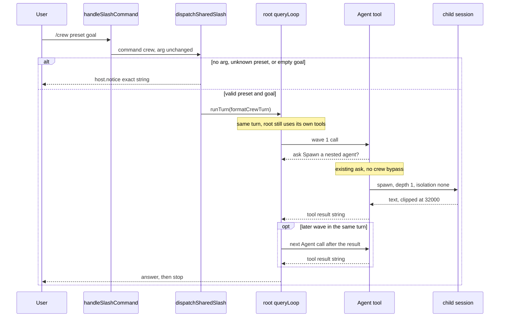

# `/crew` — one frozen-prompt slash

Date: 2026-09-28  
Author: (placeholder)  
Status: draft  
Shipped sha:  
Eventual path: `docs/superpowers/specs/2026-09-28-crew.md`  
Reviewed against the main checkout at `/Users/yeonwoosung/Desktop/RavenClaw` (no `/crew` symbol exists).  
This file reconciles three stage drafts. Where they disagreed, the locked decisions win. Citations are the current tree, not the drafts.

Implementation plan is not this document. Do not implement on `main`. Isolated worktree only. One implementation PR. This spec stays **draft** with an empty Shipped sha in that PR.

---

## Overview

`/crew` is a shared slash in the same family as `/interview`. It does not spawn anything. Shared dispatch either notices and returns, or calls `host.runTurn` once with a frozen preset string plus the user's goal, verbatim. The root model then uses the `Agent` tool it already has (`createAgentTool` in `packages/core/src/tools/agent.ts`). The root stays in the normal tool loop and still does work.

Presets are exactly `review`, `research`, and `implement`. No-arg lists them and does not start a turn. An unknown preset or a known preset with an empty goal notices and does not start a turn. There is no `/startup`, no `/hire`, and no persisted roster. Compliance is the prompt text plus tests of that text. There is no new tool, schema, engine phase, permission bypass, Edit filter, or metric.

---

## Background & Motivation

Closest shipped shape is `/interview`: not in `HOST_ONLY`, one `case` in `dispatchSharedSlash`, `await host.runTurn(INTERVIEW_PROMPT)` (`packages/cli/src/slash/dispatch.ts`). `INTERVIEW_PROMPT` lives next to `LEARN_PROMPT` and `formatOnboardingTurn` in `packages/cli/src/commands.ts`. `/learn` already freezes prompt substrings in `packages/cli/src/commands.test.ts`. `/interview` does not. `/crew` needs the parse coverage `/interview` has and the dispatch coverage it lacks.

`Agent` already asks before spawn, caps `agents[]` at 6, refuses `agents[]` plus `run_in_background`, strips `Agent` from every child, and mails only the parent session. Alternative A2 in `docs/superpowers/specs/2026-09-08-ravenclaw-coding-agent-design.md` already rejected a spawn-everything orchestrator: the root is one loop; `Agent` is for sub-tasks; the root does not only plan and spawn. `docs/superpowers/specs/2026-09-12-ravenclaw-gateway-and-parallel-agents.md` keeps depth 1, the catalog, and sync `agents[]` starting at 6.

Pain: a user who wants a short specialist graph has to remember catalog ids, the cap, and the "root still works" rule on every turn. `/crew` freezes three graphs as user-turn text. It does not grow a crew runtime.

---

## Goals & Non-Goals

### Goals

- One shared command, name `crew`, no aliases, inserted in `SLASH_COMMANDS` immediately after `team-onboarding` and before `bash`.
- Exact list / unknown / empty-goal notices. No `runTurn` on those paths.
- One `formatCrewTurn(preset, goal)` string per valid call. Goal characters are an exact substring. Required sentences below are exact substrings.
- Preset graphs: `review` (file-finder, then reviewer, read-only); `research` (`researcher-web`, plus `file-finder` in one `agents[]` batch only when the goal is this repo; no default writes); `implement` (1–6 `general` with exclusive paths, then one reviewer, then at most one fix-up).
- Tests of that text in the two CLI files named below. `packages/core` stays untouched.

### Non-Goals

- `/startup`, `/hire`, a `team` alias, a persisted roster, a session company object.
- A new tool, `Agent` input field, schema bump, `config.yaml` key, engine phase, permission mode, or metric.
- Raising `MAX_PARALLEL_CHILDREN`. Depth greater than 1. A peer mailbox. `isolation: 'worktree'` inside a crew. `run_in_background` inside a crew. File locks. An Edit (or any tool) filter. Auto-allow of `Spawn a nested agent?`.
- Changing `/agents`, `/steer`, `/team-onboarding`, `/onboard`, `/interview`, `/review`, `/learn`, or `/skill`.
- Slash parsing on Slack, Discord, ACP, or `raven exec`.
- Implementing on `main`. A second code PR. Flipping this spec to `implemented` before `main` has the commit.

---

## Where we are

`/crew` does not exist. `SLASH_COMMANDS` in `packages/cli/src/commands.ts` ends the frozen-prompt cluster at `interview`, `team-onboarding` (alias `onboard`), then `bash`. `CANONICAL_NAME` maps names and aliases only. The only aliases today are `cancel` → `stop`, `new` → `clear`, `onboard` → `team-onboarding`, `?` → `help`. `handleSlashCommand` trims the line, matches `^/(\S+)(?:\s+([\s\S]+))?$`, lowercases the command token, and leaves `match[2]` as `arg` unchanged.

`HOST_ONLY` is exactly `quit`, `stop`, `clear`, `resume`, `diff`, `retry`, `queue`, `loop`, `bash`. Both TUIs call `dispatchSharedSlash`. Neither `app.tsx` nor `opentui-app.ts` has a `case 'interview'`. A live turn is queued by the host `runTurn` (`queued (n)`), not by dispatch. Ink passes `runTurn: (prompt) => { void runTurn(prompt) }`. OpenTUI's dispatcher `await`s `runTurn`, so a frozen turn blocks that readline loop. That split already applies to `/interview`. Do not special-case `/crew`.

Slack (`submitSlackText`) and Discord (`submitDiscordText`) call `streamChatTurn`. They do not call `handleSlashCommand`. A chat line `/crew review ship it` stays ordinary user text. `packages/cli/src/index.ts` re-exports only `handleSlashCommand` and `LEARN_PROMPT`.

`Agent` facts this door relies on and does not change:

| Fact | Code |
|---|---|
| Ask before spawn | `checkPermissions` returns `{ behavior: 'ask', message: 'Spawn a nested agent?', saveAs: 'session' }` (`packages/core/src/tools/agent.ts`). Deny text is `permission_denied: ${message}` (`denyText` in `packages/core/src/loop/pairing.ts`). |
| Parallel cap | `MAX_PARALLEL_CHILDREN = 6` in `packages/core/src/tasks/mailbox.ts`, re-exported from `agent.ts`. Over-long `agents[]` returns `` `Agent failed: at most ${MAX_PARALLEL_CHILDREN} parallel children` `` and does not spawn. |
| Background combination | `agents[]` with `run_in_background: true` returns `Agent failed: agents[] cannot run in the background`. Background count at the cap returns `` `Agent failed: at most ${MAX_PARALLEL_CHILDREN} background agents` ``. |
| Fan-out | Non-empty `agents[]` runs `Promise.allSettled` and returns `formatParallelResults`: `## N (subagent)` sections joined by a blank line. Default subagent label is `general`. The parent tool call blocks until that batch settles. Empty `agents[]` is ignored; the top-level prompt runs as one child. Top-level `prompt` stays required by `inputSchema`. |
| Isolation default | `input.isolation ?? 'none'`. `prepareChildWorktree` returns `{ cwd: parentCwd, created: false }` when `isolation !== 'worktree'` (`packages/core/src/tools/worktree.ts`). |
| Unknown names | `Subagent '<id>' is not spawnable` or `Unknown subagent: <id>`. Strings, not throws. |
| Abort | `ABORTED_TEXT` = `aborted: the turn was interrupted before this tool finished.` |
| Result bound | `boundChildResult` clips at `CHILD_RESULT_CHAR_BOUND` (`32_000` in `packages/core/src/agent/definition.ts`). |
| Mail | Background completion calls `enqueueAgentMail(store, parentSessionId, text)`. `AGENT_MAIL_BODY_MAX` is `4000`. No peer address. Crew prompts do not use background, so they do not use mail for wave order. |
| Depth | `NESTING_DENIED` strips `Agent`, `AskUser`, plan mode, cron, `SetOutput`, `EnterWorktree`, `ExitWorktree`, `AddDir`, `TaskSteer` before `filterChildTools`. Built-ins set `spawnableAgents: []`. |
| Model | `resolveChildModel`: `funding === 'included'` returns the parent model; otherwise `definition.model ?? specialistModel ?? parent.model`. Built-ins set no `model`. |
| Catalog | `general` (Read, Grep, Glob, ListDir, Edit, Write, ApplyPatch, Bash, Skill; `maxRounds` 30; no history; `inheritParentSystemPrompt: true`). `file-finder` (Read, Grep, Glob; 8; no history). `formatChildPrompt` prefixes file-finder user text with `Reply with at most 20 lines of: path — reason`. `reviewer` (no tools; 4; `includeMessageHistory: true`). `researcher-web` (WebSearch, Fetch; 12; no history). `command-runner` (Read, Bash; 2). Not a preset member. Disk agents (`loadDiskAgents`, `maxRounds` 12) are spawnable when present and are not named by presets. |

`/review` is a different command: `host.notice(await runSessionReview(...))`. It is not a crew preset.

---

## Constraints

1. Do not implement on `main`. Isolated worktree only.
2. Targeted `bun test ./packages/cli/src/commands.test.ts` and `bun test ./packages/cli/src/slash/dispatch.test.ts` only. Do not point `package.json` `test` at a new script. Do not add a GitHub Actions job. `scripts/ci-unit.sh` already runs `bun test packages/cli`. Do not edit `scripts/ci-unit.sh` or `packages/cli/src/ci-unit.test.ts`.
3. Catalog, parse, notices, and the frozen prompt live in `packages/cli/src/commands.ts`. Dispatch is one `case 'crew'` in `dispatchSharedSlash`, next to `case 'interview'`. Not `HOST_ONLY`. No `case 'crew'` in `app.tsx` or `opentui-app.ts`.
4. Default prefix unchanged. No new tool. No schema bump. No `queryLoop` change. `packages/core` does not change.
5. BYOK and included funding stay as they are. Clean-room. No web UI. Do not copy vendor prompts.
6. Status of `docs/superpowers/specs/2026-09-28-crew.md` stays draft until a later honesty pass after the slash is on `main`. This door's PR does not fill Shipped sha.
7. The implementation plan may only add detail. It must not contradict these rulings or the locked decisions.

---

## Do not build

- `/startup`
- `/hire`
- A persisted roster or session company object
- An alias `team`, `startup`, `hire`, or `onboard` on `crew` (`/onboard` stays `team-onboarding`)
- A peer message bus, or any new mailbox recipient
- Depth greater than 1, or deleting names from `NESTING_DENIED`
- Raising `MAX_PARALLEL_CHILDREN`
- `run_in_background` inside a crew prompt
- `isolation: 'worktree'` inside a crew prompt, a merge coordinator, or a file lock
- Auto-allow of the `Agent` permission, a new permission mode, or an allow rule keyed on `/crew`
- A tool filter that blocks `Edit` (or any other tool) during `/crew`
- A runtime enforcer, sandbox mode, integrity mode, or new metric, log line, span, or session field
- A milestone orchestrator, multi-day loop, Workflow loop, or agent compiler
- A web UI
- A new `Agent` schema or input field
- `command-runner` inside a preset
- Disk agents inside a default graph
- Changing `/agents`, `/team-onboarding`, `/steer`, `/interview`, or `/review`
- A second engine phase, `/loop` driver, or wave-scheduler object
- Slack / Discord / ACP / `raven exec` slash parsing
- Implementing on `main`

`/crew` does not amend A2. It does not become the spawn-everything orchestrator A2 rejected.

---

## Binding rulings

1. **One slash.** `{ name: 'crew', usage: '/crew [<preset> <goal>]', summary: 'list presets, or start one frozen crew turn' }`. No `aliases`. `/CREW` is already `crew` because `handleSlashCommand` lowercases the first token. No new parse branch in `handleSlashCommand`. `packages/cli/src/index.ts` stays `export { handleSlashCommand, LEARN_PROMPT } from './commands'`.

2. **Not `HOST_ONLY`.** One `case 'crew'` in `dispatchSharedSlash`. Always returns `'handled'`. Do not check `liveTurnId` in the branch. Busy policy is the host `runTurn` policy, same as `/interview`. `/crew` does not call `enqueueSteer`.

3. **`parseCrewArg` in `commands.ts`, exported, next to `formatOnboardingTurn`.** It splits the dispatch `arg` only.

   ```ts
   export const CREW_PRESETS = ['review', 'research', 'implement'] as const
   export type CrewPreset = (typeof CREW_PRESETS)[number]

   export function parseCrewArg(arg: string | undefined):
     | { ok: false; notice: string }
     | { ok: true; preset: CrewPreset; goal: string }
   ```

   Order: trim the whole arg (`arg?.trim() ?? ''`); empty means the list notice, not a usage error (whitespace-only is this path). Else match `^(\S+)(?:\s+([\s\S]+))?$`. Preset is capture 1 lowercased. Goal is capture 2 when present, else `''`. Do not lowercase the goal. Do not trim the goal again. Internal whitespace stays, including double spaces. The `\s+` between preset and goal is the separator, not part of the goal. Unknown preset wins even when the goal is empty: `{ ok: false, notice: \`unknown crew preset: ${preset}\` }`. Known preset with goal `''`: `{ ok: false, notice: \`usage: /crew ${preset} <goal>\` }`. Else `{ ok: true, preset, goal }`.

4. **Exact notices.** Tests match these characters.

   ```ts
   export const CREW_LIST_NOTICE = [
     'crew presets: review, research, implement',
     'usage: /crew <preset> <goal>',
   ].join('\n')
   ```

   | Input after `handleSlashCommand` | Notice | `runTurn` |
   |---|---|---|
   | `/crew` | `CREW_LIST_NOTICE` | no |
   | `/crew review` | `usage: /crew review <goal>` | no |
   | `/crew research` | `usage: /crew research <goal>` | no |
   | `/crew implement` | `usage: /crew implement <goal>` | no |
   | `/crew nope` | `unknown crew preset: nope` | no |
   | `/crew startup` | `unknown crew preset: startup` | no |
   | `/crew Startup ship it` | `unknown crew preset: startup` | no |
   | `/crew REVIEW ship it` | none | yes, preset `review`, goal `ship it` |
   | `/crew research Keep  THIS` | none | yes, preset `research`, goal `Keep  THIS` |

   Do not add a fourth preset. Do not accept `startup` or `hire`.

5. **`formatCrewTurn(preset, goal)` in `commands.ts`, exported.** Called only on `ok: true`. The string is the shared sentences, then that preset's sentences, then the goal verbatim. Stage 1's interim rule that a return value of exactly `goal` is legal is **withdrawn**. Do not append session secrets, file trees, scans, or tool results. `formatCrewTurn` is pure.

   ```ts
   case 'crew': {
     const parsedCrew = parseCrewArg(parsed.arg)
     if (!parsedCrew.ok) {
       host.notice(parsedCrew.notice)
       return 'handled'
     }
     await host.runTurn(formatCrewTurn(parsedCrew.preset, parsedCrew.goal))
     return 'handled'
   }
   ```

   On success: exactly one `host.runTurn`, and no `host.notice` from this branch. On failure: exactly one `host.notice`, and no `runTurn`. Never both. `/crew review <goal>` must not call `runSessionReview`.

6. **`/crew` does not spawn.** The frozen prompt tells the root to call `Agent`. Dispatch must not import `createAgentTool`. No child session is created in the slash path. No `enqueueAgentMail` from the slash path.

7. **The root remains the switchboard and still does work.** A2 stays rejected. The root is not a CEO that only delegates.

8. **Waves are later `Agent` calls in the same root turn**, after the previous tool result is visible. Not `/loop`. Not a new session. Not a new engine phase. No wave-scheduler object.

9. **Peers do not message each other.** Mail stays parent-session only. Presets do not set `run_in_background`.

10. **Depth stays 1.** Child prompts must not tell the child to call `Agent`. The frozen prompt says so, and tells the root to copy that rule into every child prompt, because `general` has `includeMessageHistory: false`. `NESTING_DENIED` stays. Do not tell a child to call `AskUser`.

11. **One `agents[]` batch is at most 6.** Do not raise the constant. Where the preset says `No agents[]`, one `Agent` call with `subagent` set. Do not wrap that child in `agents[]`. Where the preset says `agents[]`, one batch, length 1 through 6. Length 1 is a batch of one, not a second call shape. Do not pass an empty `agents[]` (the tool ignores it and runs the top-level prompt as one child). The top-level `prompt` is still required; it is not an extra child. The implement fix-up sentence includes `No agents[].`, so that wave is one `Agent` call with `subagent: "general"` (or the root editing), not a length-1 `agents[]`.

12. **Do not set `isolation` or `command`.** Omitted `isolation` stays `'none'`. Children share the parent cwd. Exclusive path lists are the only overlap control, and only on `implement`. No new file lock.

13. **`Agent.checkPermissions` keeps asking `Spawn a nested agent?`.** Do not bypass permissions. Do not add an allow rule for `/crew`. A session `allow_always` happens only if the operator answers `allow_always` on that existing ask. The frozen text must not instruct the root to skip, auto-allow, or bypass that ask. Child leftover-asks keep `childSessionId`. Do not change ask routing.

14. **`reviewer` has `toolNames: []` and receives parent history.** Both the `review` and `implement` bodies contain `Do not assign the reviewer Edit, Write, ApplyPatch, or Bash.` The root still puts the findings or the collected summary in that child's `prompt`. `toolNames: []` is the existing engine backstop. This door does not add a tool filter.

15. **`command-runner` is in no preset. Disk agents are in no preset.** The root may call a disk agent only when the user named that id.

16. **`file-finder` already wraps its user text** with `Reply with at most 20 lines of: path — reason` (`formatChildPrompt`). The crew prompt must not invent a second output format for it.

17. **On an `Agent` result that contains an error prefix, the root reports that result and stops.** The shared body contains `If the tool result contains Agent failed:, Subagent ', Unknown subagent:, aborted:, or permission_denied:, report that result and stop. Do not retry.` Tests `toContain` that sentence. One retry of the same child is out. No shrink-and-retry. No replacement spawn. No silent retry loop. No runtime matcher, tool filter, or engine check classifies those strings.

18. **Compliance is prompt text plus tests of that text.** Not a sandbox. Not a tool filter. Not an engine phase. If the model ignores the preset, v1 has no runtime blocker. The sentence set is closed: shared sentences plus that preset's sentences, including the error-prefix sentence, research `Then answer and stop.`, the reviewer Write/ApplyPatch words, and implement fix-up `No agents[].`. Do not add Stage 3's extra obligations as further substrings (secrets-beyond-the-goal, included-model billing warning, a separate "star-shaped" sentence, a separate "spawn still needs approval" sentence). Those behaviors are already either existing engine facts or covered by the closed sentences. See Key Decisions.

19. **No flag.** Rollback is deleting the slash: catalog row, prompt exports, dispatch case, tests, and the hand docs below. No migration. Sessions already started are ordinary turns. Nothing persists a crew.

20. **Docs ride in the same PR.** `SLASH_COMMANDS.md` is hand-maintained. `CONTRIBUTING.md` requires `README.md`, `SLASH_COMMANDS.md`, and `SLASH_COMMANDS.ko.md` when the English page changes. `commands.test.ts` asserts in-memory `SLASH_HELP`, not the markdown. Do not open a docs-only follow-up. Do not rewrite `ARCHITECTURE.md` (it points at `SLASH_COMMANDS.md`). Do not add a CHANGELOG section in this door.

---

## Proposed Design

### Parse and inject

`handleSlashCommand` is unchanged. `parseCrewArg` runs only inside `case 'crew'`. `formatCrewTurn` concatenates, in order, `CREW_SHARED`, the preset body, then `Goal:\n` plus `goal` with no further trim. Each required sentence is its own line so it is a contiguous substring. `Goal:` is a label, not a required sentence. Nothing is appended after `goal`.

```ts
function crewBody(lines: readonly string[]): string {
  return lines.join('\n')
}

export const CREW_SHARED = crewBody([
  'Call the Agent tool. /crew does not spawn agents.',
  'You are the root. You still do the work. Do not only delegate.',
  'Do not tell a child to call Agent. Copy that rule into every child prompt.',
  'Do not set run_in_background.',
  'Do not set isolation.',
  'At most 6 children in one agents[] batch.',
  'The next wave is a later Agent call in this same turn.',
  'command-runner is not in this preset.',
  'Do not call a disk agent unless the user named that agent.',
  'If Agent returns an error, report that result and stop. Do not retry.',
  "If the tool result contains Agent failed:, Subagent ', Unknown subagent:, aborted:, or permission_denied:, report that result and stop. Do not retry.",
])

export const CREW_PRESET_TEXT: Record<CrewPreset, string> = {
  review: crewBody([
    'Preset: review. Read-only.',
    'Wave 1 is one file-finder. No agents[].',
    'You may Read and Grep.',
    'Do not Edit, Write, ApplyPatch, or mutate with Bash.',
    'Wave 2 is one reviewer given the findings.',
    'Do not assign the reviewer Edit, Write, ApplyPatch, or Bash.',
    'No implement follow-up.',
    'Then answer and stop.',
  ]),
  research: crewBody([
    'Preset: research. Default no repo writes.',
    'If the goal refers to this repository, wave 1 is one agents[] batch with researcher-web and file-finder.',
    'Otherwise wave 1 is researcher-web only. No agents[].',
    'No reviewer unless the goal asks for critique.',
    'You synthesize the answer.',
    'Then answer and stop.',
  ]),
  implement: crewBody([
    'Preset: implement.',
    'You may inspect first.',
    'Wave 1 is agents[] of general, 1 through 6, each prompt listing exclusive paths.',
    'Unsplittable work is one general.',
    'Wave 2 is one reviewer on the summary you collected.',
    'Do not assign the reviewer Edit, Write, ApplyPatch, or Bash.',
    'At most one fix-up wave after that, by you or one general. No agents[].',
    'Then answer and stop. No standing crew.',
  ]),
}

export function formatCrewTurn(preset: CrewPreset, goal: string): string {
  return `${CREW_SHARED}\n${CREW_PRESET_TEXT[preset]}\nGoal:\n${goal}`
}
```

Joining with `\n` is normative. A space-joined paragraph is not. Tests look for the sentences, not for a particular wrapper, but the builder above is the one to ship so the goal stays byte-identical and sentences stay contiguous.

The root writes each child `prompt` (and optional `context`). It does not set `isolation`, `run_in_background`, or `command`. `subagent` is set to the catalog id the preset names. Omitting `subagent` would still select `general` (`input.subagent ?? 'general'`); preset prompts name `general` anyway.

### Preset graphs

The user's goal is the remainder after the preset token. These graphs are the whole crew. After the last step the root answers and stops. No standing crew.

**`review` (read-only).** The root may Read and Grep. It must not Edit, Write, ApplyPatch, or mutate with Bash. No implement follow-up. Wave 1: one `Agent` call, `subagent: "file-finder"`, no `agents[]`. Wave 2: one `Agent` call, `subagent: "reviewer"`, prompt carries the findings. That prompt must not assign Edit, Write, ApplyPatch, or Bash. The root answers from its own reads plus those two results, then stops.

**`research` (default: no repo writes).** The root synthesizes. It does not edit the repo unless the user asked for a write; the default is no repo writes. If the goal refers to this repository (this cwd / this project), wave 1 is one `agents[]` batch of exactly two children: `researcher-web` and `file-finder`. Otherwise wave 1 is one `Agent` call, `subagent: "researcher-web"`, no `agents[]`. If the goal asks for critique, one later wave is one `reviewer` on the synthesis inputs. That is the only extra wave. With or without that wave, the body ends with `Then answer and stop.` Do not spawn `reviewer` by default.

**`implement`.** The root may inspect first (Read, Grep, and the other read tools it already has). Inspection is not a wave. Wave 1 is one `agents[]` of `general`, length 1 through 6. Each child prompt lists the paths only that child may change. Reads may overlap. The root must not give two generals the same mutating path. Unsplittable work is length 1 (one general inside `agents[]`), not a pretended split and not a shape outside `agents[]`. Never more than 6. Never `command-runner`. The root collects a short summary of what those children changed. Wave 2: one `Agent` call, `subagent: "reviewer"`, prompt is that summary, and must not assign Edit, Write, ApplyPatch, or Bash. At most one fix-up wave after that, and only if the review found something to fix. The frozen sentence says `No agents[].` The fix-up is either the root editing, or one `general` via a single `Agent` call. Not a length-1 `agents[]`. Then the root answers and stops. No second reviewer. No further wave.

### Failure behavior

`Agent` returns a string. The model is told to stop by one shared sentence: `If the tool result contains Agent failed:, Subagent ', Unknown subagent:, aborted:, or permission_denied:, report that result and stop. Do not retry.` "Contains" covers a single-child return and a `## N` section from `formatParallelResults`, which embeds the child string. Tests `toContain` that sentence. There is no runtime matcher.

These current tool strings are what those prefixes cover. The root quotes the tool result and stops. It does not spawn a replacement, does not shrink the batch and retry, and does not call the same child again.

- `Agent failed: at most 6 parallel children`
- `Agent failed: agents[] cannot run in the background`
- `Agent failed: at most 6 background agents`
- `Subagent '<id>' is not spawnable`
- `Unknown subagent: <id>`
- `aborted: the turn was interrupted before this tool finished.`
- `permission_denied: Spawn a nested agent?`

A child that finishes with ordinary text, including a bounded result or a finding of "nothing", is not an error unless that text contains one of those prefixes. A `Promise.allSettled` rejection is rendered as its message inside `## N`. Stop only when that result contains a named prefix. Do not add a matcher that scans sections.

### Sequence



### What the root must not do

- Set `run_in_background` or `isolation`.
- Put `command-runner` in a preset batch.
- Call a disk agent the user did not name.
- Tell a child to call `Agent` or `AskUser`.
- Retry an error string.
- On `implement`, assign the same mutating path to two generals, or run a second reviewer, or run a second fix-up.
- On `review`, edit, or add an implement follow-up.
- Invent a second file-finder output format.
- Instruct a permission bypass.

---

## API / Interface Changes

No `Tool` is added. `AgentInput` stays `prompt` required, optional `context`, `description`, `subagent`, `isolation`, `command`, `run_in_background`, `agents`. No schema version change. No `config.yaml` key. Permission modes stay `default | acceptEdits | plan | dontAsk`.

New CLI surface, all in `packages/cli/src/commands.ts`:

- `SLASH_COMMANDS` row `crew` after `team-onboarding`.
- `CREW_PRESETS`, `CrewPreset`, `CREW_LIST_NOTICE`, `CREW_SHARED`, `CREW_PRESET_TEXT`, `parseCrewArg`, `formatCrewTurn`.

`dispatchSharedSlash` gains `case 'crew'` as specified above. `SlashHost.runTurn` is unchanged.

`/help` changes only because `SLASH_HELP` is `formatSlashHelp(SLASH_COMMANDS)`. The help line is the spec row: usage padded, two spaces, summary `list presets, or start one frozen crew turn`.

Chat hosts, ACP, and `raven exec` gain nothing.

---

## Data Model Changes

None. No session column, roster table, crew id, or migration. A crew is one user message produced by `formatCrewTurn`. Child sessions, if the model calls `Agent`, are the existing child-session rows. Rollback does not rewrite old transcripts.

---

## Exact prompt substrings

Tests in `packages/cli/src/commands.test.ts` duplicate these literals and `toContain` them on `formatCrewTurn`. Do not paraphrase.

### Shared (all three presets)

- `Call the Agent tool. /crew does not spawn agents.`
- `You are the root. You still do the work. Do not only delegate.`
- `Do not tell a child to call Agent. Copy that rule into every child prompt.`
- `Do not set run_in_background.`
- `Do not set isolation.`
- `At most 6 children in one agents[] batch.`
- `The next wave is a later Agent call in this same turn.`
- `command-runner is not in this preset.`
- `Do not call a disk agent unless the user named that agent.`
- `If Agent returns an error, report that result and stop. Do not retry.`
- `If the tool result contains Agent failed:, Subagent ', Unknown subagent:, aborted:, or permission_denied:, report that result and stop. Do not retry.`

### `review` only

- `Preset: review. Read-only.`
- `Wave 1 is one file-finder. No agents[].`
- `You may Read and Grep.`
- `Do not Edit, Write, ApplyPatch, or mutate with Bash.`
- `Wave 2 is one reviewer given the findings.`
- `Do not assign the reviewer Edit, Write, ApplyPatch, or Bash.`
- `No implement follow-up.`
- `Then answer and stop.`

### `research` only

- `Preset: research. Default no repo writes.`
- `If the goal refers to this repository, wave 1 is one agents[] batch with researcher-web and file-finder.`
- `Otherwise wave 1 is researcher-web only. No agents[].`
- `No reviewer unless the goal asks for critique.`
- `You synthesize the answer.`
- `Then answer and stop.`

### `implement` only

- `Preset: implement.`
- `You may inspect first.`
- `Wave 1 is agents[] of general, 1 through 6, each prompt listing exclusive paths.`
- `Unsplittable work is one general.`
- `Wave 2 is one reviewer on the summary you collected.`
- `Do not assign the reviewer Edit, Write, ApplyPatch, or Bash.`
- `At most one fix-up wave after that, by you or one general. No agents[].`
- `Then answer and stop. No standing crew.`

Negative check, all three bodies: the `formatCrewTurn` result does not contain `auto-allow`, `allow_always`, or `skip the permission`. That is a guard against a bypass instruction, not a new required sentence.

Goal check: `formatCrewTurn('research', 'Keep  THIS')` includes `Keep  THIS` and does not include `keep  this`.

---

## Tests

No new test file. No Ink test. No OpenTUI test. No `packages/core` test edits. Do not stub `Agent`, permissions, or worktrees. Core tests of ask, cap, nesting, and `resolveChildModel` must not be edited to make `/crew` pass.

### `packages/cli/src/commands.test.ts`

| Assertion | Intent |
|---|---|
| `handleSlashCommand('/crew')` equals `{ type: 'command', name: 'crew' }` | No-arg parse has no `arg` |
| `handleSlashCommand('/CREW research')` equals `{ type: 'command', name: 'crew', arg: 'research' }` | Command token lowercased; arg unchanged |
| `handleSlashCommand('/crew REVIEW ship  it')` equals `{ type: 'command', name: 'crew', arg: 'REVIEW ship  it' }` | Preset case and internal double space stay on `arg` |
| `handleSlashCommand('/team')` equals `{ type: 'command', name: 'team' }` | Not an alias |
| `SLASH_COMMANDS` name array `toEqual` inserts `'crew'` after `'team-onboarding'` and before `'bash'` | Order |
| `SLASH_COMMANDS.find(name === 'crew')?.aliases` is `undefined` | No aliases |
| Existing `SLASH_HELP` loop still passes; `SLASH_HELP` contains `'/crew [<preset> <goal>]'` and `'list presets, or start one frozen crew turn'` | Help row |
| `parseCrewArg(undefined)` and `parseCrewArg('   ')` notice equals `CREW_LIST_NOTICE` | Whitespace-only is the list, not usage |
| `parseCrewArg('review')` notice equals `usage: /crew review <goal>` | Empty goal, preset substituted |
| `parseCrewArg('research')` notice equals `usage: /crew research <goal>` | Empty goal, preset substituted |
| `parseCrewArg('implement')` notice equals `usage: /crew implement <goal>` | Empty goal, preset substituted |
| `parseCrewArg('startup')` and `parseCrewArg('Startup ship it')` notice `unknown crew preset: startup` | Unknown wins; preset lowercased in the notice |
| `parseCrewArg('REVIEW ship it')` equals `{ ok: true, preset: 'review', goal: 'ship it' }` | Preset lowercased |
| `parseCrewArg('research Keep  THIS')` equals `{ ok: true, preset: 'research', goal: 'Keep  THIS' }` | Goal verbatim |
| Each `formatCrewTurn(preset, goal)` contains every shared sentence and that preset's sentences | Closed sentence set |
| `formatCrewTurn('research', 'Keep  THIS')` includes `Keep  THIS`, not `keep  this` | Verbatim goal |
| No preset body contains `auto-allow`, `allow_always`, or `skip the permission` | No bypass instruction |

### `packages/cli/src/slash/dispatch.test.ts`

Use the existing `cmd` / `fakeHost` / `fakeRuntime` helpers. Each case expects `'handled'`.

| Call | Intent |
|---|---|
| `cmd('crew')` | `notices` equals `[CREW_LIST_NOTICE]`, `turns` length 0 |
| `cmd('crew', '   ')` | Same list notice, `turns` length 0 |
| `cmd('crew', 'implement')` | `notices` equals `['usage: /crew implement <goal>']`, `turns` length 0 |
| `cmd('crew', 'startup ship it')` | `notices` equals `['unknown crew preset: startup']`, `turns` length 0 |
| `cmd('crew', 'nope')` | Notice is `unknown crew preset: nope`, not `unknown command: /crew` and not `unknown command: /nope`. No `runTurn` |
| `cmd('crew', 'review Keep  THIS')` | `notices` length 0, `turns` equals `[formatCrewTurn('review', 'Keep  THIS')]` |
| `cmd('crew', 'research Keep  THIS')` and `cmd('crew', 'implement Keep  THIS')` | Same: one turn, equality with `formatCrewTurn`, notices empty |

Assert the fake engine `submitMessage` was not used. Dispatch goes through `host.runTurn` only.

Targeted commands, from the worktree:

- `bun test ./packages/cli/src/commands.test.ts`
- `bun test ./packages/cli/src/slash/dispatch.test.ts`

---

## Docs the implementation must update

`SLASH_COMMANDS.md` and `SLASH_COMMANDS.ko.md` both change. English catalog order is the source array.

- Add `### /crew [<preset> <goal>]` after `### /team-onboarding` and before `### /bash` in both files. Kind: shared. Aliases: none. No-arg, unknown, and empty-goal: the exact notice strings from ruling 4, and no turn. Valid: `runTurn(formatCrewTurn(preset, goal))`, queued if busy (`queued (n)`). State that the goal is included verbatim. Do not paste the prompt body. Point at `docs/superpowers/specs/2026-09-28-crew.md` for the sentences. Tests in `commands.test.ts` are the freeze. A second copy in the markdown will drift.
- English mid-turn enqueue row (`/learn`, `/interview`, `/skill:<name>`, `/team-onboarding`): add `/crew` for the valid form only. No-arg / unknown / empty-goal belong on the immediate-notice row, next to `/agents`.
- English "Frozen prompt commands" table: add a row. Mechanism `runTurn(formatCrewTurn(preset, goal))`. Change "These four slashes" so the count matches the table (five). The row says the goal is verbatim and the sentences live in `commands.ts`, locked by tests, specified in this spec. Do not paste them.
- Korean summary table: one `crew` row between `team-onboarding` and `bash`. `busy면 enqueue` only for the valid form. Korean frozen-prompt section: a short pointer, same rule, no fenced prompt body. Quote the English notice strings (they are English in code). Only `SLASH_COMMANDS.ko.md` has the mermaid edge `learn interview team-onboarding skill` → `host.runTurn`. Add `crew` to that Korean edge. `SLASH_COMMANDS.md` has no such edge. Do not invent one. The English edits are the enqueue row and the frozen-prompt table.
- Do not document `/startup`, `/hire`, or a `team` alias.
- `README.md` slash table, one row next to `/interview`, and do not rewrite the rest of that table:

  `| `/crew [<preset> <goal>]` | List presets, or start one frozen crew turn |`

- "How to add a slash" stays accurate: this command is step 3 (shared dispatch), not step 2 (`HOST_ONLY`).

---

## Alternatives Considered

### 1. Runtime-spawned crew

The slash calls `Agent` N times from dispatch, or a new engine phase runs the waves.

**For.** The graph would be enforced. A model could not skip the reviewer.

**Against.** That is a new engine path and a second failure domain. It is the spawn-everything shape A2 rejected (`docs/superpowers/specs/2026-09-08-ravenclaw-coding-agent-design.md`, A2: spawn tax, reviewer cost, pairing across children). Dispatch would import `createAgentTool` and would have to answer `Spawn a nested agent?` outside a model turn. Wave two would need a scheduler the tool loop already is.

**Reject.**

### 2. `/startup` / `/hire` persisted org

A roster on disk, peer mail, depth greater than 1, maybe a company object in the session.

**For.** A standing crew could be steered with `/steer` and listed later. Peers could divide work without the root in the middle.

**Against.** Out of scope for this door. `enqueueAgentMail` addresses only `parentSessionId` (`packages/core/src/tasks/mailbox.ts`). `NESTING_DENIED` already strips `Agent`. A roster would be a schema change and a product the locked decisions forbid. `/agents` already lists the catalog. `/steer` already injects mid-turn text. `/team-onboarding` already walks a human through the workspace. Those stay. Do not build the names even as aliases.

**Reject.**

### 3. Frozen prompt

`/crew <preset> <goal>` injects one preset and returns. The root uses the `Agent` tool it already has. Same mechanism as `/interview` and `formatOnboardingTurn`, with an argument and three bodies.

**For.** No new failure domain. Permissions, cap, depth, and result bounds stay the code that already ships. Rollback is deleting a slash. Tests can freeze the contract without a sandbox.

**Against.** The model can ignore the text. Overlapping writes and a skipped reviewer are possible. v1 accepts that. There is no Edit filter.

**Recommend this. This door is (3).**

---

## Security & Privacy Considerations

Threat model is the existing agent threat model plus a user-controlled goal copied into a root turn that is likely to call `Agent`.

| Threat | Severity | What v1 does |
|---|---|---|
| Slash bypasses `Spawn a nested agent?` | High if introduced | Not introduced. `checkPermissions` stays `behavior: 'ask'`. No crew allow rule. Prompt must not say to skip or auto-allow. Negative substring test. |
| Model ignores the read-only / exclusive-path rules and writes anyway | Medium | Accepted. No Edit filter, no file lock, no worktree. `review` states `Do not Edit, Write, ApplyPatch, or mutate with Bash.` `implement` states exclusive paths. Overlap is a model failure. Children share cwd because `isolation` is omitted and `prepareChildWorktree` returns the parent cwd. |
| Secrets in the goal are copied into the root prompt and may be copied into child prompts | Medium | Accepted. `formatCrewTurn` copies `goal` verbatim and appends nothing else (no scan, no file tree, no tool output). v1 adds no redactor and no "do not copy secrets" sentence. The closed sentence list does not include one. Operators control the goal. `reviewer`'s own system prompt already says `No secrets.`; this door does not change that definition. |
| Included-funding spawn tax | Medium | Existing. `resolveChildModel` returns the parent model when `funding === 'included'`. Every child is billed as the parent. The prompt states `At most 6 children in one agents[] batch.` No budget enforcer and no new billing sentence. A2's cost row still stands. |
| Child asks the user, or nests another agent | Low for this door | `AskUser` and `Agent` are already in `NESTING_DENIED`. The prompt tells the root not to tell a child to call `Agent`, and to copy that into the child prompt. Leftover-ask routing is unchanged. |
| Chat-host `/crew` looks like a command but is user text | Low | Unchanged. Slack and Discord do not parse slashes. Document it. Do not add a parser. |
| Permission prompt fatigue causes `allow_always` | Low | Existing session save (`saveAs: 'session'`). This door does not suggest that answer. |

Children inherit the parent permission pipeline. `dontAsk` is not widened. No new mode.

---

## Observability

No new metric, log line, span, or session column. `runTurn` is the existing turn. The existing turn log is enough. A crew is distinguishable only as a user message that starts with the frozen sentences. Do not add a counter for preset, wave count, or child errors. Child failures are already the `Agent` tool result string.

---

## Rollout Plan

No feature flag. No config key. No schema version. Shipping is the slash appearing in `SLASH_COMMANDS` on a feature branch, in one PR, from an isolated worktree. Not from `main`.

Staged rollout is the PR itself: both TUIs get the command because it is shared. Chat hosts do not. There is no percent rollout.

Rollback is reverting that PR, or deleting the catalog row, `parseCrewArg` / `formatCrewTurn` / prompt exports, the dispatch case, the tests, the README row, and the two slash-doc sections. In-flight sessions need no migration. A turn that already received the prompt is an ordinary turn; abort it with `/stop` like any other. Permission prompts stay the parent's pipeline.

This spec file lands in that same PR at `docs/superpowers/specs/2026-09-28-crew.md` with `Status: draft` and an empty Shipped sha. Do not stamp the sha in this PR. Stamping after `main` has the commit is a later honesty pass, not a second code PR in this plan.

---

## Risks

| Risk | Severity | Mitigation | Residual |
|---|---|---|---|
| Model ignores the frozen prompt | Medium | Dispatch and commands tests lock the substrings that `runTurn` receives. No tool filter. | Model non-compliance is out of v1 enforcement. |
| Operator must approve each `Agent` spawn | Low (product) | Do not auto-allow. Preset does not mention skipping the ask. | A multi-wave crew is several asks unless the operator has already saved `allow_always` for the session. |
| Shared cwd races if paths overlap | Medium | `implement` sentence requires exclusive mutating paths. No worktree, no lock. | Overlap remains a model failure. |
| Reviewer cost and included-model tax | Medium | Sentence caps one `agents[]` batch at 6. Graphs are short (two waves plus at most one fix-up, or one research batch plus an optional reviewer). Do not raise `MAX_PARALLEL_CHILDREN`. | Included sessions still pay the parent model per child. No new warning sentence. |
| Empty `agents[]` silently becomes one child | Low | Wave rulings forbid an empty batch. Schema still requires top-level `prompt`. | Not a separate frozen sentence. The preset sentences name the batch shape. |
| Docs paste a second prompt and drift | Low | Slash docs point at this spec and do not paste the body. Tests freeze the literals. | A docs edit can still mis-state a notice. Notices are short and are specified as exact strings in the slash pages. |

---

## Key Decisions

1. **Frozen prompt, not a runtime crew.** Same family as `/interview`: `dispatchSharedSlash` calls `host.runTurn` and does not import `createAgentTool`. Rationale: A2 rejected spawn-everything; a slash-time spawner would be a second loop and a permission problem. The other two alternatives (runtime spawn, `/startup`/`/hire` org) lose on that point.

2. **Sentence set is Stage 2's list, plus four review amendments, then closed.** Stage 1 allowed `formatCrewTurn` to return exactly `goal` because that stage did not own the body. That interim is withdrawn. Stage 3 asked tests to lock extra classes the Stage 2 sentences do not state: no secrets beyond the typed goal, disjoint paths as a new sentence (implement already has `each prompt listing exclusive paths`), star-shaped report to parent, depth stays 1 as its own sentence (shared text already says `Do not tell a child to call Agent`), spawn still needs user approval, and included sessions pay the parent model per child. Those stay out. The review amendments that are in the frozen text are: one shared sentence naming the prefixes `Agent failed:`, `Subagent '`, `Unknown subagent:`, `aborted:`, and `permission_denied:`; research `Then answer and stop.`; both reviewer lines naming Edit, Write, ApplyPatch, and Bash; implement fix-up ending in `No agents[].`. Tests `toContain` those literals. No runtime matcher.

3. **Research may add one reviewer only when the goal asks for critique.** The locked one-line summary names `researcher-web` and the conditional `file-finder` batch and "no default writes". It does not forbid the critique wave. The required sentences include `No reviewer unless the goal asks for critique.` and `Then answer and stop.` That wave stays. It is one later `Agent` call, not a default. With or without it, the root answers and stops.

4. **Whitespace-only arg is the list notice, not a usage error.** Stage 1: `arg?.trim() ?? ''` empty → `CREW_LIST_NOTICE`. Stage 3 called whitespace-only "bad input" without a string. The string is the list. `/crew`, `/crew   `, and `parseCrewArg(undefined)` all notice `crew presets: review, research, implement` plus the usage line, and do not start a turn. Unknown still beats empty goal (`/crew startup` is `unknown crew preset: startup`, not `usage: /crew startup <goal>`).

5. **Notices are tested in both files.** `parseCrewArg` owns the strings, so `commands.test.ts` asserts them. `dispatch.test.ts` asserts `host.notice` and empty `turns`. Stage 3's note "do not assert notice strings in commands.test.ts if they live only in dispatch" does not apply: they live in `parseCrewArg`.

6. **One implementation PR. Spec stays draft.** Parse and the three prompt bodies are one injection. Do not split parser, prompt, and dispatch. Do not implement on `main`. Do not flip Status to implemented in the PR that adds the slash, because Shipped sha is unknown until the commit is on `main`, and this plan does not add a follow-up PR.

7. **No Edit filter and no metric.** Read-only review and exclusive paths are prompt text. A filter would be a new runtime enforcer. The locked decisions forbid both.

8. **Slash markdown does not paste the prompt.** Stage 1 forbade a pasted paragraph. Stage 3 asked for a hand section in the shape of `### /interview`, which does quote a short constant. `/crew` is twenty-plus sentences. The pages document kind, notices, `runTurn(formatCrewTurn(preset, goal))`, verbatim goal, and a pointer to this spec. "These four slashes" becomes five. That avoids a second source of truth.

9. **Root still does work. Cap stays 6. Depth stays 1. No peer bus. No worktree. No background.** These are existing code (`NESTING_DENIED`, `MAX_PARALLEL_CHILDREN`, `enqueueAgentMail(parentSessionId)`, `prepareChildWorktree` fallback) plus the shared sentences. A2 stays rejected. The sentence is `You are the root. You still do the work. Do not only delegate.`

10. **`/agents`, `/steer`, `/team-onboarding` stay.** `/agents` lists `agentCatalog`. `/steer` is `enqueueSteer` plus `abort`. `/team-onboarding` still scans and calls `formatOnboardingTurn`. `/review` stays the memory-review notice. `/crew review <goal>` is not `/review`.

---

## Open Questions

None remain. Parser notices, the three presets, verbatim goal, wave graphs, error-without-retry, depth, cap, mail, isolation, background, permission ask, compliance mechanism, doc placement, spec status, and the single PR are locked.

---

## References

- `packages/cli/src/commands.ts` — `SLASH_COMMANDS`, `handleSlashCommand`, `INTERVIEW_PROMPT`, `LEARN_PROMPT`, `formatOnboardingTurn`
- `packages/cli/src/commands.test.ts` — name order through `'interview', 'team-onboarding', 'bash'`; `LEARN_PROMPT` substring tests
- `packages/cli/src/slash/dispatch.ts` — `HOST_ONLY`, `case 'interview'`, `case 'review'`
- `packages/cli/src/slash/dispatch.test.ts` — `fakeHost` `turns` / `notices`
- `packages/cli/src/index.ts` — re-export stays `handleSlashCommand`, `LEARN_PROMPT`
- `packages/core/src/tools/agent.ts` — `createAgentTool`, `checkPermissions`, `agents[]`, `formatParallelResults`, `formatChildPrompt`
- `packages/core/src/tools/worktree.ts` — `prepareChildWorktree` fallback `{ cwd: parentCwd, created: false }`
- `packages/core/src/agent/definition.ts` — `NESTING_DENIED`, `resolveChildModel`, `CHILD_RESULT_CHAR_BOUND`
- `packages/core/src/agent/general.ts`, `file-finder.ts`, `reviewer.ts`, `researcher-web.ts`, `command-runner.ts`
- `packages/core/src/tasks/mailbox.ts` — `MAX_PARALLEL_CHILDREN = 6`, `enqueueAgentMail(store, parentSessionId, text)`, `AGENT_MAIL_BODY_MAX = 4000`
- `packages/core/src/loop/pairing.ts` — `ABORTED_TEXT`, `denyText`
- `docs/superpowers/specs/2026-09-08-ravenclaw-coding-agent-design.md` — A2 spawn-everything rejected
- `docs/superpowers/specs/2026-09-12-ravenclaw-gateway-and-parallel-agents.md` — parallel subagents, cap starts at 6, depth 1
- `docs/superpowers/specs/2026-09-22-hitl-skip-hosts.md` — house shape: draft until shipped, constraints, do-not-build, binding rulings
- `SLASH_COMMANDS.md`, `SLASH_COMMANDS.ko.md`, `README.md`, `CONTRIBUTING.md` (user-facing slash updates README and both slash docs in the same PR)
- Stage drafts reconciled here: crew stage 1 (slash surface), stage 2 (waves and sentences), stage 3 (boundaries). Stage 3 is not this spec.

---

## PR Plan

One implementation PR. That is the honest slice: parse and the prompt are one injection, same as `/interview` plus an argument. Dependencies: none. Do not split a parser PR, a prompt PR, and a dispatch PR. Do not open a docs-only follow-up. Do not edit `packages/core`, `package.json` scripts, `scripts/ci-unit.sh`, `.github/workflows/ci.yml`, `packages/cli/src/ci-unit.test.ts`, or `ARCHITECTURE.md`.

**Title:** `feat(cli): add /crew frozen-prompt presets`

**Branch:** isolated worktree only. Do not implement on `main`.

**What changes.** `/crew` becomes a shared slash. No-arg prints `crew presets: review, research, implement` and the usage line and does not start a turn. Unknown preset notices `unknown crew preset: <preset>` and does not start a turn. Known preset with an empty goal notices `usage: /crew review <goal>`, `usage: /crew research <goal>`, or `usage: /crew implement <goal>` and does not start a turn. The list notice's second line stays the literal `usage: /crew <preset> <goal>`. A valid `/crew <preset> <goal>` calls `runTurn` once with `formatCrewTurn`, goal verbatim, sentences as specified above. The root is told to call the existing `Agent` tool. Nothing in `packages/core` changes. Spec file lands as Status draft.

| Path | Change |
|---|---|
| `packages/cli/src/commands.ts` | `SLASH_COMMANDS` row after `team-onboarding`. `CREW_PRESETS`, `CREW_LIST_NOTICE`, `CREW_SHARED`, `CREW_PRESET_TEXT`, `parseCrewArg`, `formatCrewTurn`. No `handleSlashCommand` regex change. |
| `packages/cli/src/slash/dispatch.ts` | `case 'crew'` next to `interview`. Bad input: `host.notice` and `'handled'`. Good input: `runTurn(formatCrewTurn(...))` once. Not added to `HOST_ONLY`. |
| `packages/cli/src/commands.test.ts` | Parse, help, names, aliases, notices, verbatim goal, required substrings, no bypass phrasing. |
| `packages/cli/src/slash/dispatch.test.ts` | No `runTurn` on list, whitespace-only, empty goal, or unknown preset. One turn equal to `formatCrewTurn` for each preset. |
| `README.md` | One short-table row beside `/interview`. |
| `SLASH_COMMANDS.md` | Hand section, notices, frozen-prompt table row, enqueue row. No mermaid edge (the English flowchart has none to edit). No pasted prompt body. "These four slashes" count updated. |
| `SLASH_COMMANDS.ko.md` | Same facts in Korean. English notice strings quoted. Korean mermaid edge gains `crew`. No pasted prompt body. |
| `docs/superpowers/specs/2026-09-28-crew.md` | This document. Status stays `draft`. Shipped sha stays empty. |
